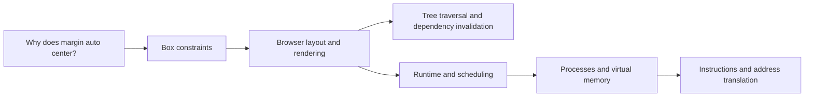

# Repository architecture

## 1. Organize around mechanisms and evidence

A topic is a question with a mechanism behind it: how address translation works, how a tree splits, or why equal auto margins center a box. Its home owns the explanation, model, experiments, and evidence. A domain groups nearby topics for browsing. A learning path orders topics for a particular goal. A project integrates several mechanisms into one executable system.

These are different relationships. Directory nesting represents ownership; the knowledge graph represents prerequisites and connections. Learning order belongs in metadata rather than numbered folder names. This lets browser rendering connect to parsing, scheduling, graphics, and networking without duplicating those explanations.

Treat the repository as an evidence system. A polished explanation is useful, but a claim becomes stronger when it includes a trace, invariant, measured result, or source location in a real implementation. Keep unanswered questions visible.

## 2. Physical structure and ownership

```text
tantradnyan/
  README.md                  entry point and runnable starting points
  INDEX.md                   generated topic index
  ROADMAP.md                 active priorities and exit criteria
  QUESTIONS.md               questions and investigation state
  IDEAS.md                   candidate explorations
  EXPERIMENTS.md              experiment discovery and recording policy
  AGENTS.md                  instructions discoverable by coding agents
  .agent/                    supporting agent protocols and repository map
  catalog/                   topics.json: stable IDs, paths, edges, milestones
  docs/                      design, generated taxonomy/paths, standards
  templates/                 optional topic, project, experiment, lab starting points
  scripts/                   small standard-library catalog tools
  domains/<domain>/<topic>/   canonical home of a mechanism
  projects/<project>/        integrations with their own bounded scope
  interactive/atlas.html     generated, offline topic graph and lab launcher
  experiments/README.md      pointers to experiments; code stays with its owner
```

**One canonical home per topic.** CPU caches belong to computer architecture; OS and database topics link to them. Memory allocation lives in programming languages/runtimes, with links from OS virtual memory and C systems programming. HTTP lives in networking; web platform topics link to it. Thread scheduling lives in operating systems; language concurrency explains what a runtime adds. Store a concept once and describe each domain's use of it locally.

**A shallow domain/topic layout.** Taxonomy groups are metadata, so adding quantum computing, robotics, or another cross-cutting area does not require moving existing topics. Create deeper local folders only when a topic has substantial internal structure. A topic can be split later by assigning new stable IDs and keeping an old-path pointer.

**No empty forest.** The catalog can describe planned topics without creating their directories. Activate a topic when it has an answerable question, a short explanation, and a tangible artifact or a documented plan for one. This starter catalog is an exploration map, not a completion checklist.

**Local dependencies.** A Rust project owns its `Cargo.toml`; a Python package owns its `pyproject.toml`; a browser lab may have no manifest beyond `lab.json`. Avoid a root dependency set containing every language's tools. Use one root environment only if a real shared tool needs it.

**Central navigation, local execution.** A copied topic should retain its model, commands, limitations, and fixtures. It may lose navigation to other topics, but it must not silently require a shared private runtime. Small duplication is preferable to an educational model hidden behind a general framework.

## 3. Taxonomy

The [generated taxonomy](TAXONOMY.md) covers foundations; physical hardware; digital logic; architecture; operating systems; networking; distributed systems; databases; synchronization; languages and runtimes; developer tools; web platform; applications; software engineering; security; graphics; AI and ML; scientific computing; embedded systems and robotics; and quantum computing.

This separates concerns that are often conflated:

- Distributed systems studies time, failure, replication, and agreement. Synchronization studies user edits, offline operation, conflicts, intention, and reconnect behavior.
- Databases studies durable state, indexing, querying, and transactions. Applications studies product mechanisms such as search, editors, authentication flows, and multiplayer worlds.
- AI and ML studies learning and inference. AI agent harnesses live in software engineering because tool execution, context, authorization, recovery, and evaluation are software system concerns.
- Security and reliability cross the entire stack. Give them explicit homes and link their mechanisms into the topics that need them.

No finite taxonomy is complete. Add a domain when it has its own questions and methods; add tags when a concern crosses many existing domains. Taxonomy breadth must not determine active workload.

## 4. Topic contract

A new topic needs only a `README.md`, a catalog entry, and its first useful artifact. Split the document when it becomes hard to scan. Add `GUIDE.md` for a long build sequence, `ROADMAP.md` for substantial local planning, and folders only when they contain something.

Recommended local elements:

| Element | Purpose | When to add |
| --- | --- | --- |
| `README.md` | Question, intuition, mechanism, run path, limitations, links | Always for active topics |
| `.agent/instructions.md` + `AGENTS.md` | Local learning objectives and special constraints | When local instructions add useful detail |
| `implementations/<language>/` | A small reference implementation | When code exposes the mechanism |
| `experiments/<experiment>/` | Hypothesis, setup, driver, observations | When there is a falsifiable prediction |
| `interactive/` | Direct manipulation of state and traces | When interaction explains causality |
| `simulations/` | Explicit models and reproducible scenarios | When real systems are difficult to control |
| `diagrams/` | Diagram source and readable exports | When prose cannot show data flow clearly |
| `exercises/` | Predictions, modifications, and design problems | As soon as useful |
| `benchmarks/` | Performance experiments with controls | After correctness and a performance question |
| `references/` | Annotated external sources and source walkthroughs | When inline references become unwieldy |

Adapt vocabulary to the work. Hardware may use `rtl/`, `testbenches/`, `waveforms/`, and `board/`. A language project may use `lexer/`, `parser/`, `ast/`, `runtime/`, and `gc/` inside its language implementation. Networking may use sanitized `packet-captures/`, protocol fixtures, and simulated networks. These are meaningful structures, not obligations.

## 5. Explanation contract

Use the [topic template](../templates/topic/README.md) as a writing prompt. Keep a compact path through:

1. A concrete question and observable behavior.
2. The problem, why it exists, and a minimal mental model.
3. A mechanism with assumptions and one worked example.
4. The simplest implementation and its invariant.
5. An experiment that might disprove the explanation.
6. A failure, counterexample, or omitted mechanism.
7. A real implementation and a source-reading task.
8. Exercises, linked prerequisites, and the next question.

Explain one mechanism at a time. Derive equations and state units. Distinguish a guarantee from a usual observation. Put uncertainty next to the claim it qualifies. A simulator's behavior is evidence about its model; it is not automatically evidence about Linux, a CPU, or a network.

References should say what to read and why: a specification section, a function at a pinned source commit, a figure in a paper, or a measured counterexample. Pin source revisions when making implementation claims. Mark unverified claims for investigation instead of giving them the voice of authority.

## 6. Progression with evidence

| Level | Question | Exit evidence |
| --- | --- | --- |
| 0 — Intuition | What happens, and what is surprising? | Predict an example before running it |
| 1 — Fundamentals | What state and rules explain it? | Explain a transition and invariant |
| 2 — Small implementation | Can I encode the simplest mechanism? | A runnable, inspectable model |
| 3 — Internals | Where does it break? | A failure trace and corrected reasoning |
| 4 — Production architecture | Which extra constraints shape real systems? | Compare mechanisms, guarantees, and tradeoffs |
| 5 — Integrated build | Can I assemble a bounded useful system? | A project with explicit acceptance criteria |
| 6 — Real implementations | Can I follow the production code? | A source walkthrough tied to an upstream revision |
| 7 — Research | What remains uncertain? | Reproduce a result or formulate a new testable question |

Levels are lenses, not eight mandatory folders. Levels 2 and 5 differ in scope: a transition function versus a system integrating several mechanisms. Reading production architecture at level 4 often helps choose a level 5 design. Researchers can revisit intuition; experienced engineers can skip a stage after supplying equivalent evidence.

Each catalog milestone has `level`, `outcome`, `state`, and `artifacts`. States are `planned`, `available`, or `verified`. Available means an artifact exists; verified means evidence supports the learning outcome. Generation renders these in [LEARNING-PATHS.md](LEARNING-PATHS.md). It never infers understanding from a folder or labels runnable code as personal mastery. Maintain your own learning notes in the relevant topic.

Prerequisites apply to the fundamentals entry point. Advanced prerequisite knowledge belongs in the milestone outcome or project scope; do not force someone to finish an OS before trying a CPU simulator. A curiosity path is a suggested route, with prerequisite gaps shown beside each stop.

## 7. Graph and cross-linking

`catalog/topics.json` is the single source for topic identity and navigation. It stores stable, globally unique IDs; human titles; domain and group; intended paths; status; tags; prerequisites; related topics; and optional milestones and lab paths. Local prose owns explanation, not a second copy of catalog fields.

Use `prerequisites` for directional entry requirements. These edges must form a directed acyclic graph. Use `related` for explanatory connections; cycles are natural and supported. Generated reverse links answer "what can I learn next?". Paths and project links answer "what can I build with this?". Keep an ID unchanged across a directory rename.



This diagram describes a route for deeper questions, not mandatory prerequisites. The generated atlas lets you search topics, filter domains and status, inspect prerequisite/related edges, see topics that depend on a selection, and launch existing labs. Keyboard-accessible controls and an adjacency list complement the SVG view. Planned nodes open a description rather than a nonexistent folder.

Avoid a graph where every topic links to everything. Add an edge only when you can explain why the connection helps. Existing metadata intentionally uses a small number of strong edges; more can be added as investigations establish them.

## 8. Interactive lab system

Default to static HTML, CSS, and plain JavaScript. Use actual platform behavior when that is the question: the CSS lab asks the browser to lay out a real element. Use a modeled state machine when control is needed: the CPU lab advances an explicit machine; the CRDT lab applies algebraic merge rules.

Every lab should offer a small initial scenario, named state, a useful manipulation, visible consequences, a reset, and stated limitations. Separate rendering from the model when there is a model. A headless experiment and a browser must use the same transition code so the visualization does not accidentally teach a different algorithm.

`lab.json` beside the HTML records `schema_version`, `id`, `topic`, `title`, `entry`, `model` (optional), and `limitations`. All paths in that manifest are relative to its own directory. The topic catalog lists the manifest path for discovery. The generator validates these paths and creates launch links; it does not execute code or install dependencies.

Use no remote assets for small labs. Plain script tags support opening the starters with `file://`. Module imports, fetching fixtures, or WebAssembly may require the localhost server; document that explicitly. Add a framework, WebGL, a worker, or a backend only after a concrete requirement justifies the dependency.

Make controls usable by keyboard, name all inputs, use text alongside colors, avoid animation that must be watched to understand the result, and show errors as text. Cap execution and trace size. Later lab extensions may add scenario import/export using the simulation contract below; the starter labs currently support reset and deterministic manual steps.

## 9. Simulation system

A simulation models a system; an interactive lab presents one. A simulation should be runnable without a UI and replay from inputs.

For distributed systems and networking, use a discrete-event scheduler: events ordered by `(logical_time, sequence_number)`; a recorded PRNG algorithm and seed when randomness is involved; explicit delivery, loss, duplication, crash, and recovery actions. Keep simulated time separate from wall time. For a CPU, use instruction steps; for circuits, declare signal and timing semantics. The right clock depends on the model.

Recommended files inside a simulation: `model.*`, `run.*`, `scenarios/*.json`, `README.md`, and small expected traces. Scenario schema version 1 should carry the model version, initial state, assumptions, seed/PRNG when used, and ordered actions. Events carry `step`, `kind`, `actor`, `before`, `after`, and optional logical time and payload. The [lab standards](LAB-STANDARDS.md) include an example.

Assert domain invariants: registers remain bytes; a stack never exceeds capacity; CRDT merges never decrease a component; an acknowledged durable database transaction survives every modeled crash point. Run replay, reorder, duplication, and boundary scenarios. A useful failure should become a small checked fixture. Fault controls alter the model's event delivery, not just the drawing.

State fidelity precisely. A TCP teaching simulator must specify which retransmission, acknowledgment, congestion, and timer rules it implements. A toy Raft simulation must not claim linearizability from a leader animation. A process crash and a power loss have different durability assumptions. Make these distinctions part of the lesson.

## 10. Diagram and Excalidraw system

Store diagrams beside the explanation, in `diagrams/`. Use a name describing the causal story, such as `wal-commit-order.mmd`, `wal-commit-order.svg`, or `wal-commit-order.excalidraw`. Keep editable source and exported SVG together when an export is needed for reading. Add a caption with state, transitions, assumptions, and the key observation.

Choose Mermaid for compact data flow and state machines; Excalidraw for hand-drawn reasoning and annotations; SVG for exact geometry; Canvas for dynamic state; WebGL for substantial spatial or GPU phenomena. Tool choice follows the explanatory requirement. Do not require every diagram to exist in every format.

Put a short source comment or adjacent note on generated exports explaining the source path and export procedure. Record tool/version when rendering changes matter. Edit the source, regenerate the export, and inspect labels at normal reading size. Commit small educational diagrams; ignore generated waveform dumps and large captures unless they are curated evidence. The catalog does not need to index every arrow or drawing.

## 11. Multi-language implementations

Start with one language that exposes the question. Add another only with a comparison question, equivalent inputs, observable semantics, and an explanation of meaningful differences.

| Mechanism | Useful comparison | What to investigate |
| --- | --- | --- |
| Allocator | C and Rust | Raw memory, alignment, unsafe boundaries, ownership of arena clients |
| Concurrent queue | Go and Rust | Scheduling, ownership, race prevention, synchronization cost |
| Tree index | Python and Rust | Algorithm clarity, object overhead, cache layout, explicit representation |
| Interpreter | Python and C | Host runtime services versus explicitly implemented objects and GC |
| Parser | JavaScript and Rust | Unicode handling, error representation, allocation, type constraints |
| Numerical kernel | Python, C, and GPU implementation | Dispatch overhead, locality, vectorization, parallel transfer costs |

Use `implementations/python/`, `rust/`, `c/`, `cpp/`, `go/`, or `javascript/` as appropriate. A `SPEC.md` fixes inputs, outputs, valid ranges, error semantics, and invariants. Small shared fixtures live in `fixtures/`; language-specific tests adapt them. A `COMPARISON.md` records the question, toolchains, semantics, measurements, and interpretation.

Languages must agree on behavior before performance is compared. Do not port Python object semantics accidentally into a C benchmark. Do not claim Rust removes the need to reason about allocator internals: raw allocation still has unsafe obligations. Stop after the comparison question is answered.

## 12. Experiment framework

An experiment begins with a prediction that could be wrong. Use the [experiment template](../templates/experiment/README.md). State independent variables, controls, observable values, expected outcomes, actual results, limitations, and follow-ups. Record unexpected results before changing the hypothesis.

For measurements, record source revision (or working-tree state), OS/kernel, hardware, toolchain, command, workload, units, repetitions, warm-up, noise sources, and raw output. Report distributions when timing is noisy. An empty results section must say "not run". Never invent measured numbers to complete documentation.

Use `results/<run-id>/` with UTC IDs such as `20261007T120000Z-cache-walk`. Commit a small representative trace and explanation; retain bulky artifacts outside Git with a digest and recovery instructions when needed. Separate deterministic simulation results from hardware measurements.

Local experiments stay under their topics. Cross-topic experiments stay under the integration project that explains them. The root experiment index points to both. A shared harness should emerge after multiple experiments have the same real need; avoid building a laboratory framework before performing a first measurement.

## 13. Project framework

A project combines concepts and owns its integration. Its README identifies the concrete goal, prerequisite topics, non-goals, runtime, acceptance criteria, milestones, invariants, and failure cases. Use the [project template](../templates/project/README.md). Its source may have a normal application layout rather than a topic layout.

Keep single-mechanism models in topics. When a database integrates pages, trees, WAL, and transactions, it belongs in `projects/tiny-database/`, linking to the explanations for each mechanism. If a topic project grows into a system, move it and preserve the navigation pointer.

Projects are optional learning routes, not claims that every learner should build twenty systems in order. The [initial 20 projects](../projects/README.md) give dependencies, experiments, and completion evidence. Complete a bounded version, then choose the next question. Advanced builds use stages so an OS or collaborative editor can produce useful evidence before it is complete.

## 14. Naming and versioning

- Directories and topic IDs use lowercase kebab-case: `virtual-memory`, `crdt-counters`, `tiny-lisp`.
- IDs describe concepts, not their current folder hierarchy. Use a qualified ID if two mechanisms otherwise collide.
- Use conventional navigation names: `README.md`, `GUIDE.md`, `SPEC.md`, `ROADMAP.md`, `COMPARISON.md`, and `AGENTS.md`.
- Experiment names describe the question: `duplicate-state-delivery`, `cache-stride`, `wal-crash-window`.
- Fixture names describe behavior: `empty-input.json`, `reordered-delivery.json`. Include units in fields, such as `latency_ms`.
- Version machine-readable schemas explicitly. Commit dependency lockfiles for runnable applications; document compiler/runtime versions locally.
- Use relative Markdown links within committed docs. A rename updates catalog paths, local links, and generated outputs together.

## 15. Testing and validation

Tests should protect the explanation's claims. Choose properties, boundary cases, and failure scenarios that can refute the implementation; avoid tests that merely copy its code.

| Layer | Appropriate evidence |
| --- | --- |
| Catalog/docs | Unique IDs, known references, acyclic prerequisites, existing active paths, existing artifacts, valid lab paths, fresh generated docs |
| Algorithms | Examples, boundaries, property tests, a simple reference oracle where practical |
| Protocols | Deterministic traces under reorder, duplication, timeout, partition, and recovery |
| Storage | Crash injection at modeled persistence boundaries, recovery invariants, corrupt-input handling |
| Systems code | Sanitizers, runtime assertions, appropriate concurrency tools, bounds and ownership reasoning |
| Hardware | RTL testbench, waveform inspection, functional/timing assumptions, independent expected outputs |
| Interactive labs | Same model as headless execution, reset and invalid-input behavior, keyboard use, visible state changes |
| Performance | Controlled experiment with raw observations, correctness established first |

The starter tooling checks metadata, local Markdown file targets, manifests, prerequisite cycles, and optionally generated-file freshness. It does not check external URLs, heading anchors, raw HTML links, embedded diagram labels, or scientific validity. The starter headless experiments exercise actual CPU and CRDT claims; browser review remains a separate check.

As automation becomes useful, add a small CI job for catalog checks and deterministic starter experiments. Then add changed-topic jobs for that topic's runtimes. Do not require FPGA tools, a GPU, root networking privileges, or every language compiler to validate a prose change. Required checks belong in the relevant topic's instructions and run guide.

## 16. Agent instruction architecture

Use `AGENTS.md` as the discoverable entry point at the root and at scopes with genuine local differences. Put longer supporting protocols in `.agent/`. Many coding tools do not discover arbitrary `.agent` files automatically, so the entry file must link to them explicitly. An unfamiliar agent should read the root entry, then relevant local entries, then the supporting files they name.

The root defines the role, educational priorities, repository ownership, artifact integrity, and baseline verification. Domain instructions can add shared constraints such as syscall assumptions or RTL conventions. Topic instructions define the question, invariants, model omissions, verification commands, and what would reduce clarity. Project instructions add integration boundaries.

Avoid copying the root instructions into every topic. Prefer local notes such as "this CPU has byte wrapping, instruction-index addresses, and a separate stack; do not add pipelining to the first model." A code generator cannot infer those teaching decisions from a folder name.

Agent workflow: clarify the question → read prerequisites and existing material → propose the smallest model → implement one inspectable mechanism → try a counterexample → record observations and uncertainty → update navigation and questions. Priorities are **correctness → understanding → experimentation → implementation → optimization**. Use automation to remove repetitive work while retaining the steps the learner needs to see.

Agents must distinguish facts from conjecture, not fabricate experiment results, record source provenance for implementation claims, preserve personal notes, and avoid expanding a small learning task into a production framework. Human learning outcomes are never marked verified merely because an agent wrote a test.

## 17. Maintenance and evolution

Keep no more than two investigations and one integration project active. Capture new curiosity in QUESTIONS rather than creating an empty repository. Link an answered question to its evidence and new questions. Revisit the roadmap when priorities change; retire or pause topics explicitly.

Status is about the content: `planned` (map entry), `seed` (first usable explanation/model), `growing` (multiple connected artifacts), or `reference` (stable core with clear evidence and known limits). None means finished forever. Prefer retiring a redundant experiment with a pointer over maintaining two contradictory explanations.

Generate navigational views from the catalog and commit them for easy browsing. Keep authored design documents separate. The generator uses only Python's standard library, performs no code execution from manifests, and serves nothing to the network. Its defaults are intentionally small; split the catalog by domain or add a search backend only when measurable maintenance or browsing problems appear.

Keep large binaries, build outputs, private packet captures, credentials, and copied third-party source trees out of normal commits. Small curated evidence belongs in Git. For external code, prefer a pinned upstream reference and your own source-reading notes; a project that needs vendoring should document provenance and license.

Choose a repository license before inviting external reuse. This starter does not guess your licensing preference. Personal ownership is compatible with rigorous attribution and reproducible commands.

## 18. Concrete topic shapes

The three existing starter topics demonstrate small, useful environments:

```text
domains/web-platform/css-centering/
  README.md                      equation, failure cases, browser experiment
  AGENTS.md -> .agent/instructions.md
  interactive/index.html         actual browser layout and measurements
  interactive/lab.json           discovery and explicit scope

domains/computer-architecture/instruction-execution/
  README.md                      state, ISA, trace, limitations
  AGENTS.md -> .agent/instructions.md
  implementations/javascript/model.js
  experiments/instruction-trace/{README.md,run.js}
  interactive/{index.html,lab.json}

domains/synchronization/crdt-counters/
  README.md                      vector state, ownership, max merge
  AGENTS.md -> .agent/instructions.md
  implementations/javascript/model.js
  experiments/delivery-order/{README.md,run.js}
  interactive/{index.html,lab.json}
```

Larger examples below are designs for future work, not existing implementations:

```text
domains/databases/write-ahead-logging/
  README.md, SPEC.md
  implementations/python/{wal.py,recover.py}
  experiments/crash-between-flushes/{README.md,run.py,results/}
  simulations/{model.py,scenarios/}
  diagrams/{commit-order.excalidraw,commit-order.svg}
  interactive/{index.html,lab.json}
  references/sqlite-walkthrough.md

domains/hardware/combinational-logic/
  README.md
  rtl/{half_adder.v,full_adder.v}
  testbenches/adder_tb.v
  experiments/gate-delay/README.md
  diagrams/adder-dataflow.svg
  waveforms/README.md              generate traces rather than commit every dump

projects/tiny-lisp/
  README.md, SPEC.md, AGENTS.md
  implementations/python/{lexer.py,parser.py,evaluator.py}
  fixtures/{lexical-scope.json,recursive-call.json}
  experiments/environment-lookup/{README.md,run.py}
  GUIDE.md                        reader → evaluator → closures → tail calls
```

## 19. Bridge models to real systems

Attach a source-reading task to the first useful model, then deepen it as you add mechanisms. Good initial bridges include [RISC-V instruction specifications](https://docs.riscv.org/reference/isa/index.html), [MIT's xv6 materials](https://pdos.csail.mit.edu/6.1810/2025/xv6.html), [SQLite's file format](https://www.sqlite.org/fileformat2.html) and [WAL documentation](https://www.sqlite.org/wal.html), [TCP's specification](https://www.rfc-editor.org/rfc/rfc9293.html), [HTTP semantics](https://www.rfc-editor.org/rfc/rfc9110.html), and the [Raft paper and implementations](https://raft.github.io/).

Use these as comparison targets, not as claims that a toy matches them. For collaboration, [Ink & Switch's local-first research](https://www.inkandswitch.com/essay/local-first/) connects replica mechanisms to application constraints. Product names such as Docs, Figma, or Linear can motivate a behavior to recreate; do not assert their current internal algorithms without primary evidence.

The roadmap should repeatedly close the loop: ask → explain → predict → experiment → implement → visualize → break → inspect a real implementation → ask again. A useful repository records both the mechanism understood and the boundary of that understanding.
