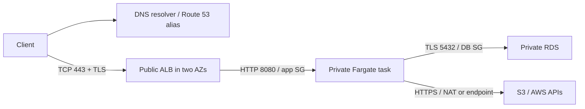

# 01 — The AWS mental model, identity, and networking

[Guide index](README.md) · [Next: service decisions](02-architecture-and-services.md)

## 1. AWS is APIs controlling resources inside boundaries

An AWS account is an ownership, permission, quota, and billing-attribution boundary. A region is a geographic deployment boundary. An Availability Zone (AZ) is an isolated infrastructure location within a region; deploy across AZs to survive a location failure. A subnet occupies **one AZ**; a VPC spans a region. Region names are stable identifiers (`us-east-1`); an AZ's letter can map differently between accounts—use AZ IDs for cross-account alignment. [Regions and AZs](https://docs.aws.amazon.com/global-infrastructure/latest/regions/aws-regions-availability-zones.html).

Think of an AWS API request as:

```text
principal + temporary credentials + action + resource + region + context
                ↓ authenticate / authorize / quota check
          control-plane change → resource → data-plane traffic
```

Creating an ECS service is a **control-plane** operation. Serving an HTTP request from a running task is **data-plane** work. A control-plane outage need not stop existing data-plane traffic; designs that must constantly create resources or resolve new credentials can still be affected. Keep these dependencies explicit.

| Concept                   | Backend-engineer translation                                                     | Practical consequence                                                                             |
| ------------------------- | -------------------------------------------------------------------------------- | ------------------------------------------------------------------------------------------------- |
| Resource                  | Managed object with configuration and lifecycle                                  | A bucket, queue, task, database, or role has an owner and deletion behavior                       |
| ARN                       | Typed resource identifier, often `arn:partition:service:region:account:resource` | Policy resource scopes need the correct ARN shape; S3 bucket ARNs omit region/account             |
| API / SDK / CLI / Console | Different clients of service APIs                                                | A console success does not imply your task role is authorized                                     |
| IAM principal             | Identity making a request: user, role session, service, federated identity       | Identify the caller before debugging permission errors                                            |
| IAM role                  | Assumable identity with temporary credentials                                    | Trust answers who may assume it; permissions answer what a session may do                         |
| Organization / OU         | Account governance tree and organizational units                                 | Central billing and guardrails; not a network                                                     |
| Global service            | IAM, Route 53 DNS, CloudFront have global aspects                                | Resources and API endpoints still have service-specific region rules                              |
| Regional service          | ECS, RDS, VPC, most workloads                                                    | Recheck region when a resource seems missing; S3 buckets have a home region despite global naming |
| Quota                     | Account/region/service-specific capacity or API ceiling                          | Check Fargate vCPU, public IP, ENI, database, and request-rate headroom before launch             |
| IaC                       | Versioned desired state reconciled through APIs                                  | A Git diff is intent; plan/change set reveals replacement and deletion effects                    |

For an unfamiliar service ask: **scope? principal? network path? durable state? failure domain? scaling unit? quotas? unit of billing? audit trail? backup/export?** This is more useful than memorizing product names.

## 2. Account foundation before a workload

**AWS best practice:** keep workloads out of the Organizations management account. Use member accounts for sandbox/development, staging, production; add security/log archive accounts as operating needs grow. The management account owns organization administration and consolidated billing and is unusually powerful: SCPs do not constrain its identities. [Management account guidance](https://docs.aws.amazon.com/organizations/latest/userguide/orgs_best-practices_mgmt-acct.html).

```text
Organization / management account — billing and governance only
├── Security OU: log archive, security administration
├── Nonproduction OU: sandbox/dev, staging
└── Production OU: production workload account(s)
       humans ← Identity Center / federation
       deployments ← tightly scoped deployment role
```

Small-team trade-off: begin with management + sandbox + production; add accounts when isolation, team ownership, compliance, and blast radius justify them. Separate VPCs or resource tags are not substitutes for account separation. Control Tower MAY automate a landing zone; understand its controls, costs, and account lifecycle first. [Multi-account best practices](https://docs.aws.amazon.com/organizations/latest/userguide/orgs_best-practices.html).

### Bootstrap checklist

- [ ] Register organization-controlled root email/phone; secure the email account itself. Store recovery procedures with two authorized people, not one employee's inbox.
- [ ] Protect root with MFA; create no root access keys. Use root only for tasks that require it. Evaluate centralized root access for member accounts; preserve tested recovery access to the management account.
- [ ] Enable IAM Identity Center; connect your IdP or create individual identities. Assign group-based permission sets: read-only, development, constrained deployment, emergency administration.
- [ ] Create member accounts and select allowed regions based on residency, latency, service availability, and cost. Record account IDs, owners, and recovery contacts.
- [ ] Test read-only and privileged access; document emergency access independent of a failed primary IdP. Alert on its use.
- [ ] Enable account/organization audit logging with protected retention; configure billing contacts, budgets, and Cost Anomaly Detection recipients who actually respond.
- [ ] Apply SCP guardrails in a test OU first. Protect logging and restrict high-risk operations while allowing required global-service actions. An allow in an SCP never grants permission.
- [ ] Choose a support plan against business impact and response requirements; verify current plans in [currency notes](05-sources-and-currency.md). Basic support is not a substitute for a production incident escalation path.
- [ ] Review quotas in the intended region and request increases ahead of load tests. Tag resources with owner, environment, service, and cost center.
- [ ] Select IaC, state ownership, review gates, deletion protection, and backup policy before creating databases.

[Root security](https://docs.aws.amazon.com/IAM/latest/UserGuide/root-user-best-practices.html) · [Identity Center](https://docs.aws.amazon.com/singlesignon/latest/userguide/what-is.html) · [Service Quotas](https://docs.aws.amazon.com/servicequotas/latest/userguide/intro.html).

## 3. IAM: two questions, several policy layers

**Authentication:** who signed this API request? **Authorization:** may that principal perform this action on this resource under these conditions? IAM is AWS authorization, not your application's tenant authorization. A task allowed to read S3 still MUST validate which customer may download a file.

| Building block                     | Use                                                                 | Frequent confusion                                                     |
| ---------------------------------- | ------------------------------------------------------------------- | ---------------------------------------------------------------------- |
| User / group                       | A persistent IAM identity / collection of users sharing permissions | Groups cannot be assumed; human federation is preferred over IAM users |
| Role / role session                | Temporary assumed identity                                          | An application role is not a password or permission group              |
| Identity policy                    | Actions allowed to a user/role                                      | Does not make another account trust it                                 |
| Resource policy                    | Bucket, queue, key, etc. names allowed principals                   | Can grant cross-account access; service semantics vary                 |
| Trust policy                       | Resource policy on a role defining who may assume it                | Trust alone does not grant workload API permissions                    |
| Permissions boundary               | Maximum permissions for an IAM identity                             | Delegation guardrail, not a grant                                      |
| Session policy                     | Further restricts a particular assumed session                      | Cannot add permissions beyond the role                                 |
| SCP / resource control policy      | Organization guardrails on principals / supported resources         | Neither is a permission grant; scope and exceptions matter             |
| Service role / service-linked role | Lets an AWS service operate on your behalf                          | Different from a task's application permissions                        |

**Evaluation model:** start with implicit deny. Find applicable allows and restrictions. An applicable explicit deny wins. For ordinary identity-based access, identity allows are bounded by session policy, permissions boundary, and organization controls. For cross-account access, the caller side and resource/trust side must authorize it. Same-account resource policy grants have nuances: grants directly to an IAM user or role **session** differ from grants to a role ARN and can bypass some _implicit_ denials. KMS also has key-policy rules. Do not reduce evaluation to “all policies are intersected” or “any allow wins.” Use the exact principal ARN and [AWS evaluation logic](https://docs.aws.amazon.com/IAM/latest/UserGuide/reference_policies_evaluation-logic.html).

### Example A: application reads only one S3 prefix

Replace the bucket name before use. This is an **identity policy on the task role**, not a bucket policy.

```json
{
  "Version": "2012-10-17",
  "Statement": [
    {
      "Sid": "ListInvoicePrefix",
      "Effect": "Allow",
      "Action": "s3:ListBucket",
      "Resource": "arn:aws:s3:::example-company-prod-files",
      "Condition": {
        "StringLike": { "s3:prefix": ["invoices/", "invoices/*"] }
      }
    },
    {
      "Sid": "ReadInvoiceObjects",
      "Effect": "Allow",
      "Action": "s3:GetObject",
      "Resource": "arn:aws:s3:::example-company-prod-files/invoices/*"
    }
  ]
}
```

Line-by-line fields: `Version` selects the policy language (not your policy revision). `Statement` is the rule list. `Sid` labels a rule. `Effect` grants rather than denies. `Action` identifies the API permission. `Resource` restricts its target. `Condition` restricts list requests to the allowed prefix. Bucket listing uses a **bucket ARN**; object retrieval uses an **object ARN**. No write, delete, version retrieval, or arbitrary bucket listing is granted. SSE-KMS objects additionally need suitable KMS authorization. Validate with [Access Analyzer policy validation](https://docs.aws.amazon.com/IAM/latest/UserGuide/access-analyzer-policy-validation.html); test both allowed and denied requests.

### Example B: GitHub deploys through OIDC

Create the GitHub OIDC provider in the deployment account. Substitute account, organization, repository, and protected environment. This is a **deployment role trust policy**:

```json
{
  "Version": "2012-10-17",
  "Statement": [
    {
      "Effect": "Allow",
      "Principal": {
        "Federated": "arn:aws:iam::111122223333:oidc-provider/token.actions.githubusercontent.com"
      },
      "Action": "sts:AssumeRoleWithWebIdentity",
      "Condition": {
        "StringEquals": {
          "token.actions.githubusercontent.com:aud": "sts.amazonaws.com",
          "token.actions.githubusercontent.com:sub": "repo:YOUR_ORG@OWNER_ID/YOUR_REPO@REPO_ID:environment:production"
        }
      }
    }
  ]
}
```

**Current GitHub subject format:** the example uses immutable owner/repository IDs. Existing repositories may still use `repo:YOUR_ORG/YOUR_REPO:environment:production`; customized subjects can differ again. Check your repository’s OIDC settings/subject preview and match the actual subject exactly—do not fix a mismatch with a wildcard. New repositories and renames/transfers adopt the immutable format under GitHub’s July 2026 rollout. [GitHub subject rollout](https://github.blog/changelog/2026-04-23-immutable-subject-claims-for-github-actions-oidc-tokens/).

`Principal.Federated` trusts that specific provider. `Action` permits token exchange, not ECS access. `aud` targets AWS STS. `sub` binds the repository and environment; when using an environment, the subject does not itself bind a branch—configure environment branch restrictions and reviewers. Attach a separate deployment permission policy scoped to the service, ECR repository, and permitted task/execution roles. `iam:PassRole` MUST be restricted to those roles and the intended service. A role that can update a workload or pass an admin role can indirectly gain its privileges. [AWS GitHub federation guidance](https://docs.aws.amazon.com/IAM/latest/UserGuide/id_roles_create_for-idp_oidc.html).

### Credential paths

- **Local:** `aws configure sso --profile aws-lab`, then `aws sso login --profile aws-lab`; SDK default credential providers use the profile. Remove stale exported access keys that override the profile. Check `aws sts get-caller-identity` before a mutation.
- **EC2:** attach a role through an instance profile; SDK obtains renewable credentials from instance metadata. Require IMDSv2 and restrict metadata exposure.
- **ECS:** SDK obtains task-role credentials from the task credential endpoint. The **execution role** pulls ECR images, writes logs, and fetches injected secrets; the **task role** authorizes your application. Do not swap them.
- **Lambda:** execution role credentials are supplied to the runtime; no application-managed access key is needed.
- **CI:** GitHub/GitLab OIDC token → STS → short-lived role session. AWS-native CodeBuild/CodePipeline uses service roles. Never give untrusted fork code privileged deployment credentials.
- **Cross-account:** source role has `sts:AssumeRole` on the destination role, whose trust policy accepts the intended source. Destination role grants destination operations. Prefer directly federating a constrained CI role in each environment when appropriate.

SDK credential chains refresh temporary credentials; avoid manually copying them into config. Some platforms deliberately expose temporary credentials in environment variables—this is different from committing permanent keys. Where long-lived keys cannot be eliminated, inventory ownership, rotate and revoke them, audit usage, and store them in a secret manager. [Temporary credentials](https://docs.aws.amazon.com/IAM/latest/UserGuide/id_credentials_temp.html) · [ECS role separation](https://docs.aws.amazon.com/AmazonECS/latest/developerguide/security-iam-roles.html).

## 4. Networking: packet paths before product names

An IP identifies an interface. A CIDR describes an address range: `10.20.0.0/16` contains smaller ranges such as `10.20.10.0/24`. Choose ranges that will not overlap future VPN, peering, or office networks. Routing selects a next hop by destination (usually longest prefix). Firewalls decide whether traffic is permitted; they do not create routes.

| AWS object               | Configure                                                  | Security/operations/cost implication                                                                |
| ------------------------ | ---------------------------------------------------------- | --------------------------------------------------------------------------------------------------- |
| VPC                      | CIDR, DNS support, DNS hostnames                           | Regional network; not a universal perimeter around AWS APIs                                         |
| Subnet                   | AZ, CIDR, route-table association                          | Reserve IP space for scaling and rolling deployments; AWS reserves addresses                        |
| Public subnet            | Default route to Internet Gateway (IGW)                    | A workload still needs public addressing and permissive SG rules to be internet reachable           |
| Private subnet           | No direct IGW route; optional NAT/endpoints                | “Private” does not mean no internet egress                                                          |
| Isolated subnet          | Local/private routes only                                  | Good DB placement; ensure required management/service paths                                         |
| IGW                      | Attach to VPC; route to it                                 | IPv4 internet reachability uses public IP mapping; not NAT for arbitrary private-only hosts         |
| Zonal public NAT gateway | Public subnet, Elastic IP, private route to it             | Outbound IPv4 translation, not unsolicited inbound; per-time/data processing, IP and transfer costs |
| Regional NAT gateway     | Regional mode and its routing configuration                | Current alternative; different setup, expansion behavior and per-AZ billing—see currency notes      |
| Elastic IP               | Allocated static public IPv4 address                       | Billed public address; not a firewall or load balancer                                              |
| Security group (SG)      | Stateful allow rules on interfaces                         | Return traffic is allowed; SG references identify workloads, not users                              |
| Network ACL              | Ordered allow/deny rules on subnet boundary                | Stateless: account for return ephemeral ports; keep simple unless a requirement needs it            |
| Gateway endpoint         | S3/DynamoDB prefix-list routes and endpoint policy         | Avoids NAT for supported traffic; no gateway-endpoint hourly charge                                 |
| Interface endpoint       | PrivateLink ENIs, SG allowing 443, private DNS             | Per-AZ hours and bytes; private access to specific services, not general internet                   |
| Route 53                 | Public/private hosted zones, aliases, resolver integration | DNS answers are not routing/firewall permissions; split DNS needs resolver reachability             |

[Routing examples](https://docs.aws.amazon.com/vpc/latest/userguide/route-table-options.html) · [Security groups](https://docs.aws.amazon.com/vpc/latest/userguide/vpc-security-groups.html) · [Endpoints](https://docs.aws.amazon.com/vpc/latest/privatelink/concepts.html).

**Zonal NAT trade-off:** one NAT is a learning cost shortcut and an AZ dependency. Same-AZ NAT per workload AZ reduces cross-AZ dependencies and transfer; current regional NAT is another option. Compare endpoints against actual traffic and fixed costs, not “private is always cheaper.” A Fargate task without internet needs the appropriate ECR API/Docker endpoints, S3 image-layer path, Logs, and Secrets Manager endpoints, plus any endpoints used by its app; otherwise image pull or initialization fails. [Fargate networking](https://docs.aws.amazon.com/AmazonECS/latest/developerguide/fargate-task-networking.html).

IPv6 requires its own routes and SG rules. An egress-only IGW provides outbound-initiated IPv6 without IPv4 NAT. Do not accidentally expose IPv6 while carefully restricting IPv4.

### Trace `https://api.example.com/orders`



1. Resolver obtains Route 53's alias answer; cached DNS answers follow TTL semantics. DNS is a lookup, not an HTTP traffic hop.
2. Client connects to an ALB public address. Routing, ALB SG, and NACLs must permit TCP 443.
3. ALB presents an ACM certificate matching the hostname; TLS terminates here. Listener rules select an **IP-type** target group for Fargate.
4. ALB makes a separate connection to the private task IP. Task SG allows 8080 **from ALB SG only**. The process must listen on `0.0.0.0:8080`, not loopback. NAT is not on this inbound path.
5. Task resolves the RDS endpoint, connects to 5432 allowed by DB SG from task SG, verifies the DB TLS certificate, and authenticates as a restricted database user. IAM network permissions do not grant SQL permissions.
6. Responses follow the established connections. ALB may use forwarded headers; trust those only from the known proxy boundary. Preserve correlation IDs across application/database/event operations.

ALB→task HTTP is a **context-dependent** choice within a restricted network; it is not end-to-end TLS. Use HTTPS targets or service-level TLS where your threat model requires it. Request-body encryption and application authorization remain your responsibility.

### A private application

Use an internal ALB, private hosted zone, and private clients via VPN/Direct Connect/peering/transit routing as appropriate. An internal ALB does not make its name resolve correctly in an office: configure DNS resolver forwarding. Another option is API Gateway with private backend integration; **private integration does not make the public API private**. Private API endpoints have their own supported API type, VPC endpoint, and resource-policy requirements. [Private APIs](https://docs.aws.amazon.com/apigateway/latest/developerguide/apigateway-private-apis.html).

### Diagnose one boundary at a time

```bash
# Set this to your actual hostname; run from the affected client network.
API_HOST=api.example.com
dig +short "$API_HOST"
dig +trace "$API_HOST"
curl --connect-timeout 5 -sv "https://$API_HOST/healthz"
openssl s_client -connect "$API_HOST:443" -servername "$API_HOST" -verify_return_error </dev/null
# From an authorized host/task INSIDE the VPC:
nc -vz "$DB_HOST" 5432
getent hosts "$DB_HOST"
```

DNS failure → zone/delegation/resolver; timeout → route/SG/NACL/listener; refused → reachable host without listener; TLS error → hostname/chain/expiry/time; HTTP error → proxy/target/application. `ping` is inconclusive for services that do not answer ICMP. Use VPC Reachability Analyzer for configuration-path analysis and VPC Flow Logs for accepted/rejected flows; neither proves application health or records request bodies. Never “debug” by opening RDS to `0.0.0.0/0`.

## 5. Layered API security

| Layer           | Minimum useful control                                                  | What it does not replace                               |
| --------------- | ----------------------------------------------------------------------- | ------------------------------------------------------ |
| Identity        | Federation, MFA, scoped task/deploy roles                               | Application authentication and tenant authorization    |
| Edge            | HTTPS, optional WAF managed/rate rules, body/timeout limits             | Secure application code or business abuse controls     |
| Network         | Public ALB only; private tasks; isolated DB; SG-to-SG access            | IAM, SQL grants, and encryption                        |
| Data            | S3 public blocking, encryption, restricted DB user, recoverable backups | Protection against an authorized destructive operation |
| Keys/secrets    | KMS authorization; Secrets Manager rotation; no plaintext Git secrets   | Safe process/log handling after retrieval              |
| Audit           | Organization CloudTrail, protected retention; selected data events      | Application request logs—CloudTrail is API audit       |
| Detection       | GuardDuty findings; Security Hub posture/exposure triage; Config rules  | An incident responder and tested response runbook      |
| Vulnerabilities | ECR/Inspector scans, dependency updates, rebuilt images                 | Automatic fixing of every vulnerable dependency        |

KMS is an authorization and key-management service, not a place to store arbitrary application secret strings. Customer-managed keys provide lifecycle/policy control but add cost and recovery dependencies; deleting/losing access to a key can make backups unusable. Secrets Manager is appropriate for credentials with managed retrieval/rotation; Parameter Store fits structured configuration and some encrypted values, with different tier/throughput/rotation capabilities. [Secrets best practices](https://docs.aws.amazon.com/secretsmanager/latest/userguide/best-practices.html) · [AWS Security Reference Architecture](https://docs.aws.amazon.com/prescriptive-guidance/latest/security-reference-architecture/welcome.html).
