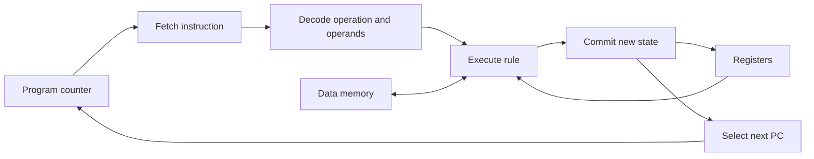

# How does a CPU execute an instruction?

A CPU is a machine whose instruction rules transform state. For one instruction, identify the input state, fetch an instruction using the program counter, decode its meaning, read operands, compute a result, commit changes, and select the next instruction. Hardware implements these rules with circuits; a simulator can expose them as an explicit function.

## Mental model



The starter machine has four byte registers, 32 bytes of data memory, a separate 16-byte stack, and a program counter measured in **instruction indexes**. Registers and stored values range from 0 to 255. Arithmetic wraps modulo 256. The instruction list is separate from data memory; this is a teaching choice, not a description of all computers.

## Instruction contract

| Instruction | Transition |
| --- | --- |
| `MOV Ra n` | Register a receives an immediate byte |
| `ADD Ra Rb` | a receives `(a + b) mod 256` |
| `SUB Ra Rb` | a receives `(a - b) mod 256` |
| `LOAD Ra address` | a receives the addressed memory byte |
| `STORE Ra address` | Addressed memory receives a |
| `PUSH Ra` / `POP Ra` | Move a byte to/from the separate stack |
| `JNZ Ra index` | Branch to an instruction index if a is nonzero |
| `HALT` | Mark halted; PC remains at HALT |

Other successful instructions advance PC by one unless a branch is taken. Invalid operands fail while loading. Stack faults and falling off the program reject the entire attempted transition, preserving the input state. There are no flags. SP is `16 - stack.length`; it describes remaining stack capacity rather than a data-memory address.

## Worked prediction

Before `ADD R0 R1`, suppose PC=2, R0=250, and R1=10. After it, R0=4, R1=10, and PC=3, provided instruction 3 exists. The result wraps because a byte has 256 possible bit patterns. The CPU does not discover the mathematical result is 260 and dynamically allocate a larger register.

The supplied program adds 3 + 2 + 1, stores 6 in memory[0], and moves 6 through the stack into R3. Predict the entire register/PC trace, then [open the lab](interactive/index.html). Edit registers and memory, set the PC, step, run with a limit, or change the program and load it.

## Code and experiment

The [JavaScript model](implementations/javascript/model.js) is shared by the browser and [instruction-trace experiment](experiments/instruction-trace/README.md).

```sh
node domains/computer-architecture/instruction-execution/experiments/instruction-trace/run.js
```

Requires Node.js 18+. HTML can be opened directly; it has no backend or external assets.

## Failure and real implementations

Try `POP R0` on an empty stack, a loop with no exit, or a program that falls off its last instruction. What should happen to the pre-instruction state? The bounded run protects the UI from an infinite loop without pretending the program terminated.

The toy omits byte encoding, instruction lengths, flags, privilege, exceptions, interrupts, memory translation, caches, pipelines, and instruction timing. For a real ISA, compare register and arithmetic rules with the [RISC-V unprivileged instruction specifications](https://docs.riscv.org/reference/isa/index.html). Choose a specific document version before a detailed source walkthrough. Instruction-level semantics do not determine the cycles needed by a particular microarchitecture.

## Next questions

1. Add a compare instruction and decide how its result becomes visible to a branch.
2. Encode instructions as bytes. How does this change PC and fetch?
3. Implement calls using a return-address stack. What extra state and invariants appear?
4. How do the same architectural rules survive pipelining or speculative execution?

Related topic IDs: `registers-and-alu`, `assembly`, `pipelines`, `virtual-machines`, and `system-calls`; browse them in [the index](../../../INDEX.md).
