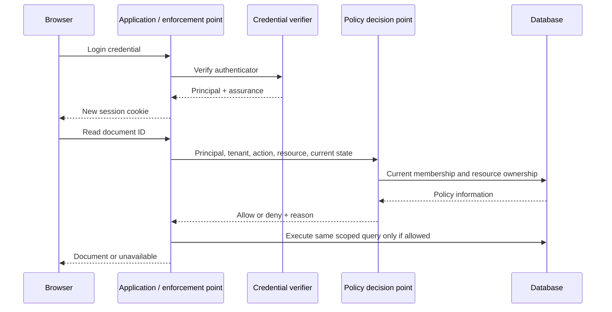
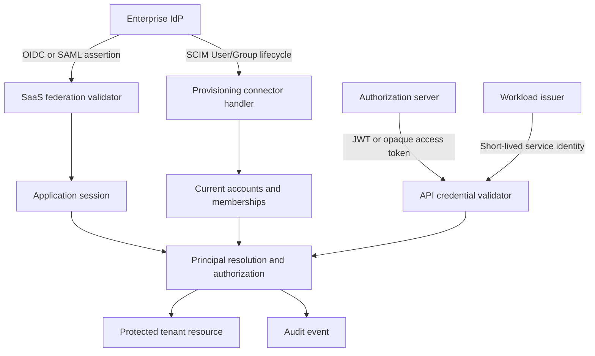

# Identity and access management from first principles

**Learner question:** How can a system establish who or what is making a request, determine what that entity may do, and enforce that decision across security boundaries—even after identities, permissions, keys and organizations change?

This is one progressive curriculum. Read chapters 1–8 before token protocols, run the corresponding [22 laboratory stages](iam-first-principles/README.md), then solve the [enterprise design challenges](DESIGN-CHALLENGES.md). The [threat workbook](THREATS.md), [database design](DATA-MODEL.md), and [source map](references/README.md) extend specific chapters. They are parts of this guide, not alternative introductions. Predict → run → inspect a failure → explain the invariant → change one assumption. Write your own observations; generated code is not evidence of personal mastery.

**Evidence language:** “Normative” identifies a protocol requirement; “BCP” identifies standards security advice; “pattern” identifies common architecture; “recommendation” identifies a design choice here; “model” identifies a bounded local implementation. A runnable model is not a certified protocol implementation or a production identity platform. [Implementation coverage](iam-first-principles/README.md) names exactly which mechanisms are modeled, integrated, or left to a mature provider.

## 1. Start with resources and boundaries

A document exists in a process, disk or database. A request crosses a boundary: browser → server, server → database, one organization → another. Without a rule, any caller able to send bytes could induce the server to read or alter the document. IAM turns those bytes into an accountable decision.

The smallest model is a reference monitor: intercept **every** sensitive operation, determine its security context, evaluate a policy, enforce the result. It must be difficult to bypass, preserve decision integrity, and remain inspectable. A login screen without checks on the document endpoint does not meet this model.

```text
resource/boundary → principal/identity → credential/authenticator → authentication
→ session/context → authorization/policy → delegation/federation
→ assertions/tokens → lifecycle/provisioning → application/API/workload IAM
```

Each layer exists because the previous layer leaves a question unanswered. An identity label does not prove who controls it; authentication does not say which document may be read; an authorization decision does not automatically execute safely; federation does not create or revoke local memberships.

Define a request context `C = (principal, authenticator, issuer, audience, tenant, time, assurance)`. Define a decision `D = policy(C, action, resource, current_state)`. Enforce `D` on the **same** resource and operation. The invariants are mediation, context binding, default deny and current authority. Omitted in the smallest model: distribution, policy changes during an operation, availability and audit durability.

**Exercise:** draw every boundary involved in exporting a document to object storage. Find an export worker that could bypass a web-controller check. Require the worker to resolve a scoped service identity and recheck the job’s authority.

## 2. Persons, accounts, identities and principals

A person is a real-world entity; an identity is a set of claims representing an entity in a context; an account is local application state; a principal is the entity to which a system attributes an operation. One person can control several accounts. One account can link several external identities. A principal may also be a service, application, workload instance, device, guest or anonymous caller. Anonymous access still needs a policy.

An email address is a mutable contact attribute, not an immutable global person identifier. Email verification proves control of a delivery channel at a time; aliases, shared mailboxes, reassignment and recovery weaken any inference about a unique human. Identity proofing asks how evidence binds an account to a real-world entity; authentication asks whether the current claimant controls an enrolled authenticator. Verification of a passport is different from verification of a password.

Use local immutable UUIDs and external identity keys `(trusted_provider_id, subject)`. For OIDC use the exact issuer and `sub`; for SAML include issuer, NameID format and applicable qualifiers. Linking requires fresh proof of control of both identities and an explicit transaction. Matching emails alone can transfer ownership to an attacker.

| Identity | Enrollment/trust root | Principal lifetime | Typical context |
| --- | --- | --- | --- |
| Human | account registration, proofing or federation | years | session with assurance |
| Application | client registration | deployment/product lifetime | client ID plus credential |
| Service | operator-managed service account | service lifetime | audience-bound token |
| Workload | attested execution environment | process/job lifetime | short-lived certificate/assertion |
| Device | enrollment and key possession | device lifecycle | certificate/passkey/device claims |
| Guest | explicit temporary invitation | bounded | limited local account/session |

**State machine:** invited → enrolled → active → suspended → deleted; authenticator and membership lifecycles run separately. A suspended organization membership need not delete the person’s other organization memberships. Predict what should happen to a user’s personal workspace when an employer offboards them.

## 3. Cryptography: guarantees before algorithms

A hash maps arbitrary bytes to a fixed-size digest. Preimage resistance impedes finding bytes for a digest; second-preimage resistance impedes substituting another message; collision resistance impedes finding any matching pair. A public hash provides no sender authenticity. Base64url only represents bytes; anyone can reverse it.

HMAC adds a secret key: `tag = HMAC(K, M)`. A valid tag indicates a holder of K authenticated these bytes, assuming key secrecy and algorithm security. Every verifier holding K can also forge tags: HMAC cannot distinguish which verifier issued one.

A signature uses `Sign(sk,M)` and `Verify(pk,M,sig)`. Verifiers can validate without the signing secret. A signature authenticates bytes under a key; deciding **whose** key it is requires trusted key distribution. It neither conceals M nor establishes whether its claims remain true.

Authenticated encryption, such as AES-GCM, protects confidentiality and detects alteration under a key. Use unique nonces for each key; nonce reuse can destroy the guarantee. HKDF derives purpose-specific keys from adequate input key material; it does not turn weak passwords into strong secrets. Password KDFs deliberately impose cost; ordinary hashing deliberately runs fast. [scrypt](https://www.rfc-editor.org/rfc/rfc7914.html) and [Argon2](https://www.rfc-editor.org/rfc/rfc9106.html) define established password functions.

For uniformly random n-bit tokens, a targeted guess succeeds with probability approximately `q / 2^n` after q attempts. Among k issued tokens, collision probability is approximately `k(k−1)/2^(n+1)` while this value is small. “64-character string” is not an entropy guarantee; randomness depends on generation. `crypto.randomBytes(32)` supplies 256 random bits; user-selected passwords do not have uniform entropy.

A nonce provides uniqueness/freshness **when the receiver checks its use**. A timestamp bounds acceptance **when authenticated and compared against a trustworthy clock**. Neither prevents replay by itself.

Run [stage 01](iam-first-principles/01-cryptography/README.md). It signs a message, rejects a modified message, derives an encryption key and performs AEAD. Change the message’s tenant and explain why successful signature verification still would not establish permission to access that tenant.

## 4. Passwords, factors and authentication assurance

Store a per-password random salt, algorithm, cost parameters and derived verifier. A salt prevents reuse of one precomputed attack across accounts; it is public. A memory-hard password KDF raises offline guessing cost; it cannot rescue a weak/reused password. A separately managed pepper adds a secret outside the password database but brings rotation and availability costs. Never create a custom password hash.

Stage 02 uses built-in asynchronous scrypt with explicit bounded costs. It is a readable mechanism example, not a benchmark-selected production setting. Choose deployment costs with representative concurrency and abuse limits. Handle unknown users with a dummy verifier to reduce obvious timing differences; return generic authentication failures; rate-limit online guessing. Password reset/recovery must be no easier to hijack than login.

Knowledge, possession and inherence are factor categories, not counts of screens. Password plus another password is one category. TOTP uses an enrolled shared secret and moving time counter: `HOTP(K, floor((t−T0)/step))`, dynamic truncation, then decimal reduction. Six digits yield only about 20 bits; bind attempts to a transaction, limit guesses, handle drift and reject reuse. The server must retrieve the TOTP secret, so protect it with encryption and restricted key access; hashing it makes verification impossible.

| Mechanism | What is proved | Threat/assurance limits | User/operational costs |
| --- | --- | --- | --- |
| Password | knowledge of a shared credential | phishing, reuse, offline guessing | familiar; reset/abuse operations |
| TOTP / OTP | enrolled secret or one-time delivery access | real-time phishing, replay if unchecked | enrollment, clock/recovery support |
| Email code | mailbox control | mailbox compromise, weak recovery | low friction; delivery delays |
| SMS code | phone-channel control | SIM swap, interception, number recycling | broad reach; telecom dependence |
| WebAuthn/passkey | RP-bound private-key use | compromised endpoint/recovery; authenticator policy matters | good UX; enrollment and device recovery |
| Hardware security key | hardware-bound key use | theft plus weak PIN/presence policy | strong possession; replacement logistics |
| Client certificate / mTLS | private-key possession under PKI trust | key extraction, issuance mistakes | lifecycle, revocation, trust bundles |
| API key / bearer token | possession of presented secret | copied credential can be replayed | simple; inventory and rotation |
| Signed request | key possession over selected request bytes | bad coverage/canonicalization or replay | signing libraries, nonce state |

Authentication assurance concerns authenticator strength; identity assurance concerns enrollment proofing; federation assurance concerns assertion delivery/trust. They must not be inferred from a provider’s brand. Consult [NIST SP 800-63-4](https://pages.nist.gov/800-63-4/) for the separate risk/assurance framework. Store `auth_time`, mechanism and assurance in trusted security context; sensitive changes may require recent **step-up** authentication. An authenticated session is evidence of a past event, not perpetual proof of present user intent.

## 5. WebAuthn, passkeys, certificates and TLS

WebAuthn registration sends a fresh challenge, RP ID and policy. The browser asks an authenticator to create a credential; the server verifies origin, challenge, RP binding and credential material before storing credential ID/public key. Authentication sends another fresh challenge; the authenticator signs authenticator data and a hash of client data. Verify signature, challenge, origin, RP ID hash, user-presence/user-verification requirements, and credential/account association. Use one-time server-side challenge state. Signature counters can help detect cloning but synced credentials may have different counter semantics.

FIDO2 combines WebAuthn and authenticator communication such as CTAP. Passkeys are discoverable public-key credentials, potentially synced or device-bound. The biometric normally unlocks local key use; the RP does not receive the biometric. Phishing resistance follows from origin/RP binding, not from “passwordless” as a label. Recovery, account linking and weak alternative login paths can undo the benefit. Use a maintained server/browser library for verification; this lab teaches the ceremony, not an authenticator implementation. [W3C WebAuthn](https://www.w3.org/TR/webauthn-3/) defines the API and verification algorithms; check that document’s published status before selecting new features.

A certificate binds names/attributes to a public key through an issuer’s signature. A chain connects that certificate to a configured trust anchor. TLS peers validate path, validity, hostname/service identity, usage and algorithms according to their stack and policy. A valid chain for another hostname is insufficient. Revocation policy and trust roots are separate configuration choices. TLS authenticates the server; mTLS additionally authenticates a client certificate. It does not automatically authorize application operations.

TLS termination at a proxy moves a boundary. Authenticate the proxy-to-app hop; only accept forwarded identity/address headers from a configured trusted proxy that strips attacker-supplied copies. Configure cookies from deployment policy rather than blindly trusting `X-Forwarded-Proto`.

## 6. A browser session is revocable security context

A server creates an unpredictable identifier after credential verification and stores its digest → user ID, authentication time, last activity, absolute expiry and CSRF state. The browser receives the raw identifier once in a cookie. Subsequent requests retrieve current state. Hashing a high-entropy session secret with SHA-256 is reasonable; hashing a low-entropy password this way is not.

```http
POST /login HTTP/1.1
Origin: https://app.example
Content-Type: application/json

{"email":"learner@example.invalid","password":"[not logged]"}

HTTP/1.1 200 OK
Set-Cookie: __Host-iam=[random]; Path=/; Secure; HttpOnly; SameSite=Lax
Cache-Control: no-store

GET /api/documents/doc-a?tenant=a HTTP/1.1
Cookie: __Host-iam=[random]

HTTP/1.1 200 OK

POST /logout HTTP/1.1
Origin: https://app.example
Cookie: __Host-iam=[random]
X-CSRF-Token: [session-bound proof]

HTTP/1.1 200 OK
Set-Cookie: __Host-iam=; Path=/; Secure; HttpOnly; SameSite=Lax; Max-Age=0

GET /me HTTP/1.1
Cookie: __Host-iam=[old random]

HTTP/1.1 401 Unauthorized
```

`Secure` restricts cookie transmission; `HttpOnly` denies script access to the cookie; `SameSite` controls cross-site attachment. `__Host-` requires Secure, Path=/ and no Domain. Domain/path scopes, browser policy, request method and site relationship govern cookie attachment. Same-site is not same-origin; sibling subdomains can be different origins but the same site.

Rotate identifiers at login and privilege changes to prevent fixation. Enforce idle **and** absolute timeouts in server state; cookie expiry alone is insufficient. Logout must invalidate the server entry. Global logout, suspension and password reset need a deliberate policy across sessions and refresh families. Per-device logout can revoke one session while retaining others.

Stages 03–04 isolate these rules; [the integration](../../projects/iam-saas/README.md) uses them on real requests. Its HTTP loopback cookie intentionally lacks Secure and `__Host-`; production requires HTTPS. Browser evidence is separate from model evidence. [OWASP session guidance](https://cheatsheetseries.owasp.org/cheatsheets/Session_Management_Cheat_Sheet.html) expands lifecycle and transport controls.

## 7. Browser attacks and storage choices

XSS executes attacker script in the application origin. It can read script-accessible storage and send authorized requests even when HttpOnly prevents cookie extraction. Prevent injection with contextual output encoding, reviewed sanitization and a restrictive CSP; limit third-party scripts. No token storage choice makes an XSS-compromised app trustworthy.

CSRF exploits ambient credentials: an attacker page induces a browser request with the victim’s cookie. Protect mutations with a session-bound unpredictable proof and exact Origin checks, with documented fallback behavior if Origin is absent. SameSite is defense in depth. Login CSRF can sign a victim into an attacker-owned account; bind pre-login transactions and check origin. GET must not change security state.

The same-origin policy limits script access across origins. It does not prohibit every cross-origin request or navigation. CORS controls whether a browser permits script to read/use certain cross-origin responses; it does not authenticate curl, authorize users, or replace CSRF. Credentialed CORS requires explicit allowed origins; never reflect arbitrary Origin with credentials.

| Storage | Script can read? | Automatically sent? | Decision implication |
| --- | --- | --- | --- |
| HttpOnly cookie | no | within cookie rules | protect CSRF; server-side revocation |
| localStorage | yes | no | persistent XSS token theft risk |
| sessionStorage | yes | no | tab-scoped, still XSS-readable |
| IndexedDB | yes | no | structured persistent storage, not secret vault |
| JS memory | yes to executing malicious code | no | less persistence, still compromised-origin risk |

A BFF holds OAuth tokens server-side and exposes a cookie session to the browser. This reduces direct token extraction but malicious same-origin script can still invoke BFF operations. A conventional same-origin application often needs sessions, not browser-held JWTs. Compare these boundaries with [OAuth browser architecture guidance](https://www.rfc-editor.org/rfc/rfc10017.html).

## 8. Authentication, authorization, provisioning and accounting



Authentication establishes a security context. Authorization decides whether a principal may perform an action on a resource. Accounting/auditing records events. Provisioning changes identities and assignments. Delegation grants another actor bounded authority. Federation allows independently administered systems to accept assertions under configured trust. None replaces the others.

A login succeeded at t₀. A membership was revoked at t₁. At t₂ a valid session resolves the same principal but its document request must fail. A token claim saying “admin” is an issuer statement at issuance; an application deciding “admin now” needs a policy on freshness and authority. Tests must include this separation.

## 9. Derive an authorization engine

Model `allow(p,a,r,c)` as a predicate, independent of token format. A resource lookup by ID alone is dangerous: the ID can name another tenant’s object. Bind the authenticated principal, selected tenant, current membership and resource’s stored tenant before evaluating permissions. Avoid “client says organization A, therefore access A”.

| Model | Smallest state/rule | Where useful | Failure to investigate |
| --- | --- | --- | --- |
| ACL | resource → principal/action entries | per-document sharing | orphaned entries after offboarding |
| DAC | owner can delegate resource rights | collaboration | owner grants more than allowed |
| MAC | centrally enforced labels/clearances | classified environments | untrusted attribute updates |
| RBAC | membership → role → permissions | organizational duties | role explosion, stale assignments |
| ABAC | policy over trusted attributes/context | department, classification, fresh MFA | missing/untrusted attributes |
| ReBAC | relationship tuples and bounded traversal | folders/groups/shares | cycles, stale edges, indirect leaks |
| Capability | unforgeable object/action authority | explicit narrow delegation | leaked capability and attenuation errors |
| Policy-based | explicit combined policy evaluation | complex rules/audit | ambiguous precedence |

RBAC hierarchy inherits permissions; reject cycles. An explicit-deny policy needs defined precedence: in this lab deny wins. Other policy systems use different combining algorithms; do not assume deny-always semantics universally. Default deny means unrecognized action/role/resource/context is denied. Least privilege reduces permitted operations; separation of duties prevents a requester from approving their own privileged action.

A **PAP** manages policy; a **PIP** supplies trusted facts; a **PDP** decides; a **PEP** enforces. They can be modules in one app. Centralizing the PDP aids consistency but introduces network availability, policy versioning and cache invalidation questions. Local evaluation reduces latency but risks divergent policy. Put the PEP close enough to the operation that alternate code paths cannot bypass it.

Run stages 05, 15 and 16. The ReBAC example bounds traversal and detects cycles; it is not a Zanzibar-equivalent service. Add a shared-folder edge, revoke it, and predict the effect on a previously authenticated reader.

## 10. Classify API actors before choosing credentials

A public client cannot keep a universally embedded secret confidential: browser/native code is delivered to users. A confidential server-side client can protect credentials under an operational boundary. A client ID identifies a registration; it is not a secret. First-party ownership does not make a shipped mobile binary confidential.

| Interaction | Recommended starting pattern | Credential/trust | Revocation/enforcement |
| --- | --- | --- | --- |
| Browser → same-origin app/API | session or BFF | HttpOnly cookie; CSRF | session store + live policy |
| Standalone SPA → API | code + PKCE when OAuth is needed | access token for API | short life; issuer policy; live grants |
| Native → API | external browser + code/PKCE | audience-scoped token | refresh family/device lifecycle |
| Server → external API | confidential OAuth or scoped key | secret/private key under server boundary | rotate credentials and grants |
| Third-party developer → customer API | delegated OAuth code + PKCE | customer grant + client registration | consent/grant revocation |
| Service → service | attested workload credentials where available | short-lived identity + target audience | workload issuer and service policy |

Basic auth transmits a Base64 representation of credentials on each request; TLS protects transport but repeated password exposure and replay remain. API keys authenticate a credential-bearing integration and can be individually scoped/expired/revoked; they do not inherently represent a human delegation. Do not put credentials in URLs. A bearer token is a usage property: possession suffices for presentation, subject to validation and policy. OAuth access tokens can be bearer or sender-constrained, JWT or opaque.

Authentication abuse limits and quotas need both network/client and principal dimensions. IP alone is unreliable behind shared NAT or a proxy; account-only limits permit denial of service. Bound request size, hashing concurrency, failures and enumeration; use adaptive controls without making recovery trivially hijackable.

## 11. Across gateway, application, service and database

```text
client -- TLS / credential --> gateway -- authenticated hop --> application
      -- audience-bound service/delegation context --> internal service
      -- least-privilege database connection / tenant-scoped query --> database
```

A gateway may reject invalid credentials and coarse scopes. The application owns object-level and tenant authorization. An internal service authenticates its caller and evaluates its own action/resource policy. The database constrains tenant relationships and can add row-level security. Do not assume a database connection’s service account identifies the end-user.

Blind token forwarding confuses audiences and multiplies exposure. A docs token should not become a billing credential merely because the docs service sends it. Authenticate the calling service independently; if user delegation is needed, carry a verified target-specific delegation context. OAuth [token exchange](https://www.rfc-editor.org/rfc/rfc8693.html) standardizes exchanging subject/actor tokens, but policy must constrain audience, scope and delegation versus impersonation.

A confused deputy has authority the caller lacks and uses it for the caller’s arbitrary target. Prevent it by binding caller, target resource, tenant and allowed action; reject arbitrary destinations; distinguish service identity from user context. A trusted proxy header must not be accepted directly from an internet client. AI/ML backends add a related boundary: model output proposing a tool action is untrusted input, never evidence of user authorization. Authorize retrieval, tool calls and exports with the same resource policy as ordinary API requests.

## 12. Token formats: JWT, JWS, JWE and keys

JWT defines a claims representation. JWS authenticates content with a signature/MAC; JWE encrypts authenticated content. JWA specifies algorithms; JWK represents a key; JWKS is a set of JWKs. A compact signed JWT usually has three Base64url segments; compact JWE has five. A nested JWT can sign then encrypt, with explicit inner/outer type and validation; it is unnecessary for many API contexts.

```text
base64url({"alg":"RS256","kid":"k1","typ":"at+jwt"})
.
base64url({"iss":"https://idp.example","sub":"alice","aud":"urn:docs",
           "iat":1000,"nbf":1000,"exp":1060,"jti":"unique-id"})
.
base64url(signature over ASCII(firstSegment + "." + secondSegment))
```

This is a constructed example; it is not a usable credential. The lab generates real tokens ephemerally and does not write them to audit logs. RS256 uses the registered RSA signature algorithm; do not substitute a home-grown RSA encoding. A JOSE library handles encoding, algorithm rules and signature verification.

| Claim | Interpretation/check | What it does not establish |
| --- | --- | --- |
| `iss` | exact configured issuer | trust just because URL is present |
| `sub` | subject in issuer’s namespace | global person or membership |
| `aud` | intended recipient(s); require your identifier | permission for every recipient resource |
| `exp` | reject at/after expiration with bounded skew | immediate revocation |
| `nbf` | reject before activation | uniqueness |
| `iat` | issuance time; add max-age/future policy where needed | automatic expiration |
| `jti` | identifier for replay/revocation state | replay prevention without state |

Registered claims are not all universally mandatory in generic JWT. The selected profile determines requirements. The lab intentionally requires sub/iat/exp/nbf/jti, fixed issuer/audience/algorithm/type; this is its profile. The complete OAuth JWT access-token profile additionally defines required claims such as `client_id`; the toy issuer is not an RFC 9068 implementation. See [JWT](https://www.rfc-editor.org/rfc/rfc7519.html), [JWS](https://www.rfc-editor.org/rfc/rfc7515.html), [JWE](https://www.rfc-editor.org/rfc/rfc7516.html), [JWK](https://www.rfc-editor.org/rfc/rfc7517.html), [JWA](https://www.rfc-editor.org/rfc/rfc7518.html) and [access-token profile](https://www.rfc-editor.org/rfc/rfc9068.html).

## 13. Validation, algorithm confusion and key rotation

Decoding only recovers claims. Validation authenticates bytes **and** checks the intended context. The verifier fixes allowed algorithms independent of token-provided `alg`; rejects unsigned/unexpected types; looks up keys only in the trusted issuer’s key set; checks issuer, audience and time; then resolves the principal and authorizes the resource. Never use an untrusted `jku`, `x5u` or arbitrary `kid` as a file path or fetch destination.

Algorithm confusion occurs when the verifier interprets a key intended for one algorithm as another algorithm’s key—for example treating a public RSA key as an HMAC secret. Use algorithm allowlists and key-type checks, distinct validation rules for distinct token uses, and established JOSE libraries. [JWT security BCP](https://www.rfc-editor.org/rfc/rfc8725.html) documents these controls.

Key rotation is a state transition: publish new public key → allow caches to learn it → start signing with new key → retain old verification key through old-token lifetime plus skew/cache overlap → retire old key. Key compromise is different: revoke trust immediately, knowingly invalidating affected tokens; evict caches, rotate signing secrets, investigate forged-token exposure and reauthenticate as needed. Normal cache overlap is unsafe during a compromise.

JWKS caches improve availability but create revocation delay. Unknown-kid refresh must be bounded to prevent request amplification. Pin trusted metadata endpoints, timeouts and cache lifetimes; avoid attacker-controlled discovery URLs and SSRF. Test cache behavior across old/new keys and metadata outages.

Stages 07–08 implement signing/decoding/rejection and real loopback JWKS retrieval. Stage 14 shows why a signature-valid token remains valid locally after a refresh family is revoked. Base64 adds roughly 4/3 size before signatures; large claims increase transport/logging risk. Keep secrets and unnecessary personal data out of signed readable payloads.

## 14. OAuth begins with delegation, not login

A customer wants a reporting application to read documents without receiving their SaaS password. The resource owner has rights; the client seeks bounded access; the authorization server mediates consent and issues credentials; the resource server validates those credentials and authorizes each operation. An authorization server can use an IdP internally, but these roles are conceptually distinct.

A grant is authority presented to obtain tokens. An access token is a credential used at a resource server. A refresh token is a credential used at the authorization server to obtain fresh tokens. “Grant type” and “token format” are independent dimensions. An authorization code is short-lived, one-use and bound to a client/redirect/transaction; it is not an access token.

```mermaid
sequenceDiagram
 participant U as User/browser
 participant C as Client
 participant AS as Authorization server
 participant RS as Resource server
 C->>U: Redirect with state and PKCE challenge
 U->>AS: Authorization request
 AS->>U: Authenticate + show requested access
 U->>AS: Approve bounded grant
 AS-->>U: Redirect to exact registered URI with code
 U->>C: Callback with code/state
 C->>AS: Code + verifier + redirect URI (+ client authentication)
 AS-->>C: Access token (+ refresh token)
 C->>RS: Bearer access token, requested action/resource
 RS->>RS: Validate audience/issuer/time; evaluate current authorization
 RS-->>C: Authorized resource
```

A consent screen is a user decision about a specific client/resource/scope, not a universal authorization override. Scope names express delegated permissions defined by an ecosystem; a `document:read` scope still requires document ownership/sharing and tenant policy. Resource indicators constrain intended APIs. Exact redirect registration prevents sending credentials to an arbitrary destination. Invalid redirect requests must not be redirected to the untrusted supplied URI.

Read [OAuth 2.0](https://www.rfc-editor.org/rfc/rfc6749.html), [bearer-token usage](https://www.rfc-editor.org/rfc/rfc6750.html) and [resource indicators](https://www.rfc-editor.org/rfc/rfc8707.html). The local code store exposes bindings; the maintained local OIDC provider exposes real protocol endpoints.

## 15. Grants and the current security baseline

| Grant | Principal/actor | Apply when | Important restriction |
| --- | --- | --- | --- |
| Authorization code | user authorizes client | browser/native/server delegation | public clients use PKCE; confidential clients also recommended |
| Client credentials | client acts as itself | M2M service account | no inferred human subject/consent |
| Refresh token | continuation of established grant | fresh limited access tokens | bind client, rotate or sender-constrain where required |
| Device authorization | user approves on another device | CLI/limited input devices | polling, expiry, user-code phishing defenses |
| Password credentials | client collects user password | historical integration | do not use; breaks separation and modern authentication |
| Implicit | access token returned through browser redirect | historical browser apps | avoid; use code/PKCE |

Current security BCP requires PKCE for public code-flow clients, recommends it for confidential clients, requires exact redirect matching with the native loopback-port exception, and prohibits the resource-owner-password grant. Public-client refresh tokens require rotation or sender constraint under the BCP conditions. Use [RFC 9700](https://www.rfc-editor.org/rfc/rfc9700.html), not a tutorial presenting legacy grants as equal modern choices.

Bind client authentication separately from PKCE. Confidential clients can use client secrets, mTLS or `private_key_jwt`; the last signs a short-lived client assertion with correct audience, subject/client ID, time and replay controls. Public clients do not gain confidentiality by embedding a secret.

Device flow: POST device authorization → receive device/user codes and verification URI → user authenticates/approves elsewhere → device polls at allowed interval → token or authorization_pending/slow_down/expired_token. Never treat knowledge of a displayed user code as a strong user authenticator. [Device grant](https://www.rfc-editor.org/rfc/rfc8628.html) and [native-app BCP](https://www.rfc-editor.org/rfc/rfc8252.html) describe specialized flows.

OAuth metadata publishes endpoints/capabilities under a trusted issuer. Discover only from preapproved configuration; do not accept arbitrary tenant input as a trusted issuer. Mix-up defenses identify which authorization server produced a response, e.g. an expected `iss` per [RFC 9207](https://www.rfc-editor.org/rfc/rfc9207.html). OAuth 2.1 draft/version status must be checked at implementation time; this curriculum’s security baseline is published BCP plus the cited specifications, not an assumed new version number.

## 16. PKCE and transaction correlation

The code may traverse browser/OS redirect handling. An attacker who intercepts it can redeem it unless another secret binds redemption to the initiating transaction. Generate a cryptographically random verifier v, retain v in transaction state, and send `challenge = BASE64URL(SHA256(ASCII(v)))` with method S256. At the token endpoint the server hashes the submitted verifier and compares with the code-bound challenge. Validate verifier syntax/entropy and prevent downgrade/missing-challenge paths. [PKCE specification](https://www.rfc-editor.org/rfc/rfc7636.html).

```http
GET /authorize?response_type=code&client_id=lab-client&redirect_uri=https%3A%2F%2Fapp.example%2Fcallback&scope=document%3Aread&state=[fresh]&code_challenge=[S256]&code_challenge_method=S256

HTTP/1.1 302 Found
Location: https://app.example/callback?code=[one-use]&state=[same]

POST /token
Content-Type: application/x-www-form-urlencoded

grant_type=authorization_code&client_id=lab-client&code=[one-use]&redirect_uri=https%3A%2F%2Fapp.example%2Fcallback&code_verifier=[secret]

HTTP/1.1 200 OK
Cache-Control: no-store
{"access_token":"[secret]","token_type":"Bearer","expires_in":300}
```

PKCE proves possession of a per-transaction secret, not a global application identity. The verifier **does** travel to the authorization server over the protected token exchange. State correlates callback to browser transaction; nonce binds an OIDC assertion to that transaction. Their mechanisms differ. Properly transaction-bound PKCE/nonce can supply CSRF defenses under the security BCP; this lab still uses fresh state as an explicit correlation defense.

Stage 10 uses the RFC test vector, rejects an intercepted code with a wrong verifier, and allows the legitimate redemption once. It does not protect stolen access tokens, a compromised client, verifier theft through XSS, a malicious AS, or unsafe redirect configuration. Explain which attacker observation is removed by S256 versus plain.

## 17. OIDC supplies authentication semantics

OAuth does not standardize a client’s evidence of an end-user login. OIDC adds an OpenID Provider (OP), Relying Party (RP), `openid` scope and ID token. The ID token addresses the RP client, describes an authentication event and carries issuer-scoped subject claims. The access token addresses a resource server; the refresh token addresses the token endpoint; the application session addresses local application state. Do not substitute these artifacts.

| Artifact | Recipient/use | Required trust question |
| --- | --- | --- |
| ID token | RP authenticates end-user | did this trusted OP authenticate this subject for this client/transaction? |
| Access token | API request authority | issued for this API/use, with permitted delegation? |
| Refresh token | token endpoint renewal | current grant/client/family still valid? |
| Application session | browser continuity | local account and session still active? |

Validation fixes issuer and permitted algorithms, verifies signature and times, checks audience including multi-audience/`azp` rules, matches nonce, and honors requested freshness/assurance. `auth_time` records authentication time; `max_age` requests freshness; `prompt` controls interaction; `acr` identifies an assurance/context class; `amr` lists methods. Interpret assurance only under an explicit provider contract. `profile` and `email` request claim sets; disclosure/availability depends on OP policy. UserInfo’s `sub` must match the validated ID token. Public subjects are shared across clients; pairwise subjects reduce cross-client correlation.

[OIDC Core with errata](https://openid.net/specs/openid-connect-core-1_0-errata2.html) defines these rules; [Discovery](https://openid.net/specs/openid-connect-discovery-1_0.html) binds issuer metadata and JWKS. Stage 11 uses `openid-client` with explicit signature checks and a local `oidc-provider`. The provider’s built-in development UI accepts arbitrary account names; it is a test issuer, not password authentication. The RP links `(issuer, alice)` to a fixture account, never by email.

Run provider and app in separate terminals, follow the login redirect, use account `alice`, approve the test grant, inspect `/me`, then attempt tenant B. Successful OIDC authentication still does not grant tenant B. Logout of the app does not necessarily terminate the OP session; RP-initiated and front/back-channel logout require distinct validated flows and session mapping.

## 18. SSO and federation are architectures

SSO is reuse of a trusted IdP session to create sessions at several applications. Each app still validates a new assertion and maintains its own state. The browser is a courier crossing domains, not a trusted signer. Federation establishes which issuer, keys, recipients, protocols and claims an app trusts. An identity broker adds another trust mapping: the RP trusts the broker, which trusts upstream providers; audit should preserve the upstream authentication context where policy needs it.

SP/RP-initiated login starts from an application-bound transaction. IdP-initiated SAML sends an unsolicited assertion, lacking the same request correlation; explicitly support and threat-model it rather than weakening SP-initiated validation. Just-in-time provisioning creates local state at login; it does not automatically reconcile changes or reliably deprovision users who never log in again.

Enterprise and social login can both use OIDC; enterprise SSO adds organization policy, domain verification, explicit provider routing, controlled membership and lifecycle management. Email domains can hint where to route a login; they do not grant an organization’s privileges. Domain verification establishes organizational control of a domain, not permanent entitlement for every mailbox.

IdP logout does not inherently delete app sessions, API tokens or SCIM accounts. MFA claims require compatible policy semantics and freshness; do not invent MFA assurance from `amr` values you do not understand. A compromised IdP may issue cryptographically valid assertions: app restrictions, independently protected administration and incident revocation remain relevant.

## 19. SAML assertion trust, step by step

SAML exchanges XML assertions. An assertion can contain authentication, attributes and authorization decision statements; ordinary Web Browser SSO conveys authentication/attributes, with application authorization still local. NameID is a subject identifier with a format/qualifiers, not necessarily an email. Metadata establishes entity IDs, binding endpoints and signing certificates under an authenticated configuration process.

```text
SP generates request ID and stores browser transaction
→ HTTP Redirect: URL-encoded Base64(raw-DEFLATE(AuthnRequest)) + RelayState
→ IdP authenticates user / reuses session
→ HTTP POST form: Base64(SAML Response) + RelayState to configured ACS
→ SP validates signatures, issuer, conditions, recipient, destination,
   audience, InResponseTo, browser transaction and replay state
→ resolve external identity → local session → local authorization
```

A Redirect-binding signature covers the specified encoded query fields when signing is used; POST-binding XML signatures cover referenced XML nodes. XML canonicalization transforms bytes before signing. A valid signature over **some node** is insufficient if the application consumes another node: this is the signature-wrapping failure. Use secure maintained parsers, forbid dangerous DTD/entities, constrain size and consume the library-validated assertion. Never hand-roll XML signature validation.

| Field | Required interpretation in this SP-initiated lab |
| --- | --- |
| Issuer | exact tenant-configured IdP entity ID |
| AudienceRestriction | this SP entity ID |
| Destination | this configured ACS |
| SubjectConfirmation Recipient | this ACS; bearer method |
| InResponseTo | one outstanding request, consumed once |
| Conditions / confirmation validity | bounded time with small skew |
| Assertion/response IDs | replay cache where applicable |
| AuthnStatement / attributes | trusted assertion input; no automatic role escalation |

Stage 18 uses `node-saml`, generated one-day local test certificates and `xml-crypto` to create synthetic signed fixtures. It accepts a valid assertion and rejects replay, tamper, wrong audience/recipient/issuer and expiration. It adds explicit issuer/destination/recipient checks to the library’s verified result. Synthetic signing is not an IdP login implementation. SAML browser POST needs deliberate cookie handling: `SameSite=None; Secure` transaction cookies need HTTPS; HTTP loopback is not evidence of enterprise browser SSO correctness.

SAML certificates in metadata identify trusted signing keys; they are not automatically equivalent to WebPKI TLS server trust. Rotate under authenticated metadata/configuration with overlap and rollback. Single Logout is a separate multi-party session protocol and may only partially succeed. Read [SAML Core](https://docs.oasis-open.org/security/saml/v2.0/saml-core-2.0-os.pdf), [Bindings](https://docs.oasis-open.org/security/saml/v2.0/saml-bindings-2.0-os.pdf), [Profiles](https://docs.oasis-open.org/security/saml/v2.0/saml-profiles-2.0-os.pdf) and [Security Considerations](https://docs.oasis-open.org/security/saml/v2.0/saml-sec-consider-2.0-os.pdf).

## 20. SCIM: identities exist before and after login

Employee joins → authoritative HR/directory lifecycle event → enterprise connector → SaaS SCIM User/Group → tenant membership/controlled group mapping → authorization. Employee leaves → deactivate organization identity/membership → revoke relevant sessions/refresh capabilities → deny current authorization → reconcile connectors until downstream state converges.

SCIM Users/Groups are schema-tagged JSON resources; server `id` is stable and server-assigned, `externalId` is the provisioning client’s correlation value. They are not interchangeable. Deactivation `active:false` is distinct from deletion. Group membership synchronization is input to app policy; arbitrary group names must not become owner/admin roles.

```http
POST /scim/v2/Users
Authorization: Bearer [tenant-bound connector]
Content-Type: application/scim+json

{"schemas":["urn:ietf:params:scim:schemas:core:2.0:User"],
 "userName":"learner@example.invalid","externalId":"hr-123","active":true}

HTTP/1.1 201 Created
Location: https://app.example/scim/v2/Users/[server-id]
ETag: W/"1"

GET /scim/v2/Users?filter=userName%20eq%20%22learner%40example.invalid%22&startIndex=1&count=100

PATCH /scim/v2/Users/[server-id]
If-Match: W/"1"
Content-Type: application/scim+json

{"schemas":["urn:ietf:params:scim:api:messages:2.0:PatchOp"],
 "Operations":[{"op":"replace","path":"active","value":false}]}
```

Requests need authenticated tenant-bound connector authority. Pagination/count, filters, PATCH ordering/atomicity, resource versions, conditional writes and error schemas matter for interoperability. POST retries can duplicate resources: use connector correlation and uniqueness/reconciliation, not an assumption that POST is idempotent. Retry transient failures with bounded backoff; do not retry invalid mappings blindly. ETags protect lost updates, not distributed delivery guarantees. Bulk is optional and advertises supported limits; it is not one giant cross-resource transaction by implication.

Stage 19 implements a documented subset: Users, Groups, simple `eq`, offset pagination, selected PATCH paths, ETags and deactivation hooks. Unsupported operators/paths fail explicitly; PUT/DELETE/Bulk/full schema discovery are omitted, so this is **not** a complete SCIM server. [RFC 7643 schemas](https://www.rfc-editor.org/rfc/rfc7643.html), [RFC 7644 protocol](https://www.rfc-editor.org/rfc/rfc7644.html) and [cursor-pagination extension RFC 9865](https://www.rfc-editor.org/rfc/rfc9865.html) are the reading path. Do not assume a connector supports extensions merely because the base standard exists.

## 21. Compose the protocols without conflating them

| Technology | Responsibility | Artifact/boundary | Validator/remaining duty |
| --- | --- | --- | --- |
| OAuth | delegated/client authority and token issuance | code/grant/token; client↔AS↔API | AS binds grant; API validates and authorizes objects |
| PKCE | transaction-bound code redemption | challenge/verifier; redirect→token hop | AS verifies bound challenge; client secures verifier |
| OIDC | standardized authentication | ID token; OP→RP | RP validates event/context; local account/session |
| JWT / JOSE | claim/key/crypto representation | signed/encrypted bytes | selected profile validation; live policy |
| SAML | assertion federation | XML assertion; IdP→SP | SP validates signed consumed assertion; local policy |
| SCIM | lifecycle/resource synchronization | User/Group JSON; connector→SaaS | SaaS authenticates connector, constrains tenant/mapping |
| SSO | session reuse experience/trust architecture | IdP session plus app sessions | every app owns session and access revocation |
| RBAC/ABAC/ReBAC | authorization rules | roles/attributes/relationships | PDP decision and PEP mediation |
| Session/cookie | browser continuity | random handle→server state | expiry/revocation, CSRF and live account state |
| Key/workload credential | non-human request identity | secret/certificate/assertion | key trust, audience and service authorization |



A browser app can use only an OIDC ID token during login and a local session afterward; no JWT is needed on every document request. A public integration needs an OAuth access token; an opaque token can use introspection rather than JWT validation. SCIM remains a distinct backend provisioning channel in both designs.

## 22. Multi-tenant SaaS: three separate questions

1. Who is authenticated? Resolve a stable local principal from verified context.
2. Which organization is selected, and is membership active now? Never infer membership from a route, email domain or untrusted token claim.
3. May that principal perform this action on this resource in that organization? Resource ownership/sharing and role policy decide.

Model users, organizations, workspaces, memberships and documents separately. One user may belong to several organizations under different roles. An organization may have several approved IdPs; link only under organization policy and proof of identity control. SSO enforcement applies at tenant entry, not just a sign-in button: require the selected tenant’s approved provider/assurance and define effects on existing sessions, guest access, recovery and personal accounts.

Invitations are expiring one-use secrets whose acceptance creates a specific permitted membership. Organization ownership transfer is an explicit transactional operation; ordinary administrators cannot assign themselves owner. Last-owner removal needs an invariant and serialized updates. Break-glass access uses a separately protected, narrow principal with strong MFA, alerts, time bounds and post-incident review; it is not a hidden bypass header.

**Failure example:** a valid token contains `sub=alice, tenant=a`. An endpoint runs `SELECT * FROM documents WHERE id=$1`, ignoring membership/tenant. Alice changes the path to a B document ID and gets B data. Cryptography behaved correctly; resource authorization failed. The fix is scoped lookup plus current policy, not a stronger signature algorithm.

Stage 17 has Node checks plus actual PostgreSQL joins, tenant-composite constraints and role-change transactions. [Database design](DATA-MODEL.md) explains additional tables and concurrency. Explicitly test cross-tenant IDs, stale claimed roles, revocation, switching, suspension and unauthorized administration. A JWT-only test is insufficient.

## 23. Non-human identities and workload trust

A service has no human login event. It can prove possession of a provisioned secret/private key, or obtain credentials from an issuer that trusts its execution environment. Static client secrets require secure distribution, inventory, rotation and removal from images/logs. Short-lived workload credentials move risk to bootstrap attestation, issuer availability and issuance policy; short lifetime alone does not authenticate the workload.

Client-credentials OAuth produces authority for the client itself. A service account gives an enduring principal; a workload instance is one execution of that service and should inherit only allowed authority. Cloud identity can exchange environment-issued evidence under configured issuer/audience/subject restrictions; do not trust a metadata header supplied by the caller. A service mesh can distribute short-lived mTLS identities, but application object/tenant permissions remain.

[OAuth mTLS](https://www.rfc-editor.org/rfc/rfc8705.html) binds client authentication and optionally access tokens to certificates; [DPoP](https://www.rfc-editor.org/rfc/rfc9449.html) binds tokens to a proof key and request information. DPoP needs method/URL/token-hash/time/identifier checks and replay controls. Neither compensates for a compromised authorized endpoint. `private_key_jwt` authenticates a client at the token endpoint; it does not itself sender-constrain an issued access token.

Stage 20 signs request bytes, demonstrates payload binding, timestamp bounds and nonce replay rejection. Its canonicalization is a **bounded byte model**, not a custom deployed protocol: use [HTTP Message Signatures RFC 9421](https://www.rfc-editor.org/rfc/rfc9421.html) libraries/profiles for real request signing. Its Set-based replay state omits distributed storage and expiry cleanup. Include method, target, authority and relevant body digest according to your profile; proxy transformations require explicit signature coverage rules.

## 24. Architecture choices and enforcement locations

| Architecture | Principal/authentication | Boundary and PEP | Lifetime/revocation | Principal threat and suitable mechanism |
| --- | --- | --- | --- | --- |
| Server-rendered | human password/passkey/federation | browser/app; route and DB query | session idle+absolute, store invalidation | CSRF/XSS; cookie session |
| SPA | user via public OAuth client | browser/API; API object checks | short AT + constrained refresh | XSS/code attacks; code/PKCE |
| BFF | human session, confidential OAuth backend | browser/BFF and BFF/API | session + server-side token family | CSRF, malicious JS actions; OIDC/code/PKCE |
| Native | human via external browser | OS redirect/API | AT/RT, device revoke | redirect interception/device theft; native BCP |
| Public API | integration plus delegated user | client/API | grant and credential lifecycle | overbroad scope/IDOR; OAuth or narrow keys |
| Microservices | service + explicit delegation | service/service | workload TTL and live policy | confused deputy; mTLS/token exchange |
| Serverless | function/workload | platform/service | execution-bound short credentials | function compromise; workload issuer |
| SaaS | human/integration, tenant membership | organization/resource | local suspension + session/grant state | cross-tenant flaws; scoped policies |
| Enterprise app | corporate subject | IdP/app and connector/app | federation session + provisioning | stale membership/IdP compromise; OIDC/SAML + SCIM |
| Developer platform | engineer and CI job | control plane/cloud | approvals, ephemeral job authority | secret sprawl; workload federation + step-up |
| AI/ML backend | user, job, tool caller | retrieval/tool/data boundaries | job scope and current user grant | prompt-driven deputy; per-tool tenant policy |

JWTs trade online credential lookup for local verification of an issuance-time assertion; they do not erase authorization state. Opaque access tokens trade a lookup/availability dependency for centrally observable revocation. Use a JWT when distributed validation and bounded staleness are acceptable; use sessions/opaque references where current state is the simpler requirement. A JWT plus mandatory database policy lookup is often useful but is not globally stateless.

## 25. Token lifecycles, revocation and outage policy

```text
issue credential → authenticate → issue session/grant/token → validate context
→ authorize current operation → renew under current grant
→ expire/revoke → propagate decision state → rotate/replace credential
```

Distinguish session expiration, access-token expiry, grant revocation, refresh-family revocation and signing-key retirement. Revoking a refresh token does not inherently revoke every issued JWT. [Revocation](https://www.rfc-editor.org/rfc/rfc7009.html) defines an AS endpoint and related-token behavior; [introspection](https://www.rfc-editor.org/rfc/rfc7662.html) lets an authorized RS query whether a token is active and inspect metadata. Protect introspection credentials and avoid becoming a token-validity oracle to arbitrary callers.

| Mechanism | State consulted | Revocation latency / consequence |
| --- | --- | --- |
| Server session | store each request | store/cache propagation; can revoke individual device |
| Opaque introspection | AS state | introspection-cache TTL; dependency on AS |
| JWT only | trusted keys and clock | until expiry or key trust removal |
| JWT + deny list | JTI state | deny-list propagation; storage until expiry |
| JWT + version | user/grant version | version lookup/cache latency; invalidates scope of version |
| Live membership check | application authority | policy-state propagation; protects resources despite valid token |

Refresh rotation atomically marks parent used and issues child. Reuse identifies a compromised or replayed family and revokes the family. Store digests, bind client, keep consumed entries until family expiry, limit absolute lifetime, and handle concurrent legitimate refreshes deliberately. Grace windows improve usability but weaken replay detection; document exact semantics. The local single-process model has no distributed race guarantee; production needs transactional locking/conditional writes.

If a permission event propagates with maximum delay P, caches survive C, and tokens live T, a JWT-only path can remain usable for roughly T plus skew; online policy paths are bounded by their own propagation/cache design, often P+C. Without bounded delivery/reconciliation, no honest numeric revocation SLA follows. IdP outage policies must separately name existing sessions, new login, access token validation, introspection and refresh. Fail closed on unknown keys/invalid context; consider bounded cached-key continuation only for already trusted keys. Solve Challenge H.

## 26. PostgreSQL data modeling and concurrency

Read [the schema and transaction design](DATA-MODEL.md), then execute stage 17 against a dedicated local database. Composite foreign keys ensure a document’s workspace and owner membership belong to its organization. Immutable IDs survive renamed emails; unique external identity keys prevent accidental duplicate links. Index tenant/resource lookups, active user memberships, session/grant lookup digests and audit time ranges.

A transaction protects a sequence, not an unprotected decision read. “Check owner → await → update role” can race with revocation. Lock the authority rows or use a conditional update/version check that serializes with revocation. Refresh-family reuse detection likewise needs a family-level lock and durable tombstones. One-use authorization code redemption should atomically check bindings/time and consume the row.

Do not store passwords, raw session/API/refresh secrets or signing private keys in ordinary tables. Password verifiers use a password KDF; random bearer-secret verifiers can use a cryptographic digest. TOTP seeds and third-party refresh tokens needed for outbound use require encryption/KMS or an appropriately protected secret store; hashing cannot support later retrieval. Store public keys/certificate metadata and KMS references, not exported signing secrets. User attributes and audit records can contain personal data: minimize, scope access, define retention and deletion policy.

A relational schema is only one protection layer. Parameterized queries prevent values becoming SQL; tenant predicates prevent object leaks; database roles/RLS can restrict damage from missed predicates. An app connected as an RLS-bypassing role defeats that intended boundary. Explicitly test the actual deployed database identity.

## 27. Audit, operational security and compliance evidence

Authentication success/failure, authorization outcomes, provisioning, role changes, invitation acceptance, SSO configuration, credential issuance/revocation and break-glass use should produce structured events. Record actor, tenant, action, resource reference, outcome/reason code, time, request/correlation ID and relevant policy version. Record security facts, not raw secrets or entire request headers/bodies.

Use allowlisted schemas and bounded fields; strip log-injection controls. Pseudonymize contact/network attributes where possible; an IP or user-agent is not reliable proof of identity. Limit access and retention, and avoid exposing resource details through denial logs to ordinary callers. Authorization logging can be sampled for routine allowed reads only when incident/access-review needs remain satisfied; privileged and lifecycle events generally need full durable capture.

Stage 21 has allowlisted event fields and an HMAC-linked chain. It detects editing without the audit key; it does not prevent a holder of the key rewriting the chain, removal of an unanchored suffix or silent loss before delivery. Production may use append-only sinks, separate trust domains, signed checkpoints, integrity verification, durable queues and restricted retention/deletion operations.

Detection needs operational hypotheses: unusual credential failures across accounts, refresh reuse, unknown issuer/kid bursts, lifecycle backlog, permission escalation and new SSO metadata. An access review compares current assignments to justified duties; separation of duties prevents self-approval; incident work needs timelines and revocation evidence. These controls support audit evidence for SOC 2/ISO 27001 and privacy obligations, but IAM alone does not establish compliance. Requirements depend on scope, governance and independently assessed controls.

## 28. Threat modeling and controlled experiments

Use [the threat workbook](THREATS.md). For each entry write attacker capability, violated assumption, preconditions, ordered flow, impact, prevention, detection and residual risk. A vulnerability is an executable counterexample to an invariant, not merely a named attack.

The exercises intentionally attempt tampered tokens, wrong recipients, stolen-code redemption, stale memberships and replay **only** against generated fixtures and loopback services. No real account/provider is targeted. Tests log pass/fail and sanitized state, not credentials. Do not weaken the integration’s verifier to run an insecure exercise against real traffic; create a isolated predicate/model and compare it to the secure implementation.

Read the [experiment ledger](experiments/README.md) for actual evidence and [exercise workbook](EXERCISES.md) for predictions, outcomes and next modifications. Time is explicit logical seconds in mechanism tests; HTTP/provider/browser tests also use real clocks and sockets. Success establishes the tested cases, not absence of all flaws or protocol conformance.

## 29. Assemble and challenge the integrated system

The [integrated project](../../projects/iam-saas/README.md) separates credential verification, session state, access-token validation, principal resolution, current tenant authorization, provisioning and audit. The local mature OP owns the OIDC authorization/token endpoints; the RP consumes validated identities. Separate teaching `/authorize` and `/token` endpoints expose code/PKCE/refresh mechanics; they deliberately use JSON and a fixture client and do not claim full OAuth/OIDC conformance.

The app’s browser route demonstrates local login, authorized A read, denied B read and logout. The HTTP test also issues/redeems a code, rotates refresh tokens, detects reuse, rotates signing keys with overlap, provisions/deactivates SCIM resources and inspects redacted audit state. PostgreSQL is a separate real persistence exercise, not the integrated app’s ephemeral state store. SAML uses real library-validated signed fixtures and an HTTPS deployment adapter, not an invented production IdP. See the explicit integration boundaries before extending it.

Work through [Challenges A–H](DESIGN-CHALLENGES.md): conventional SaaS, public API, enterprise SSO, lifecycle provisioning, microservices, collaboration, privileged administration and IdP outage. Each solution includes requirements, threats, identity, flows, policy, state/schema, standards, failure handling, audit, trade-offs and falsifying tests. Change one requirement—such as “offboarding within 30 seconds”—and derive which cache/token choices must change.

Production normally uses a mature provider for authenticators, protocol endpoints, key lifecycle, recovery and federation. The application still owns safe account linking, tenant membership, object policy, provisioning effects and operational evidence. Choosing a provider does not outsource those responsibilities.

## 30. A mental model that survives every protocol

```text
WHO is making this request?
→ WHAT evidence establishes the security context?
→ WHO issued it, under which trust configuration?
→ IS it valid for this recipient, time, protocol and transaction?
→ WHICH local principal does it represent?
→ WHAT resource/action/tenant is requested?
→ WHICH current policy and facts govern it?
→ IS this principal authorized now?
→ WHERE is the decision enforced on the actual operation?
→ HOW is the action audited without disclosing secrets?
→ HOW and within what bound can this authority be revoked?
```

For a person, the evidence may be a passkey plus session. For an app it may be client authentication plus a delegated grant. For a workload it may be an attested short-lived certificate. For an enterprise employee it may be a federated assertion plus a SCIM-managed active membership. The sequence remains the same.

| Choice | Decision framework |
| --- | --- |
| Password / passkey / federation | credential/recovery burden, phishing resistance, enterprise control and assurance needs |
| Session / access token | browser continuity versus API/delegation boundary; choose a local session when sufficient |
| JWT / opaque | local verification/availability versus central control; quantify stale authority |
| OAuth / OIDC | delegated API authority versus standardized end-user authentication; often combined |
| OIDC / SAML | ecosystem/client needs, enterprise interoperability and validation complexity; no inherent assurance ranking |
| SSO / provisioning | authentication session reuse and lifecycle synchronization solve separate problems; often need both |
| RBAC / ABAC / ReBAC | organizational duties, contextual predicates and sharing relationships; compose with defined precedence |
| API key / client credentials / workload | bounded integration credential, token-issued service authority, or environment-attested ephemeral identity |
| Local / centralized policy | latency, consistency, availability, change distribution and object data locality |
| Short life / revocation state | acceptable stale-access window and required revocation SLA; lifetime alone cannot guarantee immediate removal |

Your final artifact is not a list of acronyms. It is an explicit set of principals, trust roots, authenticated messages, state transitions, authorization predicates, enforcement boundaries and revocation policies—and counterexamples demonstrating why each is needed.
