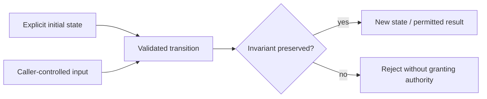

# Walkthrough: Tenant state and PostgreSQL

1. Keep the question visible: **How do account, membership and resource checks stay independent?**
2. Inspect state in [model.mjs](src/model.mjs): users, live memberships, tenant-composite resource keys. Identify which fields come from a caller and which are trusted server state.
3. Follow the transition: switch tenant, read scoped document, transact role change. Name the actor, recipient, clock and failure return/exception. No trust comes merely from the shape of an input.
4. Predict the boundary: **cross-tenant/stale/suspended/escalation cases denied**. Run the documented tests and inspect the rejecting case before modifying code.
5. Change one input in a test fixture, not a real account: principal, tenant, recipient, timestamp or credential bytes as appropriate. Explain why the outcome should change; record whether it actually does.
6. Apply the lesson: Encode containment in relational constraints and live queries. Name a production boundary that would require another check or durable transaction.

The diagram is a state-transition reading aid, not a complete wire protocol. Exact HTTP/sequence messages and production placement are in [chapter 22](../../GUIDE.md). This implementation deliberately omits RLS, last-owner transfer, durable integrated app and workspace policy. Ask which omission would invalidate your deployment’s requirement before adding features.

**Failure experiment:** run [the stage driver](experiments/run.mjs), then its negative tests. The driver prints sanitized model outcomes or integration instructions; it is not a benchmark or a claim that external IdP/SCIM integrations ran. Verify the relevant [evidence](../../experiments/README.md) and write your own hypothesis/setup/actual-result/limits/next-question note.
