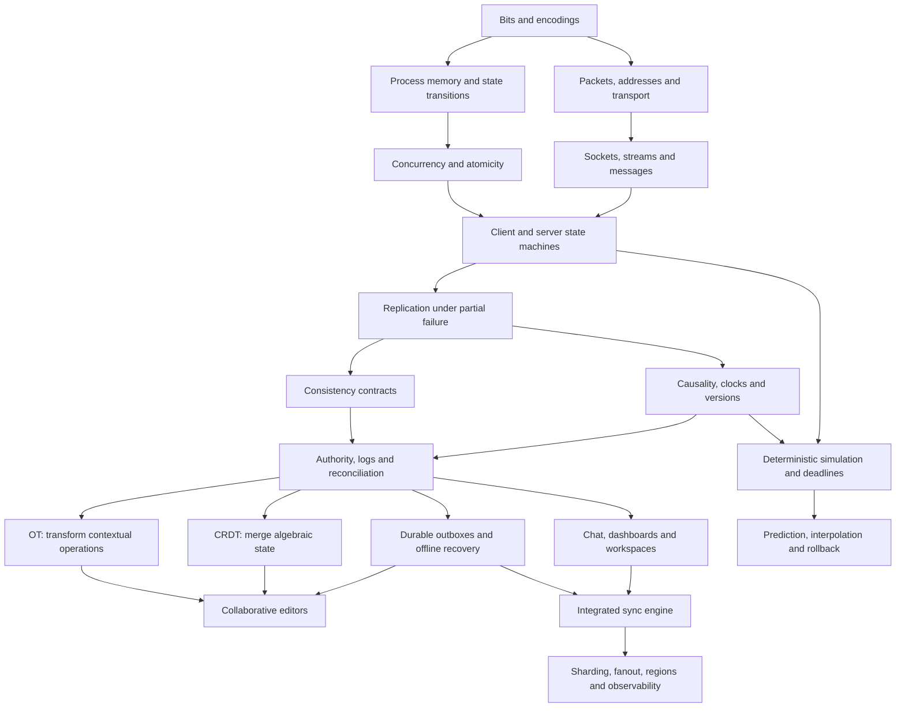
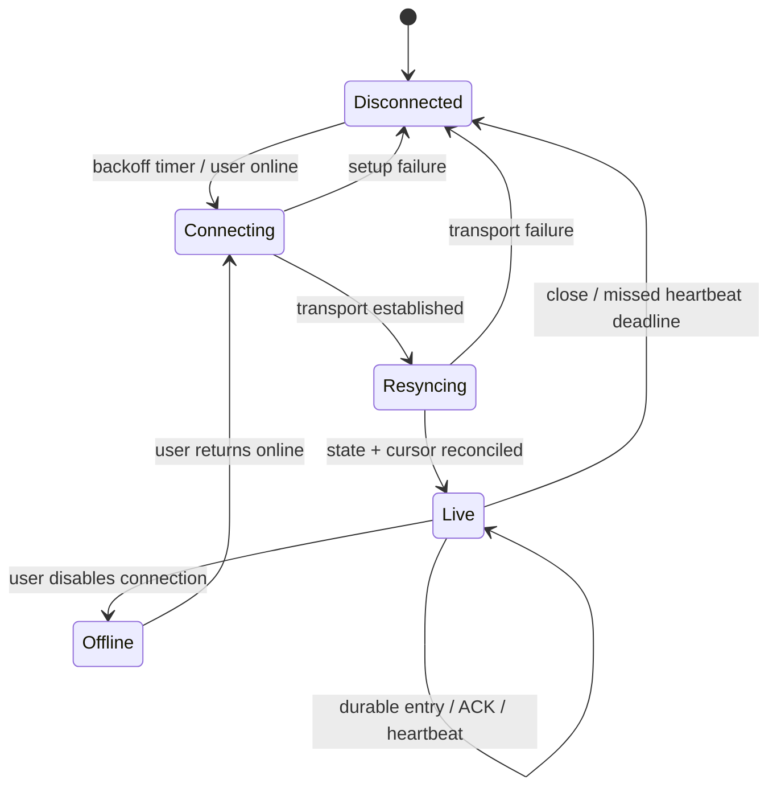
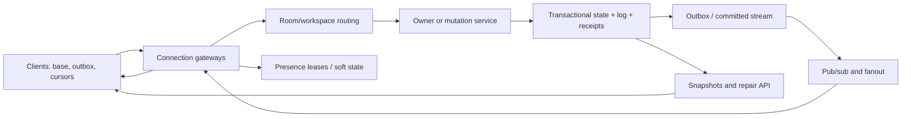
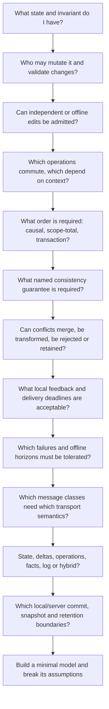

# Sync engines and real-time distributed systems: a first-principles master curriculum

**Question kept visible:** How do independent processes, with local mutable state and uncertain communication, maintain a useful relationship between their states when people or simulations mutate them concurrently?

This curriculum develops one mechanism at a time. Each chapter gives a model, a failure that motivates the next abstraction, an implementation path, and an experiment. The advanced branches share foundations but make different promises: an editor preserves edits; a game meets deadlines; a database protects invariants; chat preserves history.

## 0. Navigation, dependency map and execution contract

### 0.1 Reading route

| Stage | Chapters | Exit capability |
| --- | --- | --- |
| Representation and execution | 1–2 | Identify bytes, state, atomic transitions and interleavings |
| Communication and uncertainty | 3–5 | Distinguish transport delivery from application commit and consistency |
| Ordering and replication | 6–8 | Specify causality, authority, state/operation models and recovery |
| Concurrent editing | 9–10 | Derive pairwise OT and algebraic CRDT convergence |
| Durable applications | 11–15 | Model offline clients, databases, chat, collaboration and protocol reliability |
| Time-sensitive worlds | 16 | Derive prediction, interpolation, rollback and authority |
| Integrated system and scale | 17–19 | Build the protocol; identify which assumptions fail at scale |
| Reasoning and design | 20–23 | Connect mathematics, run failures, solve new designs and read sources |



Atomicity, networking and mathematics have independent subtrees: knowing a CPU memory barrier does not synchronize two machines; having a socket does not define conflict resolution. Follow the dependency, rather than assuming each layer automatically grants the next guarantee.

### 0.2 The pipeline used throughout

```text
LOCAL STATE → LOCAL OPERATION → ENCODE → NETWORK → REMOTE REPLICA
    → ORDER/CAUSALITY → DETECT CONFLICT → RESOLVE → APPLY/MERGE → SHARED VIEW
```

Add two paths around it:

```text
DURABILITY: local outbox → durable accepted history → checkpoints/snapshots
RECOVERY: identity + cursor + retry → deduplication → replay/merge → acknowledgement
```

Transport acts between encode and delivery. CAS acts at validation. OT changes operations before application. CRDTs change state representation and merge. A log provides replay and an order. Prediction changes the local view while authority remains remote. These solve different parts of the pipeline and can coexist.

### 0.3 Runnable artifacts

From `domains/sync-engines/sync-engine-lab`:

```sh
npm test                 # examples, merge laws, counterexamples, socket/restart integration
npm run demo             # all twenty examples, JSON results
npm run faults           # explicit failure traces and assertions
node 13-ot/src/demo.mjs
node 14-crdt/src/demo.mjs
```

All executable files use `.mjs` and Node built-ins. Requires Node 22.4+; validation runtime is recorded separately. No package installation. The shared modules are small, visible mechanisms reused by the lab; they are not an opaque sync framework.

| Lab | Mechanism and inspectable code |
| --- | --- |
| 01-networking | [Seeded event delivery](sync-engine-lab/01-networking/src/demo.mjs), [scheduler](sync-engine-lab/shared/network.mjs) |
| 02-tcp | [Actual TCP socket](sync-engine-lab/02-tcp/src/demo.mjs), [byte framing](sync-engine-lab/shared/framing.mjs) |
| 03-udp | [Actual datagrams and freshness](sync-engine-lab/03-udp/src/demo.mjs) |
| 04-websocket | [Actual WebSocket echo](sync-engine-lab/04-websocket/src/demo.mjs), [handwritten framing](sync-engine-lab/shared/websocket.mjs) |
| 05-concurrency | [Interleavings and mutex](sync-engine-lab/05-concurrency/src/demo.mjs) |
| 06-cas | [Version checks and ABA](sync-engine-lab/06-cas/src/demo.mjs) |
| 07-versioning | [Lamport, vector and hybrid clocks](sync-engine-lab/07-versioning/src/demo.mjs) |
| 08-optimistic-concurrency | [MVCC and write skew](sync-engine-lab/08-optimistic-concurrency/src/demo.mjs) |
| 09-state-sync | [Whole-state conflicts](sync-engine-lab/09-state-sync/src/demo.mjs) |
| 10-delta-sync | [Sparse merges and Merkle repair](sync-engine-lab/10-delta-sync/src/demo.mjs) |
| 11-operation-log | [Commit, dedup and cursor gaps](sync-engine-lab/11-operation-log/src/demo.mjs) |
| 12-event-sourcing | [Fact replay and schema](sync-engine-lab/12-event-sourcing/src/demo.mjs) |
| 13-ot | [Concurrent pair editor](sync-engine-lab/13-ot/src/demo.mjs) |
| 14-crdt | [Eight replicated types](sync-engine-lab/14-crdt/src/demo.mjs) |
| 15-offline-sync | [Persisted outbox restart](sync-engine-lab/15-offline-sync/src/demo.mjs) |
| 16-chat | [History, receipt cursor, TTL](sync-engine-lab/16-chat/src/demo.mjs) |
| 17-collaborative-editor | [Stable text anchors](sync-engine-lab/17-collaborative-editor/src/demo.mjs) |
| 18-multiplayer | [Prediction, interpolation, rollback](sync-engine-lab/18-multiplayer/src/demo.mjs) |
| 19-server-authoritative-game | [Input validation and reconciliation](sync-engine-lab/19-server-authoritative-game/src/demo.mjs) |
| 20-production-sync-engine | [Persistent protocol and failure scenario](sync-engine-lab/20-production-sync-engine/src/scenario.mjs) |

Every stage contains `README.md`, `GUIDE.md`, `src/`, `tests/`, and `experiments/`. The master guide owns the conceptual curriculum; local guides are code-reading prompts. Tests establish behavior of declared models. There is no browser UI, so CLI correctness does not imply graphical editor correctness. Real QUIC, WebRTC, DNS infrastructure, kernel TCP, and consensus implementations remain source-reading targets; their relevant mechanisms are modeled rather than falsely presented as complete stack implementations.

## 1. Bits, bytes, processes and state

### 1.1 Representation comes before replication

A bit distinguishes two alternatives. An octet holds 256 values. A value has meaning only under an agreed encoding: `0x41` may mean integer 65, UTF-8 `A`, or an opcode. Replicas share neither pointers nor object identities; a message must carry a representation that can be decoded independently.

```text
Object in A's heap → bytes according to schema → B's parser → new object in B's heap
```

A sync message needs semantic fields, for example `{schema, room, actor, counter, base, kind, payload}`. JSON carries structure; the protocol defines what `base` means, which actor may use an ID, and whether missing fields are invalid. Serialization is not authorization or conflict resolution.

Runnable representation experiment:

```sh
node --input-type=module <<'JS'
const text = 'Aλ🙂';
const bytes = Buffer.from(text, 'utf8');
console.log({codeUnits:text.length, codePoints:[...text].length, bytes:bytes.length,
  hex:bytes.toString('hex'), decoded:bytes.toString('utf8')});
JS
```

Predict: 4 UTF-16 code units, 3 code points, 7 UTF-8 bytes. A text operation must declare which coordinate system its position counts. A grapheme may contain several code points: neither JavaScript string length nor code-point count always equals the number of visible characters. This guide's text toys count code points.

A message length is a **byte** length. Splitting UTF-8 bytes before decoding is safe if complete byte frames are reassembled first; decoding arbitrary chunks independently can corrupt a split multibyte character. `JSON.stringify` also omits `undefined`, cannot directly encode `BigInt`, and does not encode a `Set` as its members. Specify a wire schema and validate it.

### 1.2 A process is a state-transition machine

Model process `i` as state `S_i` and transition function:

$$
(S_i', outputs)=T_i(S_i,input).
$$

Its state includes application objects, queues, timers, connection state and persisted checkpoints. Memory belongs to an address space. Two processes can use the same numeric address without referring to the same storage. A process crash destroys ordinary heap state; a restart reconstructs state from durable data, configuration and messages.

The minimal sync model is two independent objects and a function that copies data between them. Its first failure is a concurrent mutation while a copy is in transit. Add versions and messages before adding sockets: the issue is independent state, not a particular transport API.

### 1.3 State, operation, command and event

| Item | Example | Meaning |
| --- | --- | --- |
| State | `{title:'Plan', count:3}` | What the replica currently knows |
| Operation | `increment(counter,1)` | A transition to apply under declared semantics |
| Command | `transfer(A,B,10)` | A request; may fail validation |
| Event | `TransferAccepted(id,A,B,10)` | An immutable fact after acceptance |
| Projection | balance computed from accepted events | A view, possibly rebuildable |

The same byte shape can have different roles. Replaying a command that sends an email repeats a side effect unless the boundary is idempotent. Replaying an accepted event should deterministically rebuild a projection, without generating new external actions.

**Build/break:** lab 01 separates delivery from state. Remove the schema/encoding agreement and propose two interpretations of the same bytes. **Design challenge:** serialize a shape move without transmitting a heap address; specify identity, coordinates, units, preconditions and bounds.

## 2. Concurrency: make one transition indivisible

### 2.1 Interleavings explain races

A race condition exists when correctness depends on an uncontrolled execution order. A data race is the narrower memory-model notion of conflicting accesses without required synchronization; async code can have a logical race without multiple threads.

```text
value = 0
A: read 0         B: read 0
A: compute 1     B: compute 1
A: write 1       B: write 1
result = 1, intended count = 2
```

The critical section is the read/compute/write interval whose invariant would be broken by interleaving. Mutual exclusion permits only one participant in that section. A mutex serializes it; exceptions must still release the mutex. [Lab 05](sync-engine-lab/05-concurrency/src/demo.mjs) forces this exact race by yielding between reading and writing.

A JavaScript event loop runs a callback until it yields or returns. Another callback cannot interrupt ordinary synchronous statements on that same agent, but `await`, I/O completion and worker threads introduce independent scheduling. An `async` function is not a transaction. Holding an async lock across slow network I/O increases queueing and failure exposure.

Threads share memory within a process; worker threads require explicit shared buffers to share mutable memory in this lab. Processes communicate via IPC/shared mappings/sockets. Event loops multiplex waiting work; they do not make remote effects atomic.

### 2.2 Locking, progress and memory order

| Concept | Exact issue/guarantee | Small failure or implementation consequence |
| --- | --- | --- |
| Deadlock | A cycle of participants each waiting for another | A owns X and waits for Y; B owns Y and waits for X |
| Starvation | A participant never gets its turn despite others progressing | Unfair lock scheduling repeatedly favors new arrivals |
| Lock-free | System makes progress despite delays of individual threads | A CAS loop may starve one thread while another succeeds |
| Wait-free | Every operation finishes in bounded own steps under the model | Stronger than lock-free; allocation/runtime effects matter |
| Atomicity | An operation has indivisible effects at its specified boundary | Atomic word write does not make two-word update atomic |
| Memory ordering | Permitted visibility/reordering of memory accesses | Publishing a flag before payload visibility exposes incomplete data |
| Happens-before | Ordered execution plus synchronization edges constrain visibility | Mutex release/acquire or a specified atomic synchronization orders accesses |

Deadlock prevention can impose a common lock acquisition order; timeout/retry detects possible trouble but does not prove a deadlock. A wait-for graph cycle is a useful detector for this lock model. Starvation needs fairness policy; avoiding deadlock alone does not imply fairness.

Hardware/compiler reorderings matter when there is shared memory. An atomic access may provide relaxed, acquire/release or stronger ordering depending on the language. Acquire/release pairs can publish data through a synchronization location. JavaScript `Atomics` operations on supported shared arrays provide the ECMAScript-specified ordering; do not implement a portable lock with ordinary object properties shared through wishful reasoning. Remote timestamps do not create memory barriers. See [ECMAScript shared memory](https://tc39.es/ecma262/multipage/memory-model.html) for the language contract.

### 2.3 Compare-and-swap and the linearization point

CAS on a location `x` is one atomic read-modify-write:

$$
CAS(x,e,n)=\begin{cases}(x\leftarrow n,success)&x=e\\(x,fail)&x\ne e.\end{cases}
$$

If two workers expect 0, only one may replace 0 with 1; the other must observe failure. A CAS loop reads old state, computes new state, and retries when someone changed it. Repeatedly reusing a stale derived result is incorrect.

```js
const word = new Int32Array(new SharedArrayBuffer(4));
function increment() {
  for (;;) {
    const old = Atomics.load(word, 0);
    if (Atomics.compareExchange(word, 0, old, old + 1) === old) return old + 1;
  }
}
```

This is a runnable local algorithm for a bounded Int32 counter; overflow wraps. Under appropriate scheduler/atomic assumptions the algorithm is lock-free; there is no bound on one worker's retries, so it is not wait-free. Native `Atomics.add` expresses the same counter RMW directly; its implementation guarantees cannot be inferred merely from this source snippet.

For an object, compare a **version**:

```text
if version == expected_version:
    write(new_value)
    version++
```

Those three lines must execute as one protected transition. Two machines doing independent GET/check/PUT requests do not get CAS. A server callback with no yield can protect its in-memory cell; a database conditional update can protect a durable row:

```sql
UPDATE documents SET value = :new, version = version + 1
WHERE id = :id AND version = :expected;
-- zero affected rows: another writer changed the base
```

The linearization point is the conceptual instant where the successful conditional mutation takes effect between call and return. Durability is a separate boundary: an in-memory successful CAS can be lost after a process crash.

Concrete trace:

```text
A reads (title='old',v=7), B reads same
A CAS(7,'A') → success, v=8
B CAS(7,'B') → failure, current v=8
B must reread, merge/rebase, ask user, or abandon
```

**ABA:** a raw value changes `A→B→A`. CAS expecting `A` succeeds although history changed. Use `(value,generation)` in a single protected/atomic representation, plus appropriate memory reclamation when values are pointers. A version solves this only while versions do not wrap or get reused. Independently writing an atomic value and atomic version leaves an intermediate state.

### 2.4 Local coordination versus distributed coordination

| Choice | Admission/order | User wait | Failure mode | Best use |
| --- | --- | --- | --- | --- |
| Pessimistic lock | Exclusively reserve before mutation | Lock round trip and contention | Dead owner, deadlock, lease expiry | Short transactions with frequent conflicts |
| Optimistic version/CAS | Mutate provisionally; validate at commit | Fast local work, possible retry | Stale base, repeated abort | Sparse overlapping updates |
| OT | Admit concurrent contextual edits; transform | Immediate local view | Incorrect transform/control context | Ordered collaborative sequences |
| CRDT | Admit updates under merge semantics | Immediate local view | Business invariant or metadata costs | Offline independent edits |
| Server authority | Server decides accepted sequence/state | Round trip unless predicted | Authority unavailable | Games, permissions, ordered workspace fields |

A lock across a network needs failure handling. A lease expires according to a clock and authority policy; an old paused holder can wake up and write after expiry. A monotonically increasing **fencing token** must be checked by the resource that accepts writes. Chapter 15 implements this mechanism.

**Build/break:** run labs 05–06; remove the version increment and reproduce ABA. Force a lock callback to throw; its next user must still progress. **Design challenge:** two users edit a ticket status; define whether a stale transition should fail, overwrite, merge, or trigger a workflow rule.

## 3. Networking: carry representations across independent machines

### 3.1 Internet model and costs

| Building block | Problem solved | Sync implication |
| --- | --- | --- |
| IP address | Identify network interfaces/endpoints for forwarding | An address is not stable user/device identity |
| Routing | Choose next hop using destination prefixes and policies | Route changes can change RTT and ordering |
| Packet | Bounded payload carried independently | Application records can span packets |
| MTU | Bound packet size on a link | Path MTU can be smaller than local MTU |
| Port | Multiplex transport endpoints on a host | TCP and UDP ports are separate namespaces |
| NAT | Rewrite address/port mappings between networks | Inbound peer reachability and mapping lifetime matter |
| DNS | Resolve names via cached, delegated records | Name resolution, caching and address selection precede connection |
| Latency | Time until an effect can be observed | Determines feedback and acknowledgement delay |
| Bandwidth | Bytes deliverable per time interval | Limits snapshot and fanout cost |
| Jitter | Variation in arrival delay | Needs buffering or interpolation policies |
| Loss/reorder/duplication | Independent delivery differs from send sequence | Need repair, identity and ordering appropriate to data |
| Congestion | Offered load exceeds network service capacity | Queues raise latency; loss triggers adaptation |
| Partition | Some processes cannot communicate for an interval | Local progress and global agreement diverge |

IPv4 addresses have 32 bits; IPv6 has 128. Both carry best-effort packets. IPv6 routers do not fragment transit packets; sources use fragmentation when necessary and discover usable packet sizes. IPv4 fragmentation can occur when permitted, but losing one fragment prevents reassembly of that packet. Avoid turning a small update into many fragile fragments. Read [IPv6 packet sizing, RFC 8200 §5](https://www.rfc-editor.org/rfc/rfc8200.html#section-5).

Forwarding chooses a next hop from a routing table, commonly using the longest matching destination prefix. It does not reserve an end-to-end path: each router repeats a local decision. A link sends frames to its next hop; IP addresses identify the routed destination; ARP/IPv6 neighbor discovery resolves local neighbor link addresses. Hop-limit/TTL prevents indefinite forwarding loops. The [routing model](sync-engine-lab/01-networking/src/routing-model.mjs) implements a small IPv4 longest-prefix lookup without sending raw packets.

A common NAT mapping binds an internal `(address,port,protocol)` flow to an external address/port and maintains return-path state. Outbound traffic may create/refresh a mapping; expiry removes it; inbound reachability depends on mapping/filtering policy. Two peers behind different NATs may need traversal or relay. A changed public endpoint after reconnect does not change the application's device identity. [UDP NAT behavior, RFC 4787](https://www.rfc-editor.org/rfc/rfc4787.html).

DNS resolution separates names from addresses: a stub resolver asks a recursive resolver, which can answer from TTL-limited cache or follow root/domain delegation to an authoritative answer. A/AAAA records describe IPv4/IPv6 addresses; resolution can produce multiple candidates or fail independently of an established connection. Negative answers/cache expiration matter during service changes. A DNS TTL is a cache instruction, not a lease proving a server healthy. [DNS concepts, RFC 1034](https://www.rfc-editor.org/rfc/rfc1034.html).

NAT is not a reliability mechanism or security proof. DNS is not a permanent directory of machines. A server name can resolve to multiple addresses and change after reconnect; the application must keep stable actor identity outside the connection. Browser peer connectivity often needs ICE candidate exchange, STUN discovery and TURN relaying.

Approximate one-way delivery cost:

$$
T=T_{encode}+T_{queue}+\frac{bytes}{throughput}+T_{propagation}+T_{decode}.
$$

Sending 1 MB at 10 Mbit/s costs about 0.8 s just for serialization onto that bottleneck, regardless of a tiny propagation RTT. This is a dimensional estimate, not a measurement. The bandwidth-delay product `throughput × RTT` is the data in flight needed to fill a path. Increasing a queue cannot fix overload; it trades memory for more stale updates.

### 3.2 TCP derives reliable ordered bytes

Handshake with initial sequence numbers `x,y`:

```text
Client                           Server
SYN seq=x ---------------------->
       <---------------- SYN+ACK seq=y ack=x+1
ACK ack=y+1 -------------------->
          established bidirectional byte stream
```

Sequence numbers identify byte positions, not JSON messages. ACK `k` cumulatively says the receiver has the prefix before `k`. Missing bytes trigger retransmission; duplicates do not appear twice in the delivered stream. A receiver can hold out-of-order segments until gaps fill. SYN and FIN consume sequence space. Reliability promises a stream while the connection operates, or an error; it does not promise infinite eventual delivery after a partition. See [TCP concepts and sequence processing, RFC 9293](https://www.rfc-editor.org/rfc/rfc9293).

Flow control protects the receiver with its advertised window `rwnd`. Congestion control protects the path with `cwnd`. Roughly, a sender limits outstanding bytes to `min(rwnd,cwnd)`. Classical slow start grows toward path capacity; loss/congestion signals reduce sending pressure. These are transport policies, not document conflict policies. The classic algorithms are specified in [RFC 5681](https://www.rfc-editor.org/rfc/rfc5681.html).

Retransmission timers estimate RTT and variation. Retransmitted data complicates RTT sampling; an ACK may correspond to the original or retry. Application timeouts must account for transport recovery, rather than immediately launching a storm of duplicate commands. Read [RFC 6298](https://www.rfc-editor.org/rfc/rfc6298.html).

**Head-of-line blocking:** if byte 100 is missing, bytes 101–500 cannot be exposed ahead of it. A fresh cursor update behind a lost large transfer waits. Two unrelated HTTP/2 streams still share TCP's byte stream; application multiplexing alone cannot bypass that gap.

TCP does not preserve `write()` boundaries:

```text
sender write("HEL"), write("LO"), write("NEXT")
receiver data("H"), data("ELLON"), data("EXT")  # one possible partition
```

Use delimiter framing with escaping, fixed-size records, or a length prefix. The lab uses `[4-byte big-endian length][UTF-8 JSON bytes]`; the decoder accumulates bytes, validates a maximum length, and extracts zero or more frames. It waits for incomplete frames. It is incorrect to `JSON.parse(chunk)` directly. [Framing source](sync-engine-lab/shared/framing.mjs) tests every split point including Unicode.

The [ordered transport model](sync-engine-lab/02-tcp/src/transport-model.mjs) makes gap buffering, a cumulative ACK, retransmission and separate flow/congestion gates visible. It uses segment-sized sequence units for clarity; it is not a compliant TCP implementation.

A closed connection can leave the sender uncertain whether a final command committed. FIN is orderly end-of-stream; RST aborts; a blackholed path may produce no prompt event. Keep-alives detect some idle failures, often with long configured intervals; application heartbeats give a protocol-specific suspicion threshold. Neither tells you whether a database transaction committed. A timeout means **unknown outcome**, not rollback.

Backpressure propagates demand upstream. In Node, `socket.write()` returning false means queued output crossed its high-water mark; wait for `drain` before continuing an unbounded producer. Cap queues; choose to pause, coalesce replaceable samples, or disconnect a slow subscriber and replay later. ACKs at TCP level only report receiving bytes, not application validation or persistence.

### 3.3 UDP derives independent datagrams

UDP adds ports, length and checksum information to IP delivery. A receive operation gets a datagram boundary; UDP does not retransmit or establish a reliable connection. An application can observe gaps, duplicates and reordered datagrams. It must tolerate lost feedback too. [RFC 768](https://www.rfc-editor.org/rfc/rfc768) defines the small transport header.

The [selective-ACK/retry model](sync-engine-lab/03-udp/src/reliable-model.mjs) delivers five independent effects under lost data, lost ACKs and duplicate/reordered datagrams. Its in-memory IDs make repeated effects safe; it explicitly omits congestion/security/crash persistence.

Reliable UDP-style mechanisms can add packet numbers, ACK ranges/bitmaps, selective retransmission, RTT estimation, duplicate suppression, message fragmentation/reassembly, congestion control, pacing and authenticated sessions. Different message classes can have different policy:

```text
movement snapshot #81 lost → #82 supersedes it; don't stall the display
inventory purchase op U lost → retry U with dedup until accepted/rejected
input tick 81 late → deadline policy, prediction or rollback
```

Do not send faster simply because UDP permits it. UDP applications need congestion response and appropriate payload sizing; see [RFC 8085](https://www.rfc-editor.org/rfc/rfc8085.html).

### 3.4 Transport comparison

| Property | TCP | UDP | QUIC streams / datagrams |
| --- | --- | --- | --- |
| Unit exposed | Ordered bytes | Datagram | Ordered bytes per stream; optional datagrams |
| Delivery | Reliable until connection failure | Best effort | Streams reliable; datagrams best effort |
| Ordering | Per connection | None | Per stream; none for datagrams |
| Loss effect | Blocks later connection bytes | Missing datagram | Missing stream bytes block that stream |
| Congestion/flow control | Transport supplied | Application must provide needed control | Congestion plus connection/stream flow control |
| Setup | TCP handshake; TLS separately when used | No transport handshake | Integrated secure handshake; conditional resumption/0-RTT |
| Identity/reconnect | New connection loses old stream context | Application session needed | Connection IDs can support migration; app recovery still needed |
| Typical fit | Durable web traffic and collaboration | Deadline-sensitive samples | Multiplexed web requests/streams and selected real-time protocols |

QUIC multiplexes reliable streams over UDP with integrated TLS; its stream isolation removes TCP's cross-stream delivery blocking, though streams still share congestion resources. Optional QUIC datagrams are a separate extension. QUIC is not a CRDT and UDP is not inherently faster for every workload. [RFC 9000](https://www.rfc-editor.org/rfc/rfc9000.html), [RFC 9221](https://www.rfc-editor.org/rfc/rfc9221.html).

Editors normally need every durable edit plus recovery and meaningful merge. Games often need the latest timely state and a bounded input history; recovering obsolete snapshots may worsen play. Both can carry reliable critical operations separately from ephemeral samples.

**Build/break:** run labs 01–03. Deliver bytes one at a time; omit UDP sequence 2; deliver 3 twice and 1 late. **Design challenge:** partition reliable chat text from unreliable cursor coordinates in a protocol sharing one connection.

## 4. Web real-time technologies: choose a carrier after semantics

### 4.1 Connection and directionality

| Carrier | Underlying transport | Direction/connection | Reliability and ordering | Latency/cost | Browser fit and use |
| --- | --- | --- | --- | --- | --- |
| Polling | HTTP over negotiated TCP/QUIC | Repeated client requests | Reliable response; app cursor spans requests | Expected detection delay near interval/2; repeated headers | Broad Fetch/XHR; simple dashboards/history |
| Long polling | HTTP | Request waits for event/timeout; client issues next | Reliable response; app fills inter-request gaps | Prompt when waiting; timeout/proxy limits | Broad HTTP; fallback event delivery |
| SSE | HTTP streaming | Server→client stream; client writes via HTTP | Ordered events within response; reconnect IDs are app replay cursors | Prompt, text framing, automatic EventSource reconnect | Standard EventSource; notifications and feeds |
| WebSocket | Often HTTP/1.1 upgrade over TCP/TLS; other bootstraps exist | Persistent full duplex | Reliable ordered messages within live connection | Low per-message overhead; connection/heartbeat management | Standard WebSocket API; collaboration/chat |
| WebRTC data channel | SCTP over DTLS, typically UDP via ICE/TURN | Peer or client-server channels after signaling | Ordered/unordered; reliable or limited retries/lifetime | Setup/relay costs; partial reliability useful | RTCPeerConnection; media plus peer data |
| HTTP/2 | Multiplexed HTTP over TCP, usually TLS | Many request/response streams | Per-stream semantics with cross-stream TCP loss blocking | Saves connection/header overhead | Negotiated by browser; Fetch doesn't expose raw transport |
| HTTP/3 | HTTP over QUIC | Multiplexed request/response streams | Ordered reliable stream bodies, transport stream isolation | Avoids TCP cross-stream blocking; shared capacity remains | Negotiated where browser/server/network permit |

Browser availability is an API/implementation question, not a theorem. This table describes standardized mainstream interfaces; enterprise proxies, embedded browsers and product targets still need capability checks. A webpage cannot normally open arbitrary raw TCP/UDP sockets. It also cannot treat an HTTP/3 connection as a raw QUIC socket through Fetch. WebTransport can expose streams/datagrams to a cooperating server where supported; verify targets before designing around it.

SSE's `id:` and `Last-Event-ID` help a server resume, but only if it retains events or can repair from a snapshot. EventSource reconnect does not invent missed history. Specify which event cursor is used and when its side effects are safely applied. [WHATWG SSE processing model](https://html.spec.whatwg.org/multipage/server-sent-events.html).

WebSocket supplies message framing and ping/pong control frames. It supplies no application operation ID, durable commit ACK, retry, reconnect history or conflict semantics. The bounded [handwritten frame parser](sync-engine-lab/shared/websocket.mjs) shows masking, length decoding, fragmented text, close and ping/pong. It is an educational subset with frame/message limits; use audited protocol implementations in deployed systems. [RFC 6455 §§4–5](https://www.rfc-editor.org/rfc/rfc6455).

WebRTC requires a signaling path to exchange session descriptions/candidates. ICE searches usable paths; TURN may relay. A data channel's unordered or partial reliability option changes delivery obligations, not application convergence. Audio/video are separate RTP-based media paths, not JSON data channels. [W3C WebRTC specification](https://www.w3.org/TR/webrtc/), [RFC 8831](https://www.rfc-editor.org/rfc/rfc8831.html).

HTTP/2 and HTTP/3 are protocol versions beneath many of the mechanisms above, rather than direct substitutes for a replication algorithm. [RFC 9113](https://www.rfc-editor.org/rfc/rfc9113.html), [RFC 9114](https://www.rfc-editor.org/rfc/rfc9114.html).

### 4.2 Derive the choice

Begin with `GET updates?after=cursor`. If intervals meet the latency requirement, polling may suffice. If idle requests dominate, hold a request or stream updates with SSE. If both sides send frequent data, a duplex connection can simplify transport. If independent samples need deadlines/unordered delivery, evaluate data channels or streams/datagrams. Keep the recovery cursor and conflict model independent of carrier.

A notification can merely say “data changed”; the client then pulls authoritative deltas. This reduces the amount of correctness entrusted to fanout. Directly broadcasting full durable entries avoids a fetch round trip but requires ordering/gap repair.

**Build/break:** lab 04 exchanges a framed WebSocket operation; chapter 17 uses the same carrier for the engine. Close after sending but before observing a reply; tell whether the operation committed without querying history. **Exercise:** implement a polling adapter to `SyncServer.sync`; then SSE; the same cursor protocol should survive either carrier. See [the runnable HTTP carrier lab](sync-engine-lab/04-websocket/src/http-carriers.mjs).

## 5. Distributed failure and consistency contracts

### 5.1 State the model before the promise

Assume independent machines, independent heaps and clocks, message exchange with arbitrary delay, temporary loss/duplication/reordering, process crashes and partitions. No process can distinguish an indefinitely delayed response from a failed peer solely by waiting. Partial failure means A and its disk may work while A→B is broken and B→C works.

Failure categories:

| Model | Example | Required defense |
| --- | --- | --- |
| Crash-stop | Process halts and never returns | Failover/replication if availability required |
| Crash-recovery | Restart loses heap, keeps declared stable storage | Recovery log, identity and epoch rules |
| Omission/delay | Link loses or delays messages | Retry, gap repair, deadlines |
| Partition | Some groups cannot exchange messages | Choose local progress versus coordinated invariant |
| Byzantine | Participant lies, equivocates, sends invalid transitions | Authentication/validation and stronger agreement assumptions |

Ordinary crash-tolerant consensus does not tolerate malicious voters. A browser client is untrusted even if backend replicas are non-Byzantine. A forged `+1e9` G-Counter component can converge perfectly and still be invalid. Separate cryptographic identity, authorization and valid operation semantics from merge correctness.

### 5.2 CAP precisely

For an asynchronously communicating partitioned service, it is impossible to promise both linearizable reads/writes and successful termination of every request to a nonfailed node throughout every partition. CAP availability is that formal per-request guarantee; it is not uptime percentage or accepting a write into a disconnected local queue.

Example: both sides last saw balance 10. During a partition A spends 10 and B spends 10. To preserve an immediate global “never overspend” invariant, at least one side must reject/wait, or spending rights must already have been partitioned with an escrow scheme. Allowing both local edits makes availability useful but does not preserve that invariant. Partition tolerance describes the failure setting; it is not an optional third checkbox for an Internet service. Read [Gilbert and Lynch's original result](https://doi.org/10.1145/564585.564601).

Outside partitions, latency, coordination and stale reads still trade off; CAP alone does not choose your architecture. A toy server may provide a linearizable register only while it is reachable and no stale caches are included in the claimed read path.

### 5.3 Consistency models: definition, purpose, example and implications

| Model | Definition and reason to choose it | Example/guarantee | Does not guarantee | Typical use and implementation implication |
| --- | --- | --- | --- | --- |
| Linearizability | Each operation appears atomic between invocation and response, respecting real-time precedence | Completed `write(x=1)` precedes subsequently invoked `read(x)`, which must see it or a later write | Multi-object transaction invariants without extra atomicity; low latency/offline availability | Coordination, locks, inventory; authority/quorum/consensus and a read protocol respecting commits |
| Sequential consistency | One total interleaving respects each process's program order | All see writes in one order, but a later wall-time read can appear before a remote completed write | Real-time precedence | Replicated memory models; enforce global serialization plus per-process order |
| Serializability | Committed transactions are equivalent to some serial transaction execution | A transfer's multi-row result fits a valid serial order | Actual call/return order; durability; single-op freshness by itself | Database invariants; locks/OCC/SSI across read and write dependencies |
| Strict serializability | Serializable transactions also respect real-time precedence | A completed transfer precedes a transaction started afterwards | Partition availability or inexpensive cross-shard transactions | Externally consistent transactional services; distributed commit/read barriers |
| Causal consistency | If a depends on b, observers seeing a see b's effects first | Reply referencing a message is not visible before its parent | Total order of concurrent writes; global invariant preservation | Collaborative/social state; dependency context, causal buffering and sufficient replication |
| Eventual consistency | Without further writes and with eventual dissemination, replicas eventually agree | A profile update propagates after reconnection | Time bound, read-your-writes, intention preservation, conflict correctness | Caches and available replicas; anti-entropy plus deterministic resolution |
| Strong eventual consistency | Replicas with the same delivered update set have equivalent state; delivery eventually propagates | CRDT replicas agree after receiving the same valid updates | Linearizability, transactional business constraints, bounded metadata | Offline mergeable objects; proved merge/effect rules and repair transport |
| Read-your-writes | A session's reads include its completed prior writes | User sees their just-submitted message on later session reads | Other users see it; global freshness | User-facing sessions; tokens, session routing or sufficiently caught-up replicas |
| Monotonic reads | A session does not go backward in what it has observed | Reads never move from cursor 42 to 39 | Freshness or immediate visibility of others' writes | Multi-region apps; carry minimum read cursor across routing |
| Monotonic writes | A session's writes are applied in session order | Rename then edit reaches replicas in that order | Global total order between sessions | Outboxes; per-actor sequence and dependency handling |
| Writes-follow-reads | A session's new write follows writes its prior read observed | Editing a reply depends on reading its parent | All transactions serializable | Causal sessions; attach observed causal context |

“Strong consistency” is ambiguous unless you name the model and operation boundary. “Session consistency” is a family or combination of the four session guarantees, not automatically causal consistency for all participants. Isolation controls **transactions**; replication consistency controls **observations of shared objects**. Ordering a transport stream is neither definition.

### 5.4 Counterexample: one database, stale clients

```text
A reads doc v5
B commits doc v6 in a perfectly serializable database
A overwrites doc with whole v5 plus its edit, without a base check
database serial order is B, then A; B's edit disappears
```

The database successfully serializes the transactions it was asked to execute. The application omitted the user's edit context. Introduce an expected version, an operation preserving the intended edit, or a merge policy.

**Build/break:** lab 08 exhibits write skew; lab 09 exhibits whole-state overwrite. For each table row construct an allowed history that violates a stronger guarantee. **Design challenge:** decide whether an offline “seat reserved” UI is provisional or a completed reservation, then define the coordination boundary.

## 6. Ordering and time without synchronized clocks

### 6.1 Physical versus logical time

Physical clocks approximate real time but have offset/skew, rate drift and corrections. UTC wall time can move backward. Use a monotonic clock for local elapsed durations; use clock uncertainty assumptions for cross-machine deadlines. A timestamp is data; its interpretation determines whether it means capture time, commit order, expiration or a logical count.

Lamport's happened-before relation `→` is the transitive closure of local process order and send→receive edges. If neither `a→b` nor `b→a`, the events are concurrent in this model. Concurrent does not mean physically simultaneous. A happens-before DAG provides a **partial** order. A total order assigns an order even to unrelated events. [Lamport (1978)](https://lamport.azurewebsites.net/pubs/time-clocks.pdf).

### 6.2 Lamport clocks

At an event, advance `L←L+1`. At receive with timestamp `r`, advance `L←max(L,r)+1`. Thus `a→b ⇒ L(a)<L(b)`; the converse fails.

```text
A                         Server                       B
edit a L=1 ----delay---->
                                                    edit b L=1
                           receive b L=2 <-------------
                           receive a L=3
receive reply L=4 <------- send after both
```

`a` and `b` are concurrent although server arrivals order `b,a`. Pair `(L,actorID)` yields a deterministic total comparison. It does not reveal when all smaller messages have arrived; using it for online total-order delivery needs an authority, acknowledgements/watermarks, or an agreement protocol. Sorting the messages you currently have is insufficient.

### 6.3 Vector clocks and version vectors

Let one component per actor. Local event at actor `i`: increment `V[i]`. Send carries `V`. Receive merges componentwise maxima, then increments recipient component for the receive event.

$$
V\le W\iff\forall i, V_i\le W_i;\quad V<W\iff V\le W\land V\ne W.
$$

For complete event-vector histories, `V(a)<V(b)` characterizes causality. Incomparable vectors denote concurrency. Version vectors summarize object update histories; whether receiving a state increments a component depends on whether receive is an application update or merely metadata exchange.

```text
A edit: [1,0,0]             B edit: [0,1,0]
                 incomparable → concurrent
Server receives A: [1,0,1]
Server receives B: [1,1,2]
A receives server result: [2,1,2]
```

Sparse vectors save zero components but membership churn and old actors grow metadata. A scalar version can detect “not the same base” at one authority; it cannot generally distinguish concurrency from causal succession across independent authorities. A **dot** `(actor,counter)` identifies one update; a vector plus dots can represent causal context and holes more precisely. Compaction requires a policy for actors that may return after a long absence.

### 6.4 Hybrid Logical Clocks

An HLC is `(p,l)`: a physical-time-like maximum `p` plus logical counter `l`. Let local old pair be `(p,l)`, incoming pair `(r,q)` and local wall sample `w`:

```text
p' = max(w,p,r)
if p'=p=r: l'=max(l,q)+1
else if p'=p: l'=l+1
else if p'=r: l'=q+1
else: l'=0
```

This preserves monotonic causal timestamp progression even when the wall clock moves backward; it does not detect all concurrency or synchronize clocks. Physical proximity requires stated wall-clock error assumptions. Add actor ID for deterministic tie-breaking when independent events share a pair. HLC alone does not make a lease safe or a read linearizable. [Kulkarni et al., Logical Physical Clocks](https://cse.buffalo.edu/~demirbas/publications/hlc.pdf).

| Mechanism | Metadata | Detect concurrent histories? | Gives delivery agreement? | Best job |
| --- | --- | --- | --- | --- |
| Wall timestamp | Scalar | No | No | Human time and bounded-clock policies |
| Authority revision | Scalar per stream | Only stale relative to that stream | If authority enforces sequence | Resume/replay and CAS |
| Lamport | Scalar + tie-break actor | No | No | Causality-compatible comparison |
| Vector/version vector | O(actors), possibly sparse | Yes under history model | No | Causal context/conflict detection |
| HLC | Physical/logical pair + actor | No | No | Causal timestamps near wall time |

**Build/break:** lab 07 injects a backward wall-clock sample and compares concurrent vectors. **Exercise:** create a Lamport event `a=2,b=7` with no causal path; explain why the numerical order is weaker evidence than a vector comparison. **Design challenge:** propose a cursor scheme for a workspace sharded into independently ordered streams.

## 7. Formalize synchronization before choosing an algorithm

### 7.1 State machine, observation and correctness

Let `R={r₁,…,rₙ}` be replicas, `S_i` their states, `O` valid operations, `apply:S×O→S`, and `view:S→V` the application-visible interpretation. Network messages may encode full state, fragments, operations or facts. State includes metadata; equal views need not imply identical internal histories.

```text
N clients + local mutable state + concurrent mutations
+ disconnected/delayed communication + retries = synchronization problem
```

Specify at least these properties:

| Property | Precise question |
| --- | --- |
| Validity | Which accepted operations are legal? Who may issue them? |
| Safety | Which bad state/history must never be observable? |
| Convergence | When two replicas know the same accepted updates, do their views agree? |
| Liveness | Under which connectivity/fairness assumptions can pending work finish? |
| Durability | Which declared crash/storage failures preserve acknowledged updates? |
| Intent semantics | Does the resolved result represent the user's contextual operation? |
| Boundedness | Can queues, retained history and metadata stay within a policy? |

Eventual convergence after writes stop can be expressed:

$$
(\text{finite updates + eventual dissemination})\Rightarrow
\exists T\;\forall t\ge T,\forall i,j:\ view(S_i(t))=view(S_j(t)).
$$

With continuing updates, strong eventual consistency instead compares replicas with the same incorporated update set; there may never be a time when every live replica is caught up. “All clients always have identical state” is generally incompatible with immediate local mutations and nonzero latency.

### 7.2 Detection and resolution are distinct

A base version, vector clock or read dependency detects conflicting/stale histories. It does not tell you the desired result. Policies include reject/retry, authority order, maximum timestamp, additive merge, retain both versions, transform an edit, or ask the user.

```text
A changes task.status to done from v4
B changes task.status to blocked from v4
detect: both came from the same old version
resolve: choose a documented domain policy
```

If “done” requires all subtasks done, choosing the newest scalar status can violate workflow invariants. Resolution is part of the data model, not an incidental networking implementation detail.

### 7.3 State synchronization versus operation synchronization

State synchronization sends “what I know.” Operation synchronization sends “how I changed it.” State can absorb duplicates via merge; operations require effect rules plus identity/context. A patch is a state difference and may be context-dependent; it is not automatically an operation CRDT.

```text
state:        count=7
operation:    increment by 2
absolute delta: actor A's accumulated count is now 7
relative delta: add 2 to the receiver's current count
```

The absolute actor component can use `max`; the relative increment duplicated twice adds 4. Compressing a message does not preserve its semantics unless the receiver knows what the compressed bytes mean.

Operation composition matters. If `apply(apply(s,a),b)=apply(apply(s,b),a)`, the two operations commute for that state/domain. `set(x,1)` and `set(x,2)` do not; increments on a counter commute; inserting at a shifting text offset does not. Deduplication is needed even for commuting increments, because commutativity is not idempotence.

### 7.4 Recovery vocabulary

- **Retry:** transmit the same semantic operation again under its original ID.
- **Deduplication:** remember that ID's committed result; reject reuse with another payload.
- **Idempotence:** repeating an effect leaves the same state, `f(f(s))=f(s)`.
- **Replay:** apply retained accepted history from a checkpoint.
- **Snapshot:** materialized state at a defined history boundary, including necessary metadata.
- **Checkpoint:** a saved processing/recovery position; may include or reference a snapshot.
- **Anti-entropy:** periodic reconciliation of missing/divergent information.
- **Acknowledgement:** a statement about a named boundary: received, validated, committed, replicated, or processed.

A persistent receipt and the mutation must commit atomically. If the effect is stored but the dedup receipt is lost, retry repeats the effect. If receipt is stored but effect is lost, retry falsely reports success. This is an application transaction problem.

**Build/break:** lab 11 reorders sequence 2 before 1 and retries after a lost acknowledgement. **Design exercise:** write an ACK contract that tells a disconnected client whether it can safely delete its outbox entry.

## 8. Replication models and their costs

### 8.1 Mechanisms, protocols and failure behavior

In this table, bandwidth is per update or reconciliation; actual constants depend on encoding and scope. `|S|` is state size, `|Δ|` change size, `h` retained history since checkpoint.

| Model | Representation/protocol | Guarantee and conflict behavior | Failure/recovery | Cost and fit |
| --- | --- | --- | --- | --- |
| Full state | Send complete object plus version/context | Blind replacement loses edits; CAS rejects stale replacement; semilattice merge can converge | Lost transfer retry; resnapshot if history absent | O(\|S\|); simple settings/small state; costly for large docs |
| Delta/patch | Send changed fields/ranges against a base | Valid only with agreed base unless independently mergeable | Base mismatch needs repair; gaps can invalidate later patches | O(\|Δ\|), smaller traffic, more context logic |
| Operation | Send intent/effect with ID and causal context | Ordered noncommuting operations need sequencing/OT; commuting ops need reliable effect delivery | Dedup, dependencies, resend/replay | O(op size); efficient fine edits, more protocol semantics |
| Event | Send immutable accepted fact and schema version | Facts record domain decisions; projections still need ordered/idempotent processing | Cursor replay and schema-aware projection rebuild | Compact incremental history; audit/workflows |
| Ordered log | Append indexed accepted operations/events | Order is per log/partition; not inherently consensus/durability | Resume at contiguous cursor; replay or snapshot | O(h); easy gap detection; hot log serializes a scope |
| Snapshot + log | State at index k plus entries k+1 onward | Deterministic reducer reconstructs same state; metadata must match cut | Snapshot for old cursor, log for recent cursor | Bootstrap O(\|S\|), incremental O(h); common durable architecture |
| Push | Server emits updates to subscribers | Timely while connected; losses still need repair | Reconnect cursor plus periodic reconciliation | Low detection latency, fanout and queue management |
| Pull | Client requests state/missing ranges | Can bound repair independently of notification reliability | Poll/cursor repeats after outage | Latency interval/2 on average, request overhead |
| Push + pull | Push hints/entries, pull authoritative repair | Combines timely notifications with recoverable history | Missed hint healed by pull | Additional path but clear correctness boundary |
| Offline-first | Persist local state/outbox; reconnect and reconcile | Accept local provisional updates; conflicts resolved by explicit policy | Stable identity/counters, retry, snapshot and rebase | Immediate local latency; complex semantics, storage/GC costs |

Each model's **consistency** depends on its admission and merge rules. Full-state exchange can carry a CRDT; an operation log can carry stale blind replacements. “Delta sync” describes a traffic shape, not a consistency guarantee.

### 8.2 Primary/backup, multi-writer and consensus

A primary can validate mutations, assign order and replicate that order to followers. Asynchronous followers may lag; promoting one can lose acknowledged operations unless the commit policy already protected them. A write ACK must specify whether the primary only, a quorum, or a declared failure-tolerant set persisted it.

Multi-writer replication allows independent replicas to accept updates; attach causal context and merge/reject conflicts. Quorum arithmetic `R+W>N` makes successful read/write quorum sets intersect for a stable replica set. Intersection alone does not give linearizability: versions, concurrent writes, read repair/selection, membership, failure detection and commit protocol still matter.

Consensus chooses one agreed history despite crash failures. A leader needs an epoch/term, majority support, rules for log matching and safe commitment, and a read protocol. Electing a leader alone does not make committed entries safe. In a fully asynchronous model with possible crash, deterministic consensus cannot guarantee termination in every schedule; practical systems use timeouts and eventual synchrony assumptions. See [Raft's log safety and commitment rules](https://raft.github.io/raft.pdf) and [Fischer, Lynch and Paterson (1985)](https://doi.org/10.1145/3149.214121).

The final lab has **one** writer process, rather than a pretend consensus layer. To tolerate its host disappearing, replace the store boundary with a transactional replicated authority and preserve the exact operation/receipt semantics. [The bounded quorum model](sync-engine-lab/11-operation-log/src/quorum-model.mjs) demonstrates the need to fence terms; it is not Raft.

| Architecture | Mutation authority | Offline local edit | Coordination cost | Main difficulty |
| --- | --- | --- | --- | --- |
| Centralized sequencer | One owner per scope | Provisional, replay on return | Server RTT plus persistence | Availability, failover and hot scope |
| Decentralized merge | Independent replicas | Accepted under merge semantics | No per-edit global round trip | Causal metadata, invariants and repair |
| Consensus-replicated authority | One agreed committed history | Usually provisional client outbox | Quorum/leader communication | Terms, membership, commit/read safety |
| Partitioned authority | One owner per shard | Per-shard semantics | Local scope coordination | Cross-shard transactions and cursor vectors |

### 8.3 Snapshot correctness and retention

For a reducer `F`, a snapshot `S_k` must equal folding the committed prefix through `k`. Then:

$$
S_n=fold(F,S_k,[e_{k+1},…,e_n]).
$$

Publishing a snapshot labelled `k` while it already contains the effect of `k+1` causes double application during replay. Conversely, labelling it `k` while omitting `e_k` loses that effect. Capture a consistent cut; include schema, room/epoch, sequence, state and required causal/dedup metadata. Publish completely before truncating a covered log.

```text
append/commit → apply → capture S_k → publish checkpoint k → retain/trim prefix
```

A subscription must not miss entries between its snapshot and joining the live stream. Establish a barrier, capture head `k`, install subscription and replay beyond `k`, or validate a cursor continuously. Single-event-loop synchronous transitions make this cut easy in the toy; separate services need an explicit protocol.

Log compaction and dedup retention are different. A client with operation `A:1` can return after its log entry was removed. If the authority forgets that ID, it may treat an old retry as a new write. Keep receipts, an actor high-water mark with safe ordering rules, a bounded retry-age contract, or an epoch/resnapshot policy. Never silently forget history while claiming arbitrarily long offline retries are safe.

### 8.4 Merkle trees, file sync and anti-entropy

Hash canonical leaf content; hash child hashes up a fixed partitioned tree. Equal roots suggest equal contents under collision/encoding assumptions. For differing roots, descend only differing subtrees and transfer changed leaves. The tree detects difference, not the right value. [Lab 10](sync-engine-lab/10-delta-sync/src/demo.mjs) detects one changed leaf with a deterministic balanced tree.

A useful repair protocol is:

```text
exchange root/version → descend differing ranges → exchange missing states/ops
→ validate IDs/context → merge → repeat until digests agree
```

Tree shape/partitioning must be comparable; if each side builds a balanced tree over a different key set, corresponding children need not cover the same range. Use stable key/range partitions or exchange structure. Canonicalization must fix ordering, number representation and schema; hashing noncanonical JSON may report false differences.

File synchronization adds byte chunks, paths, permissions, renames, symlinks and user conflict policy. A naive whole-file upload wastes unchanged bytes; fixed-size chunk hashes identify changed chunks but an insertion shifts later boundaries. Content-defined chunking reduces that boundary cascade; rolling-checksum algorithms find matching blocks. A chunk digest verifies content, but does not say whether two edits to different offsets can merge. Keep conflict copies or domain-specific merges; model deletion with tombstones so an offline file does not resurrect unexpectedly. See [the original rsync technical report](https://rsync.samba.org/tech_report/) for a concrete delta-transfer algorithm.

**Build/break:** labs 09–12. Compact the log while an ACK is missing; then resend the old operation. **Design challenge:** choose a snapshot frequency using explicit snapshot size, update rate, offline horizon, bootstrap budget and receipt-retention policy.

## 9. Operational Transformation: preserve meaning across changed coordinates

### 9.1 Derive the conflict on `ABC`

Positions are zero-based code-point offsets. A insertion at 1 means before the original `B`; B deletion at 1 means delete that original `B`.

```text
Initial: A B C
A locally inserts X at 1: A X B C
B locally deletes at 1:  A C

A applies B's unchanged delete(1): A B C       # removes X, wrong target
B applies A's unchanged insert(1,X): A X C
```

The operation's position is contextual. To apply it after an edit, translate the coordinate while preserving the chosen target semantics. Transform B's deletion against A's insertion: `delete(1)→delete(2)`. A's insertion against deletion at 1 stays at 1. Both produce `AXC`.

### 9.2 Transform functions and the diamond

Let `T(a,b)` mean apply `a` **after** `b` while retaining `a`'s meaning relative to their common original context. For single-character operations:

| a against b | Position rule |
| --- | --- |
| insert against insert | Shift a right if b is earlier; at equal positions use a stable shared operation-ID tie-break |
| insert against delete | Shift a left if deletion is strictly before it |
| delete against insert | Shift a right if insertion is before or exactly at the target |
| delete against delete | Same original target → no-op; earlier deletion shifts later target left |

TP1/CP1 is the pairwise convergence condition:

$$
apply(apply(S,a),T(b,a))=apply(apply(S,b),T(a,b)).
$$

TP2/CP2 addresses independence from alternative transform paths through more operations, in control algorithms where those paths arise. Satisfying the two-operation diamond does not establish correctness for unrestricted multi-client histories. Operations must be transformed against operations with compatible contexts. A scalar “base revision” plus indiscriminate transformation through a list is not a universal OT proof.

The original groupware work motivates transforming concurrent edits; see [Ellis and Gibbs (1989)](https://doi.org/10.1145/67544.66963). Research distinguishes convergence, causal preservation and intention preservation; see [Sun et al. (1998)](https://doi.org/10.1145/274444.274447).

### 9.3 Minimal runnable OT engine

The complete bounded [OT implementation](sync-engine-lab/shared/ot.mjs) contains `apply`, `transform` and a two-client `round`. It enforces one code point per insert and validates positions. Run:

```sh
node 13-ot/src/demo.mjs
```

Run the bounded OT property check:

```sh
node --test --test-name-pattern='OT' shared/tests/properties.test.mjs
```

Its key rules are actual Node.js, not pseudocode:

```js
// o is being transformed against an insertion b:
if (o.type === 'insert') {
  if (o.pos > b.pos || (o.pos === b.pos && o.id > b.id)) o.pos++;
} else if (o.pos >= b.pos) o.pos++;

// against deletion b:
if (o.type === 'delete' && o.pos === b.pos) return {...o, type:'noop'};
if (o.pos > b.pos) o.pos--;
```

The round applies each local edit immediately, transforms the remote pair, and returns both final documents. Repeated rounds are permitted only after both clients finish the previous round and share the new base. The test enumerates all 49 valid pairs of one insert/delete on `ABC`, including insert ties and two deletes of the same target. It is meaningful bounded evidence, not a proof for rich-text OT.

### 9.4 Inclusion, exclusion and control protocols

**Inclusion transformation** translates an operation into a context that includes another operation. The pair function above is inclusion transformation.

**Exclusion transformation** translates back to a context without an operation, useful in undo and history/control algorithms. It is not generally an inverse that can be recovered from position alone: if a deletion turned an operation into no-op, original target information may be gone. Rich transforms retain identity/context metadata or split operations. See [Sun and Ellis's OT analysis](https://doi.org/10.1145/289444.289469).

A central OT design usually maintains a server revision and per-client contexts, buffers unacknowledged operations, transforms incoming server edits against that buffer, and transforms the buffer against incoming edits consistently. A stop-and-wait client with one outstanding operation has fewer contexts; allowing many speculative edits, reconnecting from old history, composition and undo creates more paths. Client and server need matching transformation conventions.

Convergence means identical resulting documents. Intention preservation is a semantic criterion: which character was deleted, where an insertion belongs, or what formatting range meant. Two replicas can agree on an unintuitive result. It is not guaranteed merely by sorting operation IDs.

### 9.5 Why production OT grows

Range edits split/overlap; formatting creates attribute conflicts; move operations affect identity and ancestry; undo must reverse a local intention against later edits; Unicode graphemes and IME composition do not match code-unit offsets; server rejects and schema upgrades change context; history truncation must not remove needed transform paths. A correct transform function and a correct control algorithm are both necessary.

| OT versus sequence CRDT | OT | Sequence CRDT |
| --- | --- | --- |
| Naming edits | Contextual offsets/ranges | Stable element/position identities |
| Main mechanism | Translate coordinates against concurrent edits | Deterministically order/merge identities |
| State overhead | Document plus needed transform history/buffers | Identity/order metadata and often tombstones |
| Delivery | Correct context/control algorithm required | Defined dependency/repair conditions required |
| Offline | Supported by some designs, retained/rebased context needed | Natural local admission; identity/GC still hard |
| Semantic complexity | Transform pair coverage, control, undo | Ordering intention, interleaving, deletion/undo, GC |
| Universal winner? | Depends on data and existing design | Depends on data and existing design |

**Build/break:** insert at an equal offset using inconsistent tie-breaks; the diamond fails. **Exercise:** devise a three-client history and identify every operation's context before adding a transform. **Design challenge:** explain why a block move cannot be implemented by treating each character offset independently.

## 10. CRDTs: change the representation so merge is predictable

### 10.1 Algebraic derivation

A partial order `≤` describes “contains no less information.” A join-semilattice has a least upper bound `a⊔b` for every pair. Join obeys:

$$
a\sqcup b=b\sqcup a\quad\text{(commutative)}
$$
$$
(a\sqcup b)\sqcup c=a\sqcup(b\sqcup c)\quad\text{(associative)}
$$
$$
a\sqcup a=a\quad\text{(idempotent)}.
$$

Delivery order, grouping and repetition then do not change the join of delivered states. Local updates must be inflationary in the information order: `s≤u(s)`. Visible values may decrease while metadata grows, as with PN-Counter negative components or tombstones.

**State-based/CvRDT:** store semilattice state, make inflationary updates, send state, merge by join. Replicas that eventually incorporate the same updates converge under this model.

**Operation-based/CmRDT:** separate local preparation from replicated effect. Concurrent effects must commute under the specified delivery conditions. Traditional models require reliable causal delivery and effectively once delivery for non-idempotent effects; a protocol can implement that using IDs, dedup and dependency buffering. Some effects commute without causal order, others require it.

**Delta-state:** emit small semilattice state fragments and join them, rather than sending a complete state or replaying an arbitrary relative command. Retain/repair missing deltas; for causally sensitive designs respect delta intervals/context. Merely putting “delta” on a JSON patch does not grant these properties. [Almeida, Shoker and Baquero](https://arxiv.org/abs/1603.01529).

A CRDT is not “automatically satisfy any business rule.” It provides a specified convergent replicated data type. Authentication, eventual communication, trustworthy identities, validity and domain invariants remain assumptions. [Preguiça's overview](https://arxiv.org/abs/1806.10254), [Almeida's approaches](https://arxiv.org/abs/2310.18220).

### 10.2 One inspectable implementation module

All eight types are implemented in [crdt.mjs](sync-engine-lab/shared/crdt.mjs), using serializable maps/arrays, with no CRDT library. [Lab 14](sync-engine-lab/14-crdt/src/demo.mjs) creates independent concurrent states and merges both directions. The [property tests](sync-engine-lab/shared/tests/properties.test.mjs) test associativity, commutativity, idempotence and all permutations of three states plus a duplicate. Missing ancestors and delete-before-insert get separate failure fixtures. Delay changes when a merge occurs, not its algebra.

Run:

```sh
node 14-crdt/src/demo.mjs
node --test --test-name-pattern='CRDT|OR-Set|text deletion' shared/tests/properties.test.mjs
```

### 10.3 G-Counter

A scalar total cannot distinguish “A already contributed 2” from “add another 2.” Give each actor an exclusive component:

$$
S:Actor\to\mathbb{N};\quad value(S)=\sum_i S[i];\quad (A\sqcup B)[i]=\max(A[i],B[i]).
$$

Actor `i` increments **only** `S[i]`. An actor component is an accumulated count, not an incremental message. Initial absent components are zero.

```js
let A = {A:2}, B = {B:3};
const merge = (a,b) => Object.fromEntries(
  [...new Set([...Object.keys(a),...Object.keys(b)])].sort()
    .map(k => [k,Math.max(a[k]||0,b[k]||0)]));
B = merge(merge(B,A),A); // {A:2,B:3}; total 5, not 7
```

Invariant: no component decreases; merges preserve both maxima. Concurrent `{A:2}` and `{B:3}` converge to total 5. Two devices sharing actor `A` each increment from `A:0` to `A:1` lose one increment under `max`; actor uniqueness/ownership is essential. Restoring an old device backup and reusing its counter has the same risk.

A delta can be `{A:2}`. It is independently replayable because it is an absolute semilattice fragment. This G-Counter representation illustrates state and delta sync; it is not an operation-based “increment once” protocol.

### 10.4 PN-Counter

Pair two G-Counters `(P,N)`:

$$
value(P,N)=\sum_iP[i]-\sum_iN[i].
$$

Positive edits increment `P`, negative edits increment `N`; merge each with `max`. A at `-2` and B at `+5` converge to 3. Information never decreases although the displayed number does. It does not preserve “counter never negative”: two independent withdrawals can both be admitted while their combined result violates a balance constraint. Use coordination or preallocated rights for that requirement.

```js
const pnMerge = (a,b) => ({p:merge(a.p,b.p), n:merge(a.n,b.n)});
// Full increment/decrement and value functions are in crdt.mjs.
```

### 10.5 G-Set

State is a set; partial order is subset; join is union. Add only. Concurrent `{'x'}` and `{'y'}` join to `{'x','y'}`; duplicates do nothing. Deletion would decrease state and invalidate this simple monotone model. It fits “facts observed” or delivered-ID tracking, with metadata growth as its obvious limitation.

```js
const join = (a,b) => [...new Set([...a,...b])].sort();
```

### 10.6 2P-Set

Store `(Adds,Removes)`, both G-Sets. Display `Adds\Removes`; merge each by union. Removing records permanent information instead of physically forgetting a member. In the toy, removing a named value even before its add tombstones that name.

```js
const visible = s => s.adds.filter(x => !s.removes.includes(x));
```

Invariant: a name once in `Removes` stays absent forever. Re-adding `x` cannot undo its tombstone. Use when deletion is permanent, or use a new object identity for a recreated object. Erasing a tombstone on one replica allows an offline add to resurrect `x`.

### 10.7 Observed-remove set / OR-Set

Allow re-addition by giving each add a globally unique tag. State:

```text
adds[value] = set of add tags
removed = set of observed tags removed
visible(value) ⇔ some add tag for value is not removed
```

Local remove captures only add tags the actor has observed. Both maps of tag sets and removed-tag set grow by union. Concurrent unseen adds survive; remove is not a universal delete of the value's future incarnations.

```text
Base: x has tag A:1
A removes observed A:1
B concurrently adds x with B:1
Merge: A:1 removed, B:1 live → x present
After seeing B:1, A removes x again → x absent
```

`orAdd`, `orRemove`, `orMerge` implement this directly. Unique tags and immutable tag payload binding are necessary; sharing a tag between different additions makes distinct edits indistinguishable. The toy retains all tags and tombstones. More compact observed-remove designs use causal context; do not drop tombstones until obsolete adds cannot return. [Bieniusa et al., optimized replicated set](https://arxiv.org/abs/1210.3368).

### 10.8 LWW register

Attach a totally ordered, unique assignment tag to each value. Join chooses the larger tag:

```js
function compare([n,a],[m,b]) {
  return n-m || (a<b ? -1 : a>b ? 1 : 0);
}
```

The toy uses `(logical counter, actor)`; new local assignments must exceed the actor's observed counters. This is “last” in a defined tag order, not necessarily last by real time. Physical timestamps instead risk clock skew making an old edit dominate. Equal tags with different payloads are an invalid identity collision, not an ordinary merge choice; the code rejects them.

Invariant: selected tag never decreases. Concurrent assignments converge by deterministic tie-break, but one visible value loses. LWW resolves representation conflict while discarding information; use a multi-value register if concurrent alternatives must be retained for domain resolution.

### 10.9 Replicated map

The lab composes a map of independent LWW registers; missing key is bottom, per-key join is `lwwMerge`. A delete is a tagged marker, not physically dropping the key. Different-key writes merge; same-key concurrent writes choose a winner.

```text
A: title='Draft' tag(1,A)
B: color='blue' tag(1,B)
→ both fields retained
C: title=deleted tag(2,C)
→ title hidden, tombstone retained
```

This is explicitly an **LWW field map**, not a general observed-remove map containing arbitrary resettable nested CRDTs. Concurrent delete/update policy follows register tags. Nested object deletion, recreation and resetting counters need incarnation identities and carefully defined semantics; pointwise join alone does not decide those product rules. Scalar LWW also cannot safely compose arbitrary deep business invariants.

### 10.10 Simple collaborative text: stable identities and an insertion tree

Represent each code point by immutable node `{id, tag, left, char}`. `left` is the ID of the preceding anchor at local insertion time, or the root. Nodes form a grow-only insertion tree; deletion grows a set of removed node IDs. Merge unions nodes/tombstones, rejecting ID-payload collisions. Traversal visits children in a stable tag order and then their descendants.

```text
root → A(id S:1) → B(S:2) → C(S:3)
A inserts X(4,A), left=S:1
B deletes node S:2
Merged traversal after A: X subtree, then tombstoned B's subtree C
Visible: A X C
```

Children are ordered by descending `(counter,actor)` in this RGA-like toy. A new insertion must use a Lamport-style counter larger than observed node counters; this places it correctly relative to previously observed children. Sorting raw unpadded strings like `A:10` and `A:2` would not order numeric counters correctly.

`textInsert`, `textRemove`, `textMerge`, `textVisible` expose all mechanics. Run lab 17 for the same `ABC` conflict as OT. A tombstoned anchor still positions its children. A child arriving before its parent remains hidden until repair provides its ancestor; deletion can arrive before insertion because the tombstone names an ID.

The merge algebra guarantees convergence of these valid states. It does not ensure human intention for arbitrary passages: concurrent word runs may interleave in some sequence designs, shared undo needs a policy, and a move may create ancestry conflicts. This toy uses immutable anchors and cannot move nodes or create cycles via valid local edits. Production sequences use more efficient indexing/chunking and well-defined insertion/undo semantics. An O(n²) traversal is acceptable for inspecting tiny examples, not large documents. See [RGA's original paper](https://doi.org/10.1016/j.jpdc.2010.12.006).

### 10.11 Operation CRDTs versus state CRDTs in runnable form

For a replicated increment, the effect `count += amount` commutes with other increments but is not idempotent. Add an operation-ID set:

```js
const seen = new Set(); let count = 0;
function effect({id,amount}) {
  if (seen.has(id)) return;
  seen.add(id); count += amount;
}
for (const op of [{id:'A:1',amount:2},{id:'B:1',amount:3},{id:'A:1',amount:2}])
  effect(op);
console.log(count); // 5
```

Run the complete [operation-based delivery experiment](sync-engine-lab/14-crdt/src/operation-based.mjs). It exposes effect/dedup metadata in the model and simulates reorder/duplicate delivery. An OR-Set remove operation must carry its observed tags; a remove applied before an add needs a retained removal context or causal delivery. Op-based does not mean stateless or safe under arbitrary loss. State-based can recover a lost increment through a later accumulated state; op-based needs retransmission/history of that increment.

| Type | Information order/join | Concurrent policy | Permanent metadata | Omitted application invariant |
| --- | --- | --- | --- | --- |
| G-Counter | Per-actor ≤ / max | Sum independent actor contributions | Actor components | Actor ownership, bounded totals |
| PN-Counter | Product of two counter lattices | Add positives and negatives | Two component maps | Nonnegative balance |
| G-Set | Subset / union | Add wins by growth | Members | Deletion |
| 2P-Set | Product of subsets / union | Removed name never returns | Adds and name tombstones | Recreation under same identity |
| OR-Set | Tagged adds/removals / union | Unseen concurrent add survives | Tags and tombstones/context | Bounded member count |
| LWW register | Tag order / maximum | Deterministic winning assignment | Winning tag, value | Preserve every intention |
| LWW map | Pointwise register order/join | Independent fields; tag order per field | Per-field tags/deletions | Cross-field constraints |
| Text tree | Node/removal inclusion / union | Stable sibling order; named deletions | Nodes/anchors/tombstones | Rich text, undo, noninterleaving intentions |

**Build/break:** remove IDs, decrement a G-Counter component, or remove text anchors physically. Find divergent or lost-update traces. **Design challenge:** represent a whiteboard object's delete and concurrent move; choose whether a move resurrects it and justify the chosen semantics.

## 11. Offline-first: persistent local work plus reconciliation

### 11.1 Define accepted versus provisional state

```text
local mutation → persist outbox and identity/counter → optimistic view
→ reconnect → send base/context and pending IDs → validate/resolve
→ durable server receipt/log/state → ACK or rejection
→ update confirmed state → replay remaining pending work → convergence
```

Keep separate **confirmed base** and **pending local operations**:

$$
visible=fold(apply,confirmed,pending).
$$

On a remote update, update confirmed state and recompute the view with pending edits. Do not overwrite optimistic state blindly. For offset OT, replay requires transformed pending operations; for stable-ID CRDTs, merge the relevant operations/state; for a field map, pending writes can overlay the confirmed fields.

The final lab uses server-arrival ordering for field replacements and a durable FIFO outbox. Local display is immediate and provisional; the server's final winner may differ. Reconnecting an offline client does not necessarily make its edits “older”: the server chooses acceptance order, not human wall time.

### 11.2 Storage invariants

- Stable actor identity plus a monotonically increasing local counter creates operation IDs.
- Counter advancement and outbox insertion commit together before transmission.
- A reconnect sends the same pending operation bytes and ID; retries do not manufacture new operations.
- Remove pending work only when the confirmed history/snapshot contains the accepted effect, or an explicit rejection policy handles it.
- Persist confirmed cursor and state together; otherwise the cursor can claim effects the state lacks.

Browser implementations commonly use IndexedDB for transactional local data/outboxes; localStorage is synchronous and lacks multi-record transactional semantics. Service workers change background execution opportunities, not delivery guarantees. The Node lab uses atomically replaced JSON files and declares its narrower crash model.

### 11.3 Reconnect trace with lost ACK and trimmed log

```text
A persists A:1 and sends it
S commits seq=41, receipt A:1, updates field
S's ACK is lost
S snapshots through 60 and trims old log entries
A reconnects cursor=40, pending=[A:1]
S sends state at 60 and durable receipt A:1
A installs snapshot 60 and clears A:1 because the effect is represented
A does not overwrite the snapshot by replaying an already accepted old write
```

This is why a snapshot response may need receipt information for pending IDs. Sending only the visible map could not distinguish “my identical write committed” from “someone else happened to write the same value.”

If the server rejected an operation due to permissions or domain validation, define whether to keep a conflict copy, revise the pending operation under a **new** ID, or ask the user. Do not silently convert a retry into a different payload under the same identity.

### 11.4 Tombstones, identity, schema and offline horizon

An arbitrarily old offline replica can resurrect deleted state after metadata GC. Use causal stability evidence, retained actor versions, a finite offline/retry horizon, or force a new incarnation and full resnapshot when that horizon is exceeded. New device IDs after restore avoid counter reuse; authenticated identity must still bind authorized actor IDs.

Schema migrations must transform local durable state/outboxes and snapshots/log reducers consistently. A new client receiving an unsupported operation should fail explicitly or use a supported compatibility path, rather than advancing its cursor past an unapplied effect.

**Build/break:** lab 15 restarts the client from its persisted outbox, including receipt repair after compaction. In the CLI, switch offline, edit, quit, restart the same actor and reconnect. **Design challenge:** specify data loss behavior when the user clears browser storage; define which changes were only local and which had committed remotely.

## 12. Databases: transaction integrity and application sync semantics

### 12.1 ACID derives a durable local boundary

| Letter | Contract | Common misconception |
| --- | --- | --- |
| Atomicity | Transaction effects all commit or none do | Does not automatically include remote emails/services |
| Consistency | Defined integrity constraints are preserved by valid transactions | Different meaning from distributed read consistency |
| Isolation | Concurrent execution follows a chosen observation contract | Not every isolation level is serializable |
| Durability | A committed transaction survives stated failures | Depends on storage/replication/ACK configuration |

Write-ahead logging records recovery information before exposing a durable commit under the chosen protocol. Recovery redoes/undoes as required by the engine. WAL is a storage mechanism; an application operation log is a semantic history. They can contain related information but have different consumers, retention, granularity and schema.

### 12.2 MVCC and conflict graphs

MVCC stores multiple versions so readers can use a snapshot while writers produce new versions. Snapshot reads reduce blocking but do not by themselves serialize multi-object transactions. Pessimistic locks reserve rows/ranges; OCC validates versions/dependencies before commitment. “Version lock” may mean a row lock or compare-to-version predicate: specify which.

A serialization graph has a node per transaction and dependency edges induced by reads/writes. A cycle means the history cannot match any serial execution under that dependency model. Write/write checks alone can miss read/write cycles.

```text
Constraint: at least one doctor on call
initial A=true, B=true
T1 reads B=true → writes A=false
T2 reads A=true → writes B=false
disjoint write sets, both commit under snapshot-style rules
final A=false, B=false → invariant broken (write skew)
```

[Lab 08's miniature MVCC](sync-engine-lab/shared/mechanisms.mjs) first validates only write versions, then validates read dependencies. The latter aborts one transaction for this fixed-key model. It does not implement predicate/range locks, phantom detection or a full SQL isolation engine.

| Isolation idea | Prevented/allowed behavior | Sync implication |
| --- | --- | --- |
| Read uncommitted | May expose uncommitted data where supported | Never broadcast provisional DB changes as durable facts |
| Read committed | Each statement reads committed data; successive reads may differ | Bootstrap multiple statements needs a consistent-cut strategy |
| Repeatable read / snapshot variants | Stable snapshot; details vary by engine | Can still permit write skew under snapshot isolation |
| Serializable | Equivalent serial transaction outcome; may abort | Retry entire logical transaction, not just final write |
| Strict serializable | Serial plus external real-time order | Requires stronger distributed read/commit contract |

SQL names vary by implementation. PostgreSQL maps read uncommitted to read committed; its repeatable-read and serializable implementations have explicit semantics. Do not extrapolate a toy to every database. [PostgreSQL 18 isolation documentation](https://www.postgresql.org/docs/18/transaction-iso.html).

### 12.3 Replication, logical decoding and CDC

Physical replication ships storage/log-level changes; logical replication ships logical row/transaction changes. CDC extracts committed changes for downstream consumers. A downstream cursor, delivery dedup and projection transaction are still needed, especially after failover or connector restart. WAL position order may not match the application user's edit intention. [PostgreSQL logical decoding](https://www.postgresql.org/docs/18/logicaldecoding-explanation.html).

```text
client command → validation → DB transaction(state + receipt + outbox event)
→ committed change stream → fanout/projections → clients resume by cursor
```

The transactional outbox makes publishing intent atomic with database mutation; a relay retries publications, and consumers dedup. It solves “DB committed but broker publish failed” without pretending the two systems share a transaction. A replayable broker event needs versioned schema and deterministic projection code. Event sourcing instead makes accepted domain events the authoritative record and derives current state; CDC on ordinary row tables does not automatically make the application event-sourced.

### 12.4 Three different jobs

| Layer | Owns | Does not automatically know |
| --- | --- | --- |
| Database concurrency control | Atomic transactions, dependencies, isolation, durable commit | User's stale editing context and desired merge semantics |
| Distributed synchronization | Dissemination, cursors, dependencies, dedup, reconnect | Product meaning of “delete task” versus “archive task” |
| Application resolution | Intent, validation, conflict choice and visible UX | Safe delivery/persistence unless explicitly integrated |

A serializable transaction accepting `set balance to 0` can still implement the wrong user operation. A convergent CRDT balance can still overspend. A reliable broker can still redeliver an event after a consumer crash. Compose contracts at named boundaries.

**Build/break:** labs 08 and 12. Replay an unknown schema; abort rather than silently skipping it. **Design challenge:** atomically commit a chat message and its dedup receipt while ensuring a failed fanout publish can be retried.

## 13. Chat and messaging: durable facts plus ephemeral signals

### 13.1 Model the channel, not the connection

A one-to-one conversation is a membership scope of two users; a group/channel adds membership changes, fanout and permissions. Each client/device has a history cursor. Connections are temporary carriers; channel history is durable.

A minimal durable message envelope:

```json
{"operationID":"deviceA:93","channel":"room7","kind":"send",
 "body":"hello","replyTo":"message42","schema":1}
```

The authority validates membership, binds operation ID to actor, atomically assigns channel sequence/message identity and stores a dedup receipt, then emits the accepted event. Retrying `deviceA:93` returns the original message, not a new message. A client generates the stable operation ID before going offline.

```text
client local pending bubble
    → send stable ID
    → membership/body validation
    → transaction(message + receipt + channel sequence/outbox)
    → committed ACK and channel event
    → subscriber history cursor advances
```

A sortable timestamp-derived ID can help pagination, but is not proof of causality, contiguous delivery or commit order across nodes. Assign a per-channel sequence if that is the contract; gaps in a global ID namespace may be normal. Sequence order is acceptance order, not necessarily capture time on skewed phones.

### 13.2 Delivery states, read states and ephemeral state

| Data | Durability | Consistency/order | Loss/retry policy |
| --- | --- | --- | --- |
| Message | Durable accepted history | Per-conversation order; parent dependencies when required | Retry stable ID, dedup, cursor history replay |
| Message edit/delete | Durable operation/fact | Version/permission policy; deletion marker | Replay with history; retain enough tombstone context |
| Delivered-to-device ACK | Depends on product semantics | Device has incorporated named message/cursor | Retry/cumulative cursor; not a human-read assertion |
| Read receipt | Usually durable enough to survive reconnect | Monotone per-user/channel cursor if reads are a prefix | Max cursor; batch/coalesce advances |
| Typing indicator | Ephemeral | Approximate current session signal | Expire by TTL; don't replay old typing |
| Presence | Soft state | Leased/heartbeat-derived approximation | Expire missing renewals; reconnect renews |
| Cursor position | Ephemeral | Latest sequence/sample wins | Coalesce; discard old samples |

A message should survive a restart; typing should vanish when the sender disappears. Giving both the same durable replay policy produces stale “typing…” after reconnect. Giving both lossy delivery loses user content. Multiple devices can have separate delivery cursors but one user-facing read policy.

“Read through seq 20” means a contiguous known prefix only if the UI/read semantics actually justify that. Marking a selected message read may need a sparse set, not a maximum. A receipt update with `max` converges monotonically, but permission and account identity remain validated remotely.

Presence is a suspicion, not a perfect knowledge of who is online. A partitioned device can be locally active but globally expired. Count live leases/sessions, not WebSocket objects that may remain half-open.

### 13.3 Fanout and history repair

For each accepted message, route to users subscribed to the channel. Fanout on write precomputes/inserts inbox entries; fanout on read computes a user's feed when requested. Large groups often combine channel history with live push, avoiding a full durable copy per user. Group membership changes complicate historical access: define whether a newly added member may see previous messages.

On reconnect:

```text
client after=80 → server returns visible 81..head in ordered pages
→ client transactionally applies page and saves cursor
→ repeat; join live delivery through a barrier or reconcile again
```

Filtered streams need **coverage** metadata. If entries 81–90 are invisible, the client must be told that the server scanned through 90; it cannot infer a loss just because 81 was not delivered. Do not advance the cursor beyond a range the serving replica/index can authoritatively cover.

A messaging broker introduces producer IDs/sequence, partition order, consumer offsets, replay and consumer idempotence. Consumer ACK means different things from user read receipt. Broker “exactly once” features have a named transaction scope; external side effects still need compatible idempotency/transaction design.

**Build/break:** lab 16 repeats a durable message and expires typing. **Design challenge:** specify message state transitions `pending→accepted→device-delivered→read`, including a lost ACK and a member losing access while offline.

## 14. Architectural case studies: evidence labels travel with claims

These are architectural decompositions, not claims to know current proprietary code. **Documented** means the linked primary source says it; its date bounds the claim. **Inference** is a principle derived from observable requirements. **Proposed** is a design you could implement. The same product can use different sync mechanisms for documents, metadata, media, presence and notifications.

### 14.1 Google Docs: contextual text operations

**Documented, historical:** Google's September 2010 engineering series describes character-level collaboration and names OT for merging edits. This establishes historical use of transformation, not the exact present implementation, transform table, transport, database or multi-region protocol. [Google's collaboration post](https://drive.googleblog.com/2010/09/whats-different-about-new-google-docs_21.html).

**Proposed explanatory path:**

```text
client document + revision + pending edits
→ local text operation
→ duplex carrier
→ document authority
→ order + context-aware OT
→ durable accepted operations/checkpoints
→ transformed broadcast
→ clients transform pending buffers and update view
```

The teaching mechanism is chapter 9's positional conflict. Rich text, undo, composition and rejection are additional context problems. Presence cursors should anchor to text identities/positions under edit translation and remain outside durable document history.

### 14.2 Figma: object/property granularity changes conflicts

**Documented, 2019:** Figma described WebSocket-connected clients, an initial document download, a process serving each multiplayer document, property-level updates chosen in server order, and reconnect by fetching fresh state then reapplying offline edits. Its model was a map of object IDs to properties, informed by CRDTs and simplified with central authority. Metadata outside the document used a separate system. These are claims about that published design, not every current Figma feature. [Figma's account](https://www.figma.com/blog/how-figmas-multiplayer-technology-works/).

**Decomposition of that account:**

```text
client object/property map → local property edit → WebSocket
→ document process → server-arrival ordering → persistence boundary
→ per-property winner → broadcast → remote map updates
```

The source does not specify every durable commit boundary, so do not assume one from the diagram. **Inference:** an object-ID/property operation creates fewer collisions than replacing a whole scene. A concurrent hierarchy move needs cycle/ancestry rules beyond scalar field selection. An offline delete versus move is a product semantic choice.

### 14.3 Linear: replayable workspace deltas and visibility filtering

**Documented, August 2026:** Linear describes local client databases and per-workspace immutable ordered sync-action logs. Reconnect checkpoints retrieve changes filtered by access and subscriptions. Its described read path indexes action metadata separately, enriches accepted IDs with Postgres payloads, and combines an authoritative recent head with historical index results to handle lag. This confirms separation of durable log storage and log-serving queries. [Linear's delta read-path explanation](https://linear.app/now/rebuilding-delta-sync-read-path).

**Decomposition:**

```text
client local model → mutation request → authoritative application transaction
→ workspace sync-action order → persisted action log
→ access/subscription filtering → ordered delta response
→ local DB apply + checkpoint advancement
```

**Inference:** a filtered cursor is a coverage checkpoint, not necessarily the last globally contiguous event the user personally saw. The source does not establish every write-side conflict rule or transport. Do not generalize one model's last-writer policy to all Linear document editing.

### 14.4 Slack: route realtime events by channel scope

**Documented, 2023:** Slack describes persistent WebSocket connections to gateway servers and routing realtime channel events through channel servers, discovered by channel ID using a consistent hash ring. The architecture separates frontend connections from channel routing/fanout. [Slack's realtime messaging account](https://slack.engineering/real-time-messaging/).

**Decomposition:**

```text
client pending message → API submission → application service
→ channel routing → channel server → gateway fanout → clients
```

**Inference/proposed additions:** durable message persistence and dedup must define the acceptance ACK independently of gateway delivery. On reconnect, a durable history cursor repairs missed events. The article is evidence for fanout/routing, not a universal guarantee about transaction ordering or every client retry path.

### 14.5 Discord: durable storage is another plane

**Documented, 2023:** Discord's storage account describes migration to ScyllaDB and messages partitioned by channel plus time buckets, with data services controlling database traffic and coalescing requests. This documents history storage and serving pressure, not the entire live transport or conflict engine. [Discord's message-storage account](https://discord.com/blog/how-discord-stores-trillions-of-messages).

**Proposed decomposition consistent with the problem:**

```text
device pending message → durable acceptance service → channel history storage
→ live routing/fanout → subscribed devices
reconnect → paginated channel/time history → cursor reconciliation
```

Timestamp-like IDs assist history lookup; a separate protocol must decide gaps, duplicates, permissions and delivery receipts. Voice/media delivery uses different deadlines and transport semantics from persistent text.

### 14.6 Notion-like block editor: a proposed hybrid

**Proposed architecture; no claim about Notion internals:** use stable block IDs; a sequence for block ordering; text CRDT or correctly controlled OT inside each block; per-field registers for attributes; a validated hierarchy for nested blocks. Persist snapshots plus operations and a transactional local outbox. A reliable duplex transport carries durable edits; TTL samples carry presence.

```text
block tree/text state → insert/move/edit by stable IDs → WebSocket
→ document authority/merge service → dependencies + validation
→ durable op history → text merge and hierarchy conflict policy
→ filtered broadcast → remote block projections
```

Cross-block moves/deletes are harder than isolated text inserts. A tree invariant “each block has one parent; no cycles” is not obtained by independently merging parent-ID registers. Reject/resolve cycles, constrain moves, or use a specifically designed replicated tree algorithm. Permissions changing while offline require authoritative admission or removal of no-longer-visible data.

### 14.7 Collaborative whiteboard: proposed object sync

**Proposed:** state is `Map<shapeID, properties>` plus z-order and strokes. Add/move/style operations use stable IDs; independent fields merge or are ordered by server. Sampled stroke points can be batched, but completed strokes are durable. Conflict policy for move/resize may use per-field LWW, an atomic geometry register, or exclusive short manipulation leases. Presence/transient drag previews are lossy and expire.

```text
scene → property/stroke ops → transport → room authority
→ field ordering/validation → persisted shapes + log
→ delete/update/move resolution → broadcast deltas → scene projection
```

**Inference:** viewport interest reduces huge-scene transfer, but clients must receive necessary anchors/dependencies. A partial replica's apparent absence is not evidence of global deletion.

### 14.8 Multiplayer code editor: proposed sequence plus server tasks

**Proposed:** represent each file's text with OT or a sequence CRDT, identity files independently, and synchronize workspace metadata through a durable map/log. Compile/run/debug operations execute at an authority with permission and resource isolation. A cursor references text anchors; it does not become a durable edit. Git commits and shared live state have different boundaries.

```text
file text + pending edits → insert/delete → document carrier
→ text merge/order → op log/snapshot → remote file view
run command → authenticated server task → output stream tagged to source revision
```

Receiving identical text does not imply every participant executed the same program; outputs must refer to an exact content/version snapshot.

### 14.9 Real-time dashboard: proposed materialized view

**Proposed:** authority ingests measurements/events, updates aggregations, exposes a snapshot at cursor `k`, then streams deltas after `k` via SSE/WebSocket. If only the latest temperature matters, samples may be coalesced. If an audit chart needs every reading, retain ordered data with replay. Corrections must distinguish capture timestamp from ingestion cursor.

```text
source events → server ordering/aggregation → durable stream or latest-value store
→ snapshot + streaming deltas → client projection
```

A chart can look live while missing historical events. Decide whether the UI promises latest estimate, exact replayed history, or eventually corrected aggregates.

### 14.10 Read an architecture from requirements

| Product state | Durable unit | Ephemeral unit | Main conflict | Likely mechanism to evaluate |
| --- | --- | --- | --- | --- |
| Text document | Edit/history | Selection/presence | Contextual insertion/deletion | OT or sequence CRDT |
| Design scene | Object/property/stroke | Drag preview/cursor | Same field or ancestry move | Field map + explicit tree/order policy |
| Workspace | Entity transaction | Presence | Stale workflow transition | Local DB + authority versions + action log |
| Chat | Accepted message | Typing/online status | Duplicate send/edit vs delete | Deduped append log + receipt cursors |
| Dashboard | Reading/aggregate, if required | Latest sample | Late corrections | Snapshot + event stream/coalescing |
| Game | Authoritative tick/input/checkpoint | Entity snapshots | Late/invalid input | Prediction + authority + interpolation |

**Build/break:** compare the identical `ABC` workload in labs 13 and 17; compare field replacement in lab 20. **Design exercise:** label every assertion about a real product as documented, inferred or proposed before using it as a design constraint.

## 15. Reliability: assemble small mechanisms into a protocol

### 15.1 IDs and counters have different scopes

| Field | Identity/order scope | Purpose |
| --- | --- | --- |
| Request ID | One exchange attempt | Correlate a response/heartbeat; may change on retry |
| Operation ID | One semantic mutation across attempts | Dedup and return original committed result |
| Actor counter | Durable stream from one device/actor incarnation | Unique operation identity and optional actor ordering |
| Server sequence | Accepted history in one room/partition/epoch | Detect gaps and resume replay |
| Snapshot index | State/history cut | Establish which prefix is materialized |
| Epoch/term | Authority or stream incarnation | Fence obsolete leaders/histories |
| Causal context | Observed predecessor updates | Delay dependent effects or detect conflicts |

A UUID provides likely unique identity but no meaningful total order. A sequential number provides order only within its namespace. A server sequence is not a physical timestamp, and a client operation counter is not an ACK.

### 15.2 Lost ACK, duplicate operation and “exactly once”

```text
A                S
op U ----------> validate → durable transaction(effect + receipt U)
     X<-------- ACK lost
retry U -------> find receipt U; return same result, no repeated effect
```

For the authoritative effect, this gives at-most-once application plus eventual acknowledgement under retry/fair-delivery assumptions. Transport is still at-least-once. Exactly-once end-to-end claims must name the transactional scope and retained identity horizon. If the reducer calls a payment API, the downstream API must also honor a stable idempotency key or participate in an appropriate transaction. [AWS on retry-safe idempotent APIs](https://aws.amazon.com/builders-library/making-retries-safe-with-idempotent-APIs/).

Retries should use capped exponential backoff with jitter:

$$
d_k\sim Uniform(0,\min(d_{max},d_0 2^k)).
$$

The cap bounds waiting intervals; it does not bound the number of retries. Reset/reduce retry state after observed progress according to policy. Distinguish retriable loss/timeouts from permanent validation errors. A timeout says uncertain result, so retry with original identity.

### 15.3 ACKs and contiguous prefixes

Per-message ACK names one item; cumulative ACK `k` acknowledges a prefix. Selective ACKs identify received ranges beyond gaps. If a client receives seq 12 while at 10, it stores 12 but cannot advance its prefix to 12 until 11 arrives or a snapshot covers it.

```text
received: 8,9,11,12
cursor:   9
buffer:   {11,12}
repair:   request after 9
receive 10 → apply 10,11,12 → cursor 12
```

A bounded buffer triggers repair/disconnection when it grows too large. A client's cursor and projected state commit atomically. On a replay response, avoid treating already applied entries as new commands.

### 15.4 Heartbeats, leases and reconnect state machine



A heartbeat measures recent communication. Missing it triggers suspicion and a reconnect policy. A lease grants authority until a declared expiry; its validity relies on the authority/time model, and stale holders must be fenced at the destination.

The runnable `LeaseAuthority` in [mechanisms.mjs](sync-engine-lab/shared/mechanisms.mjs) grants increasing epochs and checks the resource token. Trace: A token 1 expires; B gets token 2; paused A's token 1 write fails. This model shares one logical clock/authority; a distributed deployment must enforce fencing through durable storage and handle clock uncertainty.

Reconnect must resume a **session-independent** actor and cursor, not assume that a new socket implies a new user or a pristine state. Bound reconnect storms with jitter and admission/repair quotas.

### 15.5 Backpressure and queue policy

Let input rate be `λ`, service rate be `μ`. If `λ>μ` persistently, backlog grows without bound unless load is rejected/coalesced/throttled. A bigger queue hides overload temporarily.

| Queue content | Correct pressure response |
| --- | --- |
| Durable accepted operation | Persist/replay later; do not silently drop |
| Local pending edit | Bound storage; surface pending/full state; preserve IDs |
| Latest cursor/movement sample | Coalesce to newest sample |
| Required dependency | Retain/request it before dependent effects |
| Slow subscriber stream | Disconnect at bounded queue, resume by cursor |
| Replay bootstrap | Page/chunk and limit concurrent rooms |

In the final lab, local pending count is capped at 256; incoming gap buffering is capped at 1024; a slow WebSocket subscriber is closed after a bounded output backlog. The entire sync response is still unpaged, so its frame-size limit bounds the usable history/map size. Scaling requires paginated snapshots/log replies, flow control and retained receipts; a bigger frame limit alone is not the design.

### 15.6 Security is part of valid synchronization

Authenticate actor/session, authorize each read/mutation, limit operation size/rate, validate shape and contextual preconditions, and bind IDs to their original payloads. Do not let a client select an arbitrary server sequence, claim someone else's actor or forge a snapshot. End-to-end encryption can hide data from a server, changing which conflict checks/indexing/validation it can perform; metadata and ordering still need a protocol.

The local lab deliberately has no credentials because localhost algorithm inspection is its scope. Its actor-format and payload checks are not authorization. A public deployment requires a different trust boundary.

**Build/break:** kill the final server after durable commit and before the client clears pending. Reconnect using the same actor. Expire a lease then resume the old holder. **Design challenge:** define which messages may be dropped/coalesced and which require durable replay in a mixed chat/presence protocol.

## 16. Multiplayer: synchronize a changing simulation under deadlines

### 16.1 State is a function of tick and inputs

For deterministic simulation:

$$
S_{t+1}=F(S_t,I_t,\Delta t).
$$

Determinism requires the same initial state, ordered inputs, seed, timestep and relevant computation behavior. Floating-point/platform differences, iteration order, random calls and nondeterministic physics can diverge simulations. Tick rate governs simulation frequency; snapshot rate governs network publication; render rate governs display. They need not match.

A 60 Hz tick has a nominal 16.67 ms interval; this is arithmetic, not a latency claim or recommendation. Deadline requirements depend on game mechanics, player geography and fairness budget.

### 16.2 Authority, prediction and reconciliation

An authoritative server accepts **inputs**, validates them, simulates outcomes and sends state. Sending “my position is now 500” delegates too much trust to an untrusted client unless constrained. Server validation limits movement/action rates, checks game rules and rejects invalid commands. Avoid disclosing hidden world information unnecessarily; authority alone does not stop every cheat.

Waiting one RTT before moving feels unresponsive. Predict local movement immediately from pending inputs, while authority determines truth. Server snapshot carries state and highest incorporated input sequence:

```text
client inputs i1,i2,i3 → locally predicts x3
server snapshot x1, ack=i1 arrives
client starts at x1, discards i≤i1, replays i2,i3 → corrected predicted x3'
```

$$
S_{pred}=fold(F,S_{ack},I_{ack+1..local}).
$$

The [game model](sync-engine-lab/shared/mechanisms.mjs) implements an integer position, input validation, sequence-gap buffering, dedup and replay. Lab 19 sends input 2 before 1, retries 1 and rejects impossible input. The teaching authority advances per accepted input; a real action server needs paced ticks and a deadline/default policy for missing inputs so a gap cannot stall forever.

### 16.3 Interpolation versus extrapolation

For remote entities, render at a buffered time `now-D` between received snapshots. Given `(t₀,x₀),(t₁,x₁)`:

$$
\alpha=\frac{t-t_0}{t_1-t_0},\quad x(t)=(1-\alpha)x_0+\alpha x_1.
$$

Interpolation trades intentional display delay for smoothness and jitter tolerance. Extrapolation projects beyond the newest snapshot, for example `x≈x_latest+v Δt`; it reduces added delay but predicts incorrectly around collisions/turns. Bound extrapolation and handle correction/snap policy. Interpolation time must use a consistent estimated server timeline, not blindly compare unsynchronized wall clocks.

Local player's prediction and remote entities' interpolation are different paths. Applying interpolation to the local controlled entity adds input lag; predicting every remote player's future can create frequent corrections.

### 16.4 Lag compensation

An FPS server can retain bounded past entity states. A shot command carries a validated timing/input reference; the authority evaluates hit geometry against an allowed historical view, then restores/currently continues the simulation. This compensates the fact that the shooter saw remote players in the recent past. It is not an unlimited license for client-supplied timestamps. Bound rewind, authenticate input timeline, and decide fairness between shooter advantage and target's present state. [Valve's Source networking account](https://developer.valvesoftware.com/wiki/Source_Multiplayer_Networking?language=uk).

### 16.5 Lockstep and rollback

**Lockstep:** every participant waits for the required inputs for tick `t`, then executes identical `F`. Send inputs rather than full world state. Bandwidth is small; worst participant/delay can stall progress; determinism is mandatory. Periodic state hashes detect desync but do not repair its cause.

**Rollback:** execute with predicted missing inputs, save recent states/inputs, and when a late real input differs, restore the affected prior state and replay to the present. Bound history by an allowed rollback window. Sounds, achievements and external effects must be deferred or reconciled to avoid duplicate irreversible outputs. The state must capture every variable relevant to deterministic replay.

Lab 18 replays an integer model with corrected input history; it demonstrates the mechanism, not a full fighting game rollback scheduler. GGPO documents the practical rollback approach; [GGPO's project account](https://www.ggpo.net/).

| Architecture | Network unit | Local latency | Required assumptions | Main failure | Typical fit |
| --- | --- | --- | --- | --- | --- |
| Delayed lockstep | Tick inputs | Delay until inputs complete | Deterministic simulation | Slowest participant stalls | RTS and deterministic strategy |
| Rollback | Inputs + correction/history | Immediate prediction | Cheap deterministic save/replay, bounded window | Large late correction/replay load | Fighting games and small deterministic worlds |
| Authority + prediction | Inputs up, snapshots down | Immediate controlled entity | Valid server model, replayable own inputs | Correction and snapshot loss | Action games/FPS |
| Snapshot interpolation | State samples | Buffered remote display | Enough timely samples | Buffer underrun | Remote entities in action games |
| Turn authority | Durable turn command | Wait/optimistic turn UI | Turn validation and persistence | Duplicate/stale turn submission | Board/turn-based games |

### 16.6 Replicate entities, deltas and interest

Snapshot every entity to every player costs roughly `players × entity_count × bytes × rate`. Use interest sets based on room/team/spatial visibility; grids, quadtrees/octrees and bounding queries reduce irrelevant entities. Quantize/compress fields, send changed values against an **acknowledged** baseline, and periodically send keyframes. Delta against an unknown/lost baseline cannot be decoded correctly.

Interest entry needs initial state; interest exit needs a removal/visibility marker, distinct from entity destruction. Preserve reference/dependency semantics for attachments/projectiles. Large open worlds often partition simulation ownership and route clients through gateways; crossing boundaries needs handoff/fencing, not merely pub/sub.

| Genre | State and interaction | Plausible design to evaluate |
| --- | --- | --- |
| Real-time action | Deadline-sensitive local movement | Authority, prediction, snapshots, interpolation |
| FPS | Movement, hits, hidden opponents | Above plus bounded lag compensation and visibility control |
| Fighting | Few players, precise frame inputs | Deterministic rollback or input delay |
| RTS | Many entities, relatively compact commands | Deterministic lockstep/turn command history; desync detection |
| Turn-based | Discrete validated transitions | Durable authority/CAS/log, retries and reconnection |
| MMO-style | Large world plus durable economy | Spatial authority/interest for motion, transactions for inventory/economy |

### 16.7 Why an FPS differs from an editor

An editor cannot ordinarily discard a keystroke because a newer packet arrived; edits accumulate and survive long offline periods. An FPS should discard an obsolete remote-position snapshot when newer state exists; replaying all historical positions delays current play. Offline edits to a document can later merge; participating in a live game while disconnected cannot satisfy its present-time interaction requirements. Game clients predict a provisional simulation under server validation; editor clients preserve authored intent under transformation/merge. Durable inventory and chat inside the game still use conventional transaction/log patterns.

**Build/break:** labs 18–19. Omit an input forever, change the random seed or tick size during rollback, and identify the needed policy. **Design challenge:** divide a 64-player FPS's traffic into reliable transactions, tick inputs, superseding entity samples and voice, then define validation and repair for each.

## 17. Build the complete engine

### 17.1 Minimal product, explicit boundaries

The integrated engine synchronizes a single field map among multiple clients. It supplies stable operation IDs, one authoritative sequence, commit ACKs, durable client/server JSON, a dedup receipt table, optimistic pending overlay, offline edits, reconnect, missed-entry recovery, snapshots/log compaction and deterministic application of accepted history. The seeded simulation injects loss, delay, duplicate/reordered messages, disconnect and server restart.

**Conflict policy:** compare submitted `expected` per-key revision to current key revision; record a conflict flag on mismatch; accept the write and choose latest **server acceptance sequence** per field. This preserves deterministic replay of a chosen server history; different network arrival schedules can choose different winners. It does not claim schedule-independent semantics, globally causal multi-writer state, or intention preservation for text. A client's queued follow-up write can be marked stale relative to its own earlier write because its base was captured before that earlier write was confirmed.

### 17.2 State and wire protocol

```text
Server:
  seq, base, state[key]={value,seq}, snapshot, log[], receipts[operationID]

Client durable:
  actor, nextCounter, cursor, confirmed[key]={value,seq}, pending[]
Client volatile:
  connection readiness, out-of-order entry buffer
```

| Message | Fields | Meaning |
| --- | --- | --- |
| hello | cursor, pending operation IDs | Request repair plus receipt lookup |
| op | id, actor, counter, key, value, expected | Submit/retry one stable field mutation |
| entry | seq, op, conflict, optional ACK marker | Accepted authoritative effect, possibly duplicated |
| sync/log | head, entries after cursor, matching receipts | Repair within retained log |
| sync/snapshot | head, state at head, matching receipts | Repair when cursor precedes retained log |
| ping/pong | request ID | Application communication heartbeat |
| error | reason | Explicit invalid message/history/operation rejection |

`seq` belongs to this one persisted server history. The toy rejects a cursor beyond server head; it does not automatically recover a replaced/rolled-back authority. Production adds stream identity/epoch and a policy for reconciling or rejecting history discontinuity.

### 17.3 Commit path and recovery invariants

1. Client increments its actor counter and appends the operation in one local save; view overlays it immediately.
2. On connection, client first requests reconciliation. Only the first pending operation is sent; stop-and-wait preserves that actor's upload order.
3. Server validates fields and checks the receipt table. Reused ID with changed payload fails.
4. For a new ID, copy server state, assign sequence, detect stale key base, append log, apply field and add receipt.
5. Save that entire new server state before publishing ACK/broadcast. A failed save does not publish the new in-memory state.
6. Client buffers future entries, applies only a contiguous prefix, removes represented pending operations, and saves cursor/state/outbox together.
7. Periodic `hello` repairs even a silently lost final broadcast with no later sequence revealing the gap.
8. Compaction saves current state and boundary, trims the operation log, and retains receipts. Old pending IDs remain deduplicated.

At server head `h`:

$$
state_h=fold(fieldReducer,snapshot_k,log_{k+1..h}).
$$

Every receipt's ID maps to exactly one immutable accepted entry. Client cursor `c` means confirmed state represents all entries through `c`; a sparse delivery buffer never lies about this prefix. Visible state may differ while pending edits exist.

The [engine source](sync-engine-lab/shared/engine.mjs) implements these rules directly. The [storage source](sync-engine-lab/shared/storage.mjs) uses write-to-temp then rename. This supplies the modeled ordinary process-restart boundary; no `fsync`, directory syncing or storage-controller guarantees are claimed. It stores the whole JSON state synchronously, which blocks the event loop and scales poorly. Learn commit ordering here; use an appropriate transactional durable store for stronger failure/performance contracts.

### 17.4 Run separate processes

From the lab root, use three terminals:

```sh
# Terminal 1
npm run server

# Terminal 2
npm run client -- A

# Terminal 3
npm run client -- B
```

In client A:

```text
set title "Draft"
show
offline
set title "Offline A"
```

In client B:

```text
set title "Online B"
```

In A:

```text
online
show
```

Observe pending overlay, cursor movement and final accepted state. The offline upload will be accepted later and can win the field. Quit/restart client A with the same actor; `.data/client-A.json` reconstructs its counter, confirmed state and outbox. Do not run two independent clients with the same actor/store: identity ownership is assumed.

Stop/restart the server with the same `.data/server.json`; clients reconnect with jittered backoff, reconcile cursors and retry stable IDs. Use distinct actors for more clients. `SYNC_PORT`, `SYNC_STORE` and `SYNC_URL` customize local endpoint/store paths. `set KEY JSON` accepts JSON values, including quoted strings, arrays and objects; the educational server bounds payload/key size.

### 17.5 Simulated faults and actual integration checks

```sh
npm run faults
npm test
```

Simulation defaults: xorshift32 seed 7, 500 ms base application delivery delay, 0–500 ms additional delay, 10% send loss and 5% duplicate injection. Jitter reorders independent messages. One client is disconnected for 30,000 logical ms, server restarts at 6,000, log compacts at 10,000, then the client rejoins. The run ends with an explicit loss-free fair recovery interval because a finite stochastic schedule cannot prove eventual delivery.

These injected failures occur at the **application message model**, not as packet drops inside real TCP. Real WebSocket/TCP deliver live connection bytes in order; messages can still repeat across retries/reconnect or through multi-path application routing. The model deliberately exercises a more hostile receiver delivery order.

The socket integration test uses independent server processes, actual native Node WebSocket clients, temporary files, an offline mutation and an actual server `SIGKILL`/restart. It checks recovery after an ordinary process failure, not host power loss. Socket tests bind loopback and need an environment permitting that bind.

### 17.6 Replace one mechanism at a time

| Extension | Change required | Existing invariant to preserve |
| --- | --- | --- |
| Reject stale writes | Save rejection receipt; client conflict-copy/retry UX | Same ID keeps same result |
| Text collaboration | Replace field reducer with contextual OT/sequence CRDT plus metadata | Cursor/state/outbox commit coherently |
| Multiple rooms | Namespace server history and receipts; per-room cursors | No accidental sequence collision |
| Larger states | Page/chunk snapshot/log, bounded flow control | Exact snapshot cut and coverage |
| Crash-safe DB | Transaction state/log/receipt; explicit fsync/replication ACK | Commit before ACK |
| Multiple server owners | Route room owner, fence epochs, replicated authority | One accepted history per scope |
| Permissioned clients | Authenticate actor; filter reads and validate writes | Replay cannot bypass authorization |

**Design challenge:** add a finite dedup retention policy. Produce the exact trace where an ancient client is required to reset/resnapshot, and explain how to prevent it replaying old committed work as new work.

## 18. Production architecture: scale the dimensions that grow

### 18.1 Separate planes with explicit boundaries



Gateways own sockets and bounded send queues. Mutation services own validity and ordered commitment. Storage owns durable history. Fanout accelerates delivery. Repair restores correctness when fanout fails. Presence is a separate soft-state workload. Deploying these as separate services is justified by load/ownership constraints, not obligatory for ten users.

### 18.2 Illustrative scale bands, not capacity claims

| Concurrent users/connections | Small plausible architecture | Assumption that starts to change | Evidence to measure |
| --- | --- | --- | --- |
| 10 | One process, transactional DB, room maps, snapshot + log | Single authority acceptable; tiny replay/fanout | Correctness, restart recovery, pending counts |
| 100 | Same architecture may suffice; bounded queues, room subscriptions, presence TTL | Hot room/synchronous storage may dominate | Tick/commit/event-loop delay, fanout queues, snapshot size |
| 10,000 | Gateway pool + room ownership/routing + durable store + replay API | Connections and mutation load need independent scaling; failover ownership | Per-room skew, replay p95, DB latency, reconnect admission |
| 1,000,000 | Partitioned gateways/owners/logs; tenant isolation; regional edges; controlled fanout/repair | FD/memory/TLS costs, hot topics, region failures and index lag dominate | Memory/connection, bandwidth, partition lag, quorum latency, error/recovery SLOs |

Connection count alone is insufficient. One million idle sockets differ from 10,000 clients uploading megabyte snapshots or 100 users editing one hot room at high rate. These rows are proposed design stages; they are not benchmark results or universal thresholds.

### 18.3 Stateful versus stateless and routing

A “stateless” API service still depends on external authoritative state. A gateway is stateful in its live sockets even if it owns no durable product data. A room owner may cache state and sequence writes. Sticky sessions simplify local cache/owner affinity; they do not survive owner failure or prevent split ownership. Route by room/shard with fencing epochs; reconnect rebuilds from durable history.

Horizontal scaling partitions independent scopes; it does not parallelize a single total order without additional semantics. One hot document may need batching, operation composition, subdocument partitions, interest filtering or a deliberately serialized owner. Splitting a document into independently mutable blocks changes cross-block transaction/ordering guarantees.

### 18.4 Pub/sub versus replayable brokers

Redis-style pub/sub can deliver live fanout hints quickly but basic pub/sub does not retain a replayable consumer history. Other Redis data types/services have different guarantees; name the one used. A durable broker/log can retain partition history and offsets. Kafka-style ordering is per partition, not global; a room key can preserve scope order. Consumer processing and downstream commit still need idempotence/offset transactions.

If DB commit and broadcast are separate, durable outbox/CDC closes the lost-publication gap. Broker unavailability should not corrupt authoritative state; policy decides whether writes continue with delayed fanout or wait. A subscriber with a missing event repairs from authority instead of trusting pub/sub continuity.

### 18.5 Sharding, partitioning, interest and permission

Choose partition keys from correctness scope: document, room, channel, workspace, entity owner. Tenant isolation and key skew matter. A workspace with a million actions is also a permission/subscription query problem, not only a storage-size problem. Secondary read indexes must expose authoritative coverage/watermarks; advancing a cursor beyond an index's complete range can silently skip later-visible events.

Partial replication requires knowing what a client owns/has subscribed to. Unloaded objects are not deleted objects. References can require dependency closure. ACL revocation may require evicting local data, ending subscriptions and invalidating cached access. Never replay privileged history simply because the caller has an old cursor.

### 18.6 Snapshotting and metadata garbage collection

Snapshot interval trades write/checkpoint overhead against replay work and recovery time. Incremental snapshots reduce copying but complicate consistent cuts. Keep immutable published snapshots/checkpoints and validate hashes/schema. Deleting log entries is safe only after all recovery paths covered by policy can use an adequate snapshot.

CRDT GC additionally needs evidence that removed identities cannot return from replicas/messages. Causal stability, actor retirement, epochs and finite offline horizons solve different versions of that requirement. A disconnected replica outside the supported horizon needs explicit reset/migration, not silently merging obsolete state.

Dedup receipts can dominate storage even if visible state is small. Store actor prefix progress only when operations are strictly ordered and the system can return appropriate results/reject payload collisions. Sparse out-of-order operation IDs need more than one scalar high-water mark.

### 18.7 Multi-region choices

| Design | Latency/availability | Conflict/consistency cost |
| --- | --- | --- |
| Home region per room | Nearby reads may cache; remote writes travel to owner | One order; failover must preserve committed prefix and fence old owner |
| Consensus across regions | Strong commits/read contract if protocol configured accordingly | Quorum WAN delay; partitions can reject/wait |
| Independent regional writers | Local admission during partitions | Mergeable semantics/context; cross-region invariants may require coordination |
| Mixed | Local presence/samples, durable room authority, regional repair caches | Explicit separate guarantees per data class |

Physical timestamps/HLC help label updates but do not elect safe leaders. A region failover must choose which commits survive and how old clients/owners discover the new epoch. Cross-shard or cross-region transactions can require distributed commit in addition to consensus within each shard.

### 18.8 Observability and failure recovery

Trace one mutation through operation ID, actor, room, request attempt, sequence, snapshot generation and connection/session. Observe:

- Pending outbox age/count and conflict/rejection rate.
- Commit/ACK latency distributions and persistence failures.
- Cursor lag, sequence gaps, repair duration and snapshot frequency/bytes.
- Reconnect attempts, heartbeat expirations and slow-subscriber disconnects.
- Fanout recipients/bytes, hot-room skew and per-gateway queued output.
- Broker/CDC lag and index coverage/fallback rate.
- Snapshot/log/receipt sizes and tombstone/actor growth.
- Simulation ticks, replay/rollback work and deadline misses for games.

An average hides the long repair tails users notice. Measure p50/p95/p99 with named workloads and units; correlate failures and invariants rather than treating low latency as proof of correct sync. Alert on “cursor advanced without applied effect,” “ACK before commit,” and ID/payload collisions.

**Build/break:** run the 100-client seeded scenario to stress *model correctness*. It does not measure a million connections. **Design challenge:** partition a large whiteboard while preserving cross-partition references; define subscription bootstrap, owner handoff and crash repair.

## 19. Cross-technique comparisons

### 19.1 Resolution and coordination

| Technique | Ordering | Conflict resolution | Offline admission | Latency | Complexity | Typical use |
| --- | --- | --- | --- | --- | --- | --- |
| Locks | Lock acquisition order within scope | Exclude overlap | Only provisional unless lock valid | Acquisition/queue delay | Local simple; distributed fencing/failure hard | Short transaction sections |
| CAS/version | Atomic authority comparison | Reject stale base; caller resolves | Pending edits can queue | Local work plus validation RTT | Moderate retry/context logic | Workflow/entity updates |
| Authority log | Accepted sequence per scope | Deterministic server policy/reducer | Queue or merge on return | RTT plus durability unless predicted | Order/replay/owner recovery | Chat/workspaces/game commands |
| OT | Context-aware order/transform | Translate positional intentions | Design-dependent retained contexts | Immediate local view | Transform and control proof | Collaborative sequences |
| CRDT | Defined causal requirements; no global order for merge | Algebraic policy | Yes for valid supported operations | Immediate local mutation | Representation/metadata/semantics | Offline text/sets/maps/counters |
| Event sourcing | Event history order by scope | Decision at command acceptance | Commands pending; facts after acceptance | Commit then projection lag | Schema/replay/side effects | Audit/workflow histories |
| Server game authority | Tick/input order | Validate and compute truth | No offline participation in present match | Prediction immediate; correction RTT | Deadline/simulation/security | Action worlds |

### 19.2 Orthogonal choices

| Choice | Gain | Cost/failure | Decision question |
| --- | --- | --- | --- |
| State vs operations | State easy recovery; operations small/contextual | State bandwidth; op history/dependencies | Is the result mergeable, or must intent be preserved? |
| Snapshot vs event log | Snapshot fast bootstrap; log audit/replay | Snapshot loses detailed history; log grows/requires schema | What past information must survive? |
| Push vs pull | Push prompt; pull heals independently | Push fanout/queues; pull interval/queries | What detection delay and replay cost are acceptable? |
| Optimistic vs pessimistic | Optimistic local responsiveness; lock prevents overlap | Retry/conflict UX; contention/dead-owner handling | How frequent/expensive are conflicting transactions? |
| Strong vs eventual | Strong immediate invariants; eventual local availability | Coordination/partition waiting; merge semantics | Which violation is unacceptable? |
| Centralized vs decentralized | Simple scope order; independent local progress | Owner availability; causal/GC/invariant complexity | Who must decide validity and winners? |
| Lockstep vs prediction | Tiny input bandwidth/determinism; instant local response | Slowest input stalls; corrections/replay | Can simulation be deterministic and rollback cheap? |
| TCP vs UDP-style | All ordered bytes; selective timeliness | Head blocking; app reliability/congestion work | Must old data arrive before newer data is useful? |

Do not choose one row as a whole product architecture. A multiplayer workspace can use CAS for permissions, CRDT text, log-based chat, SSE notifications and lossy presence. Define consistency and recovery per state class, then compose their dependency boundaries.

**Exercise:** name one system where each pair can coexist, and explain the boundary between their guarantees.

## 20. Mathematics tied to executable mechanisms

### 20.1 Minimal vocabulary, examples and algorithms

| Abstraction | Definition | Smallest example | Why it matters / concrete algorithm |
| --- | --- | --- | --- |
| Set | Collection with membership, no multiplicity | `{a,b} ∪ {b,c}={a,b,c}` | G-Set merge, ID dedup, OR-Set tags |
| Relation | Subset of `X×X` | `{(send,receive)}` | Causality and conflict/dependency edges |
| Function | Maps each domain element to one output | `max(2,3)=3` | Deterministic reducers and merges |
| Partial order | Reflexive, antisymmetric, transitive relation | Subset order; `{a}` and `{b}` incomparable | Causal vectors, accumulated information |
| Strict partial order | Irreflexive/transitive relation | Event happened-before | Dependency DAG; concurrency is incomparability |
| Total order | Partial order compares every pair | `(revision,actor)` lexicographic order | Authority log or LWW winner; extra arbitration of concurrent events |
| Join-semilattice | Pair has least upper bound | Set union or component max | State CRDT merge independent of delivery order |
| Lattice | Pair has both least upper and greatest lower bounds | Sets with union/intersection | Richer algebra; meet not required for the basic CRDT proof |
| Monoid | Associative operation plus identity | Lists under concatenation, identity `[]` | Compose logs/batches; not necessarily commutative/idempotent |
| Commutativity | `a⊗b=b⊗a` | Addition; not string concatenation | Reordered effects equivalent |
| Associativity | `(a⊗b)⊗c=a⊗(b⊗c)` | Set union | Batching/tree merge grouping irrelevant |
| Idempotence | `a⊗a=a` or `f(f(s))=f(s)` | `max(x,x)=x`; increment fails | Duplicate state/effect harmless |
| Inflationary transition | `s≤u(s)` in information order | Add tag; increase actor counter | State only accumulates mergeable information |
| Graph | Vertices plus edges | A→S→B | Causal delivery, waits, replication topology |
| DAG/topological order | Directed acyclic graph/order respecting edges | Parent event before reply | Schedule causal operations; distinguish multiple valid linear extensions |
| Fixed point | `F(s)=s` | Merging already-known state changes nothing | Detect quiescent repaired state |

A monoid alone does not make a CRDT. String concatenation is associative with empty identity but not commutative; different message order creates different strings. A commutative monoid of additive effects still repeats duplicates; dedup or idempotence is another condition. Algebra must match the fault model.

For vectors `a=[1,0]`, `b=[0,1]`, neither is ≤ the other; their join `[1,1]` contains both histories. For subsets, bottom is empty set. For a counter component lattice, bottom is zero. For a LWW register, bottom is no assignment and the tag order determines the join.

### 20.2 A convergence argument you can reproduce

For state CRDT replicas, each valid local update contributes information. Any sequence of full-state joins yielding the same accumulated update information evaluates to the same join because commutativity removes permutation dependence, associativity removes grouping dependence, and idempotence removes repetition dependence. Inflationary updates prevent locally erasing information that another replica could later restore incorrectly. Eventual dissemination supplies liveness; the algebra supplies deterministic agreement when information matches.

This is a **sufficient-condition argument under assumptions**, not evidence that an arbitrary application data structure satisfies them. Prove the concrete state order, join and update rules. Then test implementation laws, boundary inputs and identity violations. Tombstone deletion/GC changes the state order and requires another proof/protocol.

For operation CRDTs, consider a causal partial order of effects. If all concurrent effects commute, alternative linear extensions can exchange adjacent concurrent effects without changing result. Causal order prevents exchanges of noncommuting dependent effects. Reliable effective-once delivery ensures equal effect sets. An implementation with duplicate effects or missing dependencies violates the argument's premises.

### 20.3 Probability, queueing and information

Under independent message loss probability `p`, probability of losing every one of `k` attempts is `p^k`; expected attempts to first success is `1/(1-p)` for `p<1`. If request and reply loss are independent with probability `p`, one attempt's success is `(1-p)^2`. Real outages are correlated; a partition can make success probability zero for a whole interval, so geometric estimates do not bound completion time.

For `M` uniformly random IDs from a space of `2^b`, the birthday approximation is `P(collision)≈M(M-1)/2^(b+1)` when the probability is small. This explains why sufficiently large random IDs are useful; authentication and payload binding still matter. Sequential actor counters avoid probabilistic collision only if actor identity/counter persistence/ownership hold.

A quantile describes a fraction of observations, not a deterministic upper bound. Distinguish average and tail latency. Under stable queue assumptions, Little's law is `L=λW` (items = items/time × time); an unbounded overloaded queue violates the steady-state conditions. The conceptual overload test uses arrival/service rates, not fabricated production measurements.

Information theory asks how many distinguishable possibilities must be encoded. At least `log₂ M` bits distinguish `M` equally possible identities/states. Entropy `H(X)=-Σ p(x)log₂p(x)` estimates average information under a distribution; it does not eliminate context. Delta compression uses a shared baseline to avoid retransmitting predictable state; if that baseline differs, the short representation loses meaning. A digest can detect equality under hashing assumptions but cannot reconstruct an arbitrary missing document from its few bytes.

The [runnable math/causality model](sync-engine-lab/07-versioning/src/math-model.mjs) implements set/vector order, a dependency topological sort, monoid counterexamples and these probability calculations. Alter a dependency to introduce a cycle; it must fail rather than claim an order.

**Design challenge:** prove an application invariant for your mergeable state. If the invariant is not closed under merging independently valid replicas, specify coordination or restricted rights.

## 21. Experiments: predict, inject one failure, record evidence

### 21.1 Lab drivers

Use `npm test` for the bounded assertions and `npm run faults` for the combined named experiments. Every local `experiments/README.md` declares a hypothesis, controls, driver, expected outcome, observation status and limits. The aggregate [evidence ledger](experiments/README.md) records actual commands/results/environment. Model logical milliseconds are not benchmark timings.

The simulator orders events by `(logical time,insertion sequence)` and uses named xorshift32 with recorded seed. Replay the same seed/inputs to reproduce the schedule. A fault-free recovery phase is explicitly part of the model. “Passed 20 random schedules” is neither a mathematical proof nor an estimate of production failure probability.

| Experiment | Controlled change | Predicted/observable result | Driver |
| --- | --- | --- | --- |
| 1: concurrent edits | A insert X; B delete B from ABC | Naive positional replay diverges; OT pair and text tree both yield AXC | Labs 13,17 |
| 2: 500 ms latency | Explicit logical send delay | Local pending overlay changes before confirmed cursor; commit feedback later | Scenario `latency:500` |
| 3: reordering | Jitter and deliberate future entry | Gap buffer delays prefix; merge law independent of state order | Labs 01,11; properties |
| 4: 10% loss | Seeded loss=0.1 | Retries/repair restore updates once a fair path returns | Scenario |
| 5: 5% duplication | duplicate=0.05 | Same operation ID has one accepted effect | Scenario + receipt assertions |
| 6: 30 s offline | One endpoint blocked for 30,000 logical ms | Persisted edits remain visible locally; snapshot repair on return | Scenario |
| 7: server restart | Model reconstruction at 6,000 ms; real child killed separately | Receipt/log/state survive declared restart boundary | Scenario + socket integration test |
| 8: 100 writers | clients=100 with independent actor IDs | Expected accepted count 201; all converge after recovery | Scenario test/driver |
| 9: OT vs text CRDT | Same bounded common-base operation pair | Both final views AXC; different intermediate metadata/control | Lab comparison experiment |
| 10: authority game | Reordered/duplicate/invalid inputs | No repeated movement; gaps buffered; cheating-sized input rejected | Labs 18,19 |
| 11: stale state | Two full states from same base | Blind replacement loses edit; versioned commit rejects stale branch | Lab 09 |
| 12: partial history | ACK lost; log compacted before return | Pending-ID receipts prevent reapplying accepted stale work | Lab 15/property test |
| 13: DB write skew | Validate write set only versus read set | Both off-call under snapshot rules; read dependency check aborts one | Lab 08 |
| 14: identity violation | Reuse ID for another payload / same actor counters | Explicit collision error or demonstrated lost component update | Properties + CRDT exercise |
| 15: unsupported schema | Replay unknown event version | Fail explicitly; do not advance past unapplied event | Lab 12 |

### 21.2 Failure matrix: what each model can actually expose

| Failure | Scalar/CAS | State CRDT | OT pair | Integrated engine | Game toy |
| --- | --- | --- | --- | --- | --- |
| Concurrent mutation | Stale-version failure | Independent actors merge | Transform common-base pair | Conflict flag/server winner | Ordered authority inputs |
| Duplicate delivery | CAS is not a transport dedup policy | Idempotent join | Needs protocol dedup, not double transform | Durable receipt identity | Input-sequence suppression |
| Out-of-order delivery | Base checks reject invalid contexts | Join independent of order; anchors may wait | Valid context required | Buffer gap + repair | Buffer input gap |
| Loss/disconnection | Caller retry/unknown result | Later anti-entropy needed | Control/history recovery needed | Outbox/resync/snapshot | Defaults/deadlines needed in real game |
| Process restart | Durable authority needed | Persist metadata/identity | Persist needed contexts | Explicit file/Store recovery | Checkpoints/reconnect outside tiny model |
| Old client/history GC | Version tells stale, not merge | Stability/epoch/offline horizon | Old base needs retained transforms/rebase | Snapshot plus retained receipts | Reject obsolete ticks / bounded history |

Failure injection is meaningful only at an existing boundary. A pure set-union function has no socket to disconnect; wrap it in replica delivery/persistence to study communication failures. The curriculum supplies primitive checks and an integrated delivery model, rather than pretending each mathematical function implements a server.

### 21.3 Exercises that reveal understanding

1. Write the smallest trace showing successful TCP send does not imply durable application commit.
2. Construct two executions that look identical to a timeout observer: server crashed before commit versus committed then reply lost.
3. Show that commutative increments still need dedup.
4. Show that an LWW map can converge while losing a human edit; define a multi-value alternative.
5. Remove an OR-Set tombstone and let an old state return.
6. Label each OT operation's original context before transforming it against anything.
7. Make a client persist cursor before state and crash between writes; identify the skipped effect.
8. Compact dedup receipts without a retention contract; produce a stale retry counterexample.
9. Make a filtered sync server return only authorized IDs; explain how it proves coverage across omitted entries.
10. Roll back a simulation with an unrecorded random call or emitted sound; explain why state/output diverges.
11. Describe a quorum read intersecting a write while still returning a stale value because the version/selection protocol is wrong.
12. Find an application invariant that is preserved locally but not under independent merge; propose escrow or coordination.

For each answer provide **state, event trace, violated invariant, corrected transition, and remaining assumption**. Generated code is a tool for investigating, not a certification of understanding.

## 22. Design challenges with solution constraints

### 22.1 Required design artifact

For every challenge, fill this table before choosing a library/transport:

| Decision | Required artifact |
| --- | --- |
| State | Entities, IDs, metadata, authoritative versus derived/ephemeral state |
| Operation | Preconditions, effects, identity and schema; what commutes |
| Transport | Direction, message classes, deadlines, ordering/reliability needs |
| Consistency | Named guarantees per data class and their observation boundaries |
| Ordering | Per-key/room/shard/global order; causal dependencies |
| Conflict resolution | Stale/concurrent cases and chosen visible outcome |
| Persistence | Atomic commit group, local outbox and server durability contract |
| Failure recovery | Retry/ACK, cursor gaps, replay, snapshot, epochs and offline horizon |
| Scaling | Partition key, hot-scope/fanout/interest and cross-shard work |
| Trade-offs | Costs, unavailable operations and semantics intentionally omitted |

Include a normal trace and at least lost-ACK, concurrent-write, stale-client and restart traces. State one counterexample your design intentionally does not solve. Estimate bytes/operation, snapshot size and fanout with declared assumptions; do not invent measured throughput.

### 22.2 Notion-like editor: 100 concurrent editors, offline editing

**Problem:** rich blocks, hierarchy, concurrent text, offline days, permissions and undo.

**Candidate design:** stable block/character identities; sequence CRDT per text block or correctly controlled OT with adequate context retention; entity registers for attributes; server-admitted hierarchy moves with explicit cycle/delete policy; durable local DB/outbox; snapshot plus log and permission-filtered WebSocket push/pull recovery. Partition by document/subdocument, accounting for cross-block dependencies.

**Resolve before implementation:** concurrent block move versus delete; moving into a descendant; two simultaneous text formats; revoked editor returning with pending work; compaction after weeks offline. An answer that says only “use CRDT + WebSocket” leaves these invariants undefined.

**Acceptance evidence:** both clients retain independent edits under delivery permutations; invalid ancestry never appears under the chosen policy; revoked reads/writes are denied; recovery does not duplicate old accepted work; undo reverses a defined intention without erasing unrelated edits.

### 22.3 FPS: 64 players

**Problem:** movement deadlines, hits, hidden state and untrusted input.

**Candidate design:** authoritative paced ticks, validated input sequences, client prediction/reconciliation, remote snapshot interpolation, bounded lag compensation, interest management and delta snapshots against acknowledged baselines. Use deadline-friendly transport for samples/inputs, reliable idempotent commands for inventory/chat/match results. Retain a bounded correction/rewind history; do not promise disconnected play in the ongoing live match.

**Resolve:** permanently lost input policy, late shot window, tick overload, exploding entity fanout, owner crash/disconnect, match result durability and unfair client clocks.

**Acceptance evidence:** repeated input never repeats movement; invalid displacement is rejected; snapshot baseline loss gets a keyframe; bounded rewind is enforced; authority restarts/terminates matches under a stated recovery policy; hidden entities are excluded from unauthorized recipients.

### 22.4 Collaborative whiteboard

**Problem:** shapes, strokes, layering, dragging and huge canvases.

**Candidate design:** object IDs plus atomic geometry/field registers, replicated order or server order for layering, append/chunked durable strokes, ephemeral drag/presence samples, explicit deletion tombstones and move/delete policy. Viewport subscriptions fetch a consistent region snapshot plus relevant log; references require dependencies. Persist room map/history; shard independent rooms before dividing one canvas.

**Resolve:** resize/move atomicity, double-delete/recreation identities, parent cycles, stroke completion after disconnect, z-order collisions and partial replica deletion semantics.

**Acceptance evidence:** completed strokes survive restart; drag previews expire; removing a shape is not reversed by a stale state; viewport entry gets all needed objects and anchors; changing viewport cannot silently skip its new subscription history.

### 22.5 Distributed chat

**Problem:** channels, membership, offline delivery, message edits, receipts, hot announcements.

**Candidate design:** per-channel durable accepted sequence, operation dedup, transactional message/outbox, gateway fanout and paged history repair. Receipt cursors follow explicit user/device semantics; presence/typing use TTL soft state. Shard channels/time ranges with a policy for ultra-hot channels; permit regional read replicas only with session/coverage constraints.

**Resolve:** send ACK meaning, membership races, edit/delete order, device read versus human read, historical access for new members, huge fanout and index lag.

**Acceptance evidence:** one stable send ID creates one message; lost push repairs from history; receipts do not regress; typing is absent after lease expiry; a revoked member cannot retrieve replayed private history.

### 22.6 Offline-first mobile workspace

**Problem:** local work for days, battery/network constraints, attachments, workflow invariants.

**Candidate design:** transactional local DB/outbox, per-device identity, version/context-tagged entity operations, server-authoritative workflow constraints, field/text merge where allowed, resumable content-addressed attachment transfer and snapshot/action-log repair. Push can wake clients, but scheduled pull remains a correctness path; background execution is not guaranteed.

**Resolve:** user storage deletion/restore, counter reuse, expired credentials, offline horizon, deleted entities/attachments, schema upgrades, network-cost limits, a locally displayed state the server later rejects.

**Acceptance evidence:** abrupt client restart preserves pending edits; unchanged chunks are reused; unsupported schema fails safely; optimistic state can become a visible conflict copy; reusing old history does not repeat accepted side effects.

### 22.7 File sync and distributed database variants

For **file sync**, model file identity separately from pathname, content chunks separately from directory metadata, and rename/delete versus edits explicitly. Merkle/chunk comparison detects byte differences; choose conflict copies or semantic merges. Attach permissions and symlink policy; do not automatically follow arbitrary links outside the intended synchronized tree.

For a **distributed database**, first specify keys, transaction boundaries and named isolation/read consistency. Choose consensus/leader reads for strict invariants, or causal/multi-writer representations for available merges. Add reconfiguration, log durability, repair and cross-shard transaction rules. Client optimistic caching sits outside that DB boundary and still needs stale-write context.

**Extension exercise:** apply the same ten-decision artifact to a financial ledger and a temperature dashboard. Explain why accepting all local operations has different consequences despite both showing live numbers.

## 23. Final synthesis: what is a sync engine?

A **synchronization engine** is a protocol plus state-transition and recovery machinery that maintains a specified relationship among independently held state representations despite concurrent mutation and declared communication/process failures. It identifies mutations and replicas, decides admissibility, carries information, establishes required order/causality, applies a conflict policy, persists the necessary history/metadata, and repairs missing information until its promised consistency relationship is restored.

The relationship need not be “every byte is identical at every instant.” A database may promise linearizable committed values; a CRDT promises agreement when update information matches; a chat system promises durable ordered history with approximate presence; a game promises authoritative state with bounded-lag/predicted client projections; a dashboard may promise newest available samples and replayable history only where explicitly retained.

### 23.1 Decision framework



| Answer | Derived design pressure |
| --- | --- |
| Strict shared invariant under overlapping writes | Coordinate/reject, transact, or preallocate nonoverlapping rights |
| Immediate offline edits required | Separate provisional UI from globally accepted state, or adopt mergeable semantics |
| Operations commute but are not idempotent | Dedup + eventual delivery still necessary |
| Positions depend on prior document state | Carry/transform context or name stable sequence identities |
| Latest sample supersedes older state | Coalesce, prioritize freshness, interpolate/extrapolate where appropriate |
| Every event must survive | Durable identity/log, commit ACK, replay and schema policy |
| Large state, sparse edits | Deltas/log + snapshots/interest; compare baseline/context |
| Many independent rooms | Partition authority/history by room; keep cross-room guarantees explicit |
| One hot room | Batch/compose, filter recipients, partition only with semantic change |
| Untrusted clients | Validate commands at an authority; convergence alone is insufficient |
| Old clients return after GC | Retain sufficient metadata or enforce epoch/offline-horizon reset |
| Need present-time gameplay | Authority/deadlines/prediction, rather than merging indefinitely offline actions |

### 23.2 A compact specification template

```text
State and view:
Valid mutations and authority:
Operation identity / actor incarnation:
Conflict policy and its user meaning:
Consistency per data class:
Ordering scope and dependency context:
Commit/ACK boundary:
Local persistence and optimistic projection:
Transport and queue/backpressure policy:
Retry, dedup and receipt-retention contract:
Reconnect cursor, snapshot cut and replay:
GC/offline horizon / epoch discontinuity:
Partition, failover and untrusted-client behavior:
Invariants, counterexamples and evidence:
```

Once those choices are explicit, a transport or library becomes an implementation choice with a checkable contract. The central pipeline is now decomposable: state and operations define meaning; transport carries representations; time/version metadata describes context; authority/transform/merge chooses outcomes; persistence and recovery preserve and restore those decisions.

## 24. Source reading and coverage map

The [annotated primary-source index](references/README.md) records document versions/dates, reading targets and what each source does **not** establish. The guide's product-specific claims are deliberately narrower than its proposed generic designs. No benchmark values or proprietary protocols are invented.

| Requested foundation | Where to inspect |
| --- | --- |
| Bits, bytes, process memory, serialization | 1; framing module |
| Race/critical section/mutex/deadlock/starvation/atomics/CAS/ABA/memory order | 2; labs 05–06; worker experiment |
| IP, IPv4/IPv6, routing/MTU/NAT/DNS/network conditions | 3; network/routing model and source index |
| TCP/UDP/sockets, reliability, flow/congestion control and backpressure | 3; real labs 02–03 and framing |
| Polling/long polling/SSE/WebSocket/WebRTC/HTTP2/HTTP3/QUIC | 4; HTTP carrier demo and channel model |
| Failures, CAP, linearizability/serializability/causal/eventual/session guarantees | 5; OCC/MVCC and history counterexamples |
| Lamport/vector/HLC/version vectors and causal/total order | 6; clocks/math model |
| Formal sync, state/operation/event/delta/log/snapshot/push/pull | 7–8; labs 09–12 |
| Replication/consensus/anti-entropy/Merkle/file sync | 8; quorum and Merkle models; sources |
| OT derivation, inclusion/exclusion and bounded engine/tests | 9; lab 13 |
| CRDT algebra/CvRDT/CmRDT/deltas and eight implementations | 10; labs 14,17 and operation-based experiment |
| Offline persistence, replay, identities, GC | 11; lab 15 and final engine |
| Transactions/ACID/MVCC/isolation/WAL/logical replication/CDC | 12; lab 08/12 and source index |
| Chat/read receipts/presence/typing/fanout/history | 13; lab 16 |
| Real product and proposed architectural cases | 14; dated primary sources |
| IDs/ACK/retry/backoff/heartbeat/lease/reconnect/dedup/backpressure | 15; engine and mechanisms |
| Authoritative games/prediction/reconciliation/interpolation/rollback/lockstep/interest | 16; labs 18–19 |
| Complete persistent WebSocket sync protocol | 17; lab 20 and restart check |
| Scaling/routing/pubsub/brokers/shards/regions/observability | 18; proposed scale bands |
| Comparisons and mathematical foundations | 19–20 |
| Experiments, exercises and ten-part design analyses | 21–22 |
| Unified definition and decision process | 23 |
